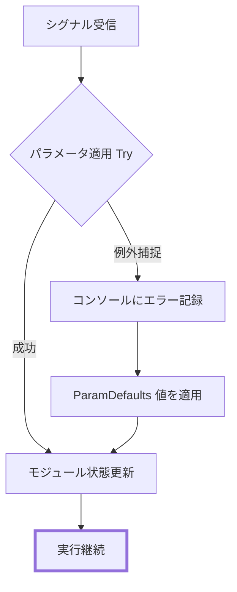
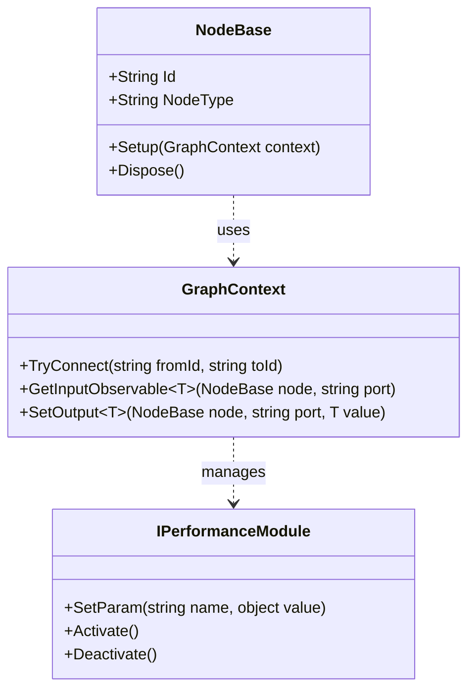

# コーディングガイドラインと安定性ルール (Coding Guidelines & Stability Rules)

関連ソースファイル

このWikiページの生成にあたって、以下のファイルがコンテキストとして使用されました：

- [CLAUDE.md](../../CLAUDE.md)
- [docs/CODING_GUIDELINES.md](../../docs/CODING_GUIDELINES.md)
- [docs/TECHNICAL_DESIGN.md](../../docs/TECHNICAL_DESIGN.md)

本ページでは、**rhizomode** コードベースのエンジニアリング標準および安定性プロトコルを概説します。VR ライブパフォーマンスツールという目的を踏まえ、主目標は、将来の開発に向けた **拡張性**、パフォーマンスを中断するクラッシュを防ぐ **ランタイム安定性**、迅速なオンボーディングとデバッグを支える **明確性** です。

## 1. Open/Closed 原則による拡張 (Extension via Open/Closed Principle)

アーキテクチャは Open/Closed 原則に従います: システムは拡張に開かれ (新規ノードやモジュール追加)、修正に閉じている (既存のコアロジックは変更されない)。

### 1.1 インタフェース境界
アセンブリ間の通信は、密結合と循環依存を防ぐため厳密にインタフェースで統御されます [docs/TECHNICAL_DESIGN.md:53-60]()。インタフェースが利用可能な場合、アセンブリ境界をまたいで具象型を使用すべきではありません [docs/CODING_GUIDELINES.md:13-29]()。

### 1.2 拡張パターン
*   **新規パラメータ型**: `IOutputPort` と `IInputPort` のデータ転送に `object` を利用することで、`GraphContext` の接続ロジックを変更せず新規型を追加可能 [docs/CODING_GUIDELINES.md:31-33]()。
*   **新規ノード**: `NodeBase` を継承し `Setup()` を実装することで新機能を追加。既存のノードロジックの変更は不要 [docs/CODING_GUIDELINES.md:34-51]()。
*   **新規パフォーマンスモジュール**: `IPerformanceModule` インタフェースを実装し `ScriptableObject` を作成することで、新規レンダリングエフェクト (VFX、Shaders) を動的に統合可能 [docs/CODING_GUIDELINES.md:35-36]()。

### 1.3 依存性注入 (Dependency Injection / DI)
テスト容易性とモジュール性を維持するため：
*   **MonoBehaviour**: Inspector ベースの注入に `[SerializeField]` を使用 [docs/CODING_GUIDELINES.md:69-71]()。
*   **純粋 C# クラス**: コンストラクタ注入を使用。隠れた依存関係を防ぐため、ノードロジック内では静的「Instance」や「Singleton」パターンを避ける [docs/CODING_GUIDELINES.md:71-90]()。

**拡張性マッピング: 自然言語からコードエンティティへ**

| 概念 | コードエンティティ | 実装詳細 |
| :--- | :--- | :--- |
| **データ型** | `ParamType` | Float、Color、Bool を定義する Enum [docs/TECHNICAL_DESIGN.md:84-90]() |
| **ノードロジック** | `NodeBase.Setup()` | R3 Observable チェーンが構築される場所 [docs/TECHNICAL_DESIGN.md:150-163]() |
| **ポートインタフェース** | `IInputPort` / `IOutputPort` | `Type` と `OnNext(object)` を定義 [docs/TECHNICAL_DESIGN.md:100-110]() |
| **エフェクトロジック** | `IPerformanceModule` | `SetParam`、`Activate`、`Deactivate` のインタフェース [docs/TECHNICAL_DESIGN.md:31-33]() |

**ソース:** [docs/TECHNICAL_DESIGN.md:31-33](), [docs/TECHNICAL_DESIGN.md:53-60](), [docs/TECHNICAL_DESIGN.md:84-90](), [docs/TECHNICAL_DESIGN.md:100-110](), [docs/TECHNICAL_DESIGN.md:150-163](), [docs/CODING_GUIDELINES.md:13-51](), [docs/CODING_GUIDELINES.md:69-90]()

## 2. 安定性と破壊的変更 (Stability & Breaking Changes)

ライブパフォーマンス中は安定性が最優先です。システムはエラーに対して耐性を持ち、保存済みグラフデータとの後方互換性を維持しなければなりません。

### 2.1 破壊的変更の定義
重大なバグ修正を除き、以下は厳格に禁止されます：
*   インタフェースシグネチャや public メソッドシグネチャの変更 [docs/CODING_GUIDELINES.md:112-117]()。
*   シリアライズされた JSON フィールドの改名・削除 (例: `NodeData` や `EdgeData` 内) [docs/CODING_GUIDELINES.md:118-121]()。
*   ノードのポート名変更 — セーブファイル内の既存接続データを壊すため [docs/CODING_GUIDELINES.md:120-121]()。

### 2.2 防御的プログラミング
「映像は決して止まらない」を実現するため、システムは防御的パターンを使用します：
*   **Try-Catch ラッパー**: 外部呼び出しおよびパラメータ適用は try-catch ブロックで包み、単一ノードの失敗がグラフ全体をクラッシュさせるのを防ぐ [docs/CODING_GUIDELINES.md:172-194]()。
*   **ParamDefaults**: 値が null や無効な場合、事前定義された定数 (`ParamDefaults.Float = 0f` など) にフォールバック [docs/CODING_GUIDELINES.md:204-215]()。
*   **Obsolete パターン**: 非推奨メソッドは即時削除せず `[Obsolete]` 属性でマーキング [docs/CODING_GUIDELINES.md:160-170]()。

**安定性ロジックフロー**

**ソース:** [docs/CODING_GUIDELINES.md:112-121](), [docs/CODING_GUIDELINES.md:160-170](), [docs/CODING_GUIDELINES.md:172-194](), [docs/CODING_GUIDELINES.md:204-215]()

## 3. コードの明確性と構造 (Code Clarity & Structure)

### 3.1 構造ルール
*   **1 ファイル = 1 クラス**: すべての C# ファイルはちょうど 1 つのクラスまたはインタフェースを含む。ファイル名はクラス名と完全に一致 [docs/CODING_GUIDELINES.md:221-253]()。
*   **メソッド長**: メソッドは 30 行未満に保つ。長くなる場合は private ヘルパーメソッドに分割 [CLAUDE.md:84-84]()。
*   **リージョン禁止**: `#region` の使用は禁止。クラスがリージョンを必要とするほど大きい場合は分割すべき [CLAUDE.md:83-83]()。

### 3.2 命名規約
命名は意図を明確に伝えなければなりません：
*   **真偽値**: `Is`、`Has`、`Can`、`Try` のいずれかのプレフィクスを使用 (例: `IsActive`、`TryConnect`) [docs/CODING_GUIDELINES.md:286-297]()。
*   **メソッド**: 失敗の可能性のあるメソッドは `Try` プレフィクスを使用 [docs/CODING_GUIDELINES.md:260-268]()。
*   **private フィールド**: `_camelCase` を使用 (例: `_subject`) [CLAUDE.md:107-107]()。
*   **定数**: `PascalCase` を使用 [CLAUDE.md:109-109]()。

**命名とエンティティの対応**

**ソース:** [docs/CODING_GUIDELINES.md:221-253](), [docs/CODING_GUIDELINES.md:260-268](), [docs/CODING_GUIDELINES.md:286-297](), [CLAUDE.md:83-84](), [CLAUDE.md:107-109]()

## 4. Git とコミット規約 (Git & Commit Conventions)

本プロジェクトは可読な履歴を維持するため **Conventional Commits** を採用します [docs/CODING_GUIDELINES.md:315-320]()。

*   **フォーマット**: `<type>: <description>`
*   **許可された type**: `feat`、`fix`、`refactor`、`docs`、`test`、`chore` [CLAUDE.md:117-117]()。
*   **粒度**: 1 コミットはちょうど 1 つの論理変更を表すべき [CLAUDE.md:118-118]()。
*   **ブランチ**: 作業は `feature/xxx` ブランチで行い、安定した `main` ブランチへマージ [CLAUDE.md:115-116]()。

**ソース:** [docs/CODING_GUIDELINES.md:315-320](), [CLAUDE.md:115-118]()

---
