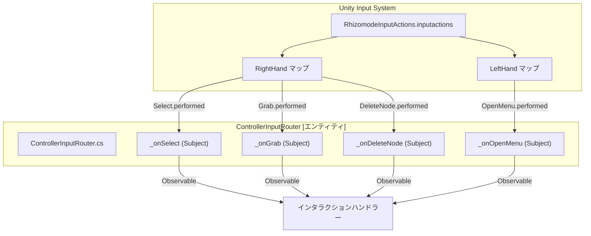
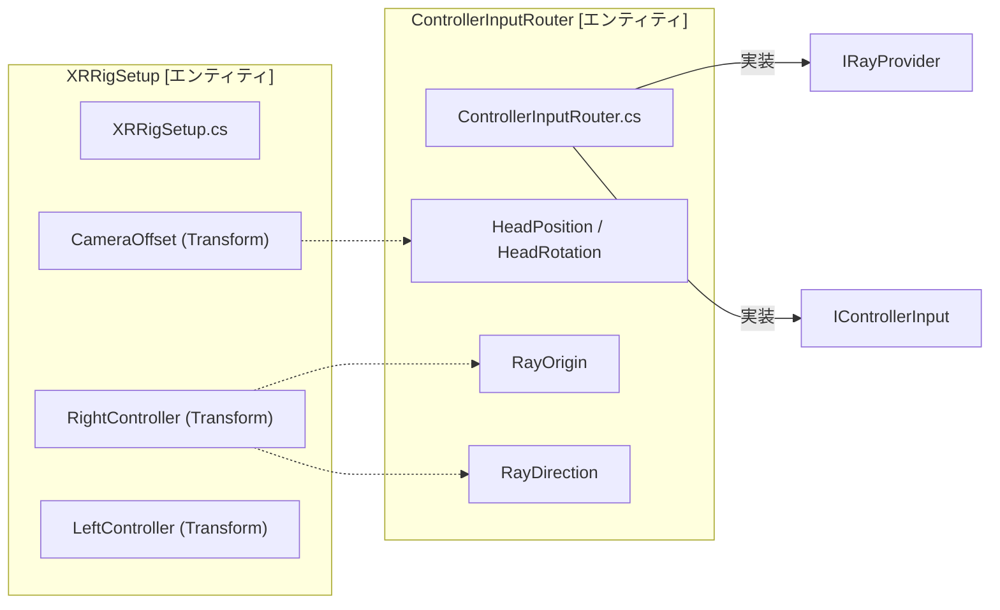

# コントローラ入力と入力アクション (Controller Input & Input Actions)

関連ソースファイル

このWikiページの生成にあたって、以下のファイルがコンテキストとして使用されました：

- [rhizomode/Assets/Runtime/UI/NodeVisualController.cs](../../rhizomode/Assets/Runtime/UI/NodeVisualController.cs)
- [rhizomode/Assets/Runtime/UI/NodeVisualManager.cs](../../rhizomode/Assets/Runtime/UI/NodeVisualManager.cs)
- [rhizomode/Assets/Runtime/UI/USS/NodePanel.uss](../../rhizomode/Assets/Runtime/UI/USS/NodePanel.uss)
- [rhizomode/Assets/Runtime/XR/ControllerInputRouter.cs](../../rhizomode/Assets/Runtime/XR/ControllerInputRouter.cs)
- [rhizomode/Assets/Runtime/XR/Input/RhizomodeInputActions.inputactions](../../rhizomode/Assets/Runtime/XR/Input/RhizomodeInputActions.inputactions)
- [rhizomode/Assets/Runtime/XR/Input/RhizomodeInputActions.inputactions.meta](../../rhizomode/Assets/Runtime/XR/Input/RhizomodeInputActions.inputactions.meta)
- [rhizomode/Assets/Runtime/XR/XRRigSetup.cs](../../rhizomode/Assets/Runtime/XR/XRRigSetup.cs)

rhizomode のコントローラ入力システムは、物理ハードウェア (VR コントローラまたはキーボード/マウス) とノードグラフのインタラクションロジックを橋渡しします。Unity Input System と R3 リアクティブフレームワークを活用し、ユーザーの意図を扱うためのストリームベースインタフェースを提供します。

## 概要と入力アーキテクチャ (Overview and Input Architecture)

本システムの中心は `ControllerInputRouter` で、生のハードウェア入力を高レベルな意味的アクションへ抽象化します。次の2つの重要なインタフェースを実装します：
1.  **`IControllerInput`**: ボタン押下、トグル、軸の動きの `Observable` ストリームを提供 [rhizomode/Assets/Runtime/XR/ControllerInputRouter.cs:15-15]()。
2.  **`IRayProvider`**: インタラクション用 Ray の空間的な原点と方向を提供。通常は右コントローラの位置と前方ベクトルにマッピング [rhizomode/Assets/Runtime/XR/ControllerInputRouter.cs:15-15]()。

### rhizomode 入力マッピング
本システムは `RhizomodeInputActions.inputactions` を用いて、操作系の `RightHand` とナビゲーション/メニュー系の `LeftHand` という2つの主要アクションマップを定義します。

| アクション名 | マップ | 型 | ハードウェアマッピング (XR) | フォールバック (キーボード/マウス) |
| :--- | :--- | :--- | :--- | :--- |
| `Select` | RightHand | Button | Trigger 押下 | 左マウスボタン |
| `Grab` | RightHand | Button | Grip 押下 | - |
| `DeleteNode` | RightHand | Button | Primary ボタン (A/X) | Delete キー |
| `CutEdge` | RightHand | Button | Secondary ボタン (B/Y) | - |
| `Turn` | RightHand | Value | サムスティック (Vector2) | - |
| `OpenMenu` | LeftHand | Button | Primary ボタン (X/A) | 'X' キー |
| `Move` | LeftHand | Value | サムスティック (Vector2) | - |

ソース: [rhizomode/Assets/Runtime/XR/Input/RhizomodeInputActions.inputactions:3-183](), [rhizomode/Assets/Runtime/XR/ControllerInputRouter.cs:82-101]()

## ControllerInputRouter の実装

`ControllerInputRouter` は初期化時に `InputActionAsset` を内部の `Subject` インスタンスへバインドします。これらの Subject は `Observable` ストリームとして公開され、インタラクションハンドラーから消費されます。

### データフロー: ハードウェアから R3 ストリームへ
入力を正確に取得するため、ルーターは特定のライフサイクルに従います：
1.  **バインディング**: `BindActions()` が `RightHand` と `LeftHand` のマップから個別の `InputAction` オブジェクトを取得 [rhizomode/Assets/Runtime/XR/ControllerInputRouter.cs:82-101]()。
2.  **購読**: `SubscribeActions()` が Input System の `performed` と `canceled` イベントにリスナーを取り付け [rhizomode/Assets/Runtime/XR/ControllerInputRouter.cs:113-122]()。
3.  **変換**: `SubscribeToggle` や `SubscribeAxis` などの内部ヘルパーが、値を R3 `Subject` インスタンスへプッシュ [rhizomode/Assets/Runtime/XR/ControllerInputRouter.cs:124-142]()。

### 入力ルーティング図
次の図は、`ControllerInputRouter` が Unity Input System とリアクティブロジックをどのように橋渡しするかを示します。

**入力ルーティングロジック**

ソース: [rhizomode/Assets/Runtime/XR/ControllerInputRouter.cs:29-41](), [rhizomode/Assets/Runtime/XR/ControllerInputRouter.cs:113-122]()

## Ray Provider と空間トラッキング (Ray Provider and Spatial Tracking)

`IRayProvider` として、`ControllerInputRouter` は XR コンポーネントの物理的位置を追跡し、ワールドスペース UI 操作とノード選択を支援します。

*   **RayOrigin**: `rightControllerTransform.position` にマッピング [rhizomode/Assets/Runtime/XR/ControllerInputRouter.cs:54-54]()。
*   **RayDirection**: `rightControllerTransform.forward` にマッピング [rhizomode/Assets/Runtime/XR/ControllerInputRouter.cs:55-55]()。
*   **ヘッドトラッキング**: `headTransform` から `HeadPosition` と `HeadRotation` を提供。ユーザーの正面にメニューをスポーンする際などに使用 [rhizomode/Assets/Runtime/XR/ControllerInputRouter.cs:49-51]()。

### 空間エンティティのマッピング
この図は、物理的な `XRRigSetup` と `ControllerInputRouter` が提供するデータの関係を示します。

**空間プロバイダーのマッピング**

ソース: [rhizomode/Assets/Runtime/XR/XRRigSetup.cs:11-25](), [rhizomode/Assets/Runtime/XR/ControllerInputRouter.cs:49-55]()

## XRRigSetup と検証 (XRRigSetup and Validation)

`XRRigSetup` コンポーネントは、XR Origin (または XR Rig) が Unity シーン内で正しく設定されていることを保証します。`Awake()` 時に `ValidateSetup()` を実行し、必要な `Transform` 参照が割り当てられていることを確認します [rhizomode/Assets/Runtime/XR/XRRigSetup.cs:26-31]()。

`cameraOffset`、`rightController`、`leftController` などの参照が欠落している場合は警告ログを出力し、`ControllerInputRouter` の実行時に NullReferenceException が発生するのを防止します [rhizomode/Assets/Runtime/XR/XRRigSetup.cs:33-39]()。

## キーボードとマウスのフォールバック (Keyboard and Mouse Fallback)

VR ヘッドセットなしでも高速に開発・テストできるよう、`RhizomodeInputActions` は `Keyboard` 制御スキームを含みます [rhizomode/Assets/Runtime/XR/Input/RhizomodeInputActions.inputactions:72-72]()。

*   **選択**: `Select` アクションは `<Mouse>/leftButton` にバインド [rhizomode/Assets/Runtime/XR/Input/RhizomodeInputActions.inputactions:69-69]()。
*   **削除**: `DeleteNode` アクションは `<Keyboard>/delete` にバインド [rhizomode/Assets/Runtime/XR/Input/RhizomodeInputActions.inputactions:102-102]()。
*   **メニュー**: `OpenMenu` アクションは `<Keyboard>/x` にバインド [rhizomode/Assets/Runtime/XR/Input/RhizomodeInputActions.inputactions:172-172]()。

このフォールバックにより、`UIRaycastDriver` とインタラクションハンドラーは XR デバイスがない場合でも、Unity Editor 上で標準のマウスレイキャストを用いて動作します。

ソース: [rhizomode/Assets/Runtime/XR/Input/RhizomodeInputActions.inputactions:54-183]()

---
