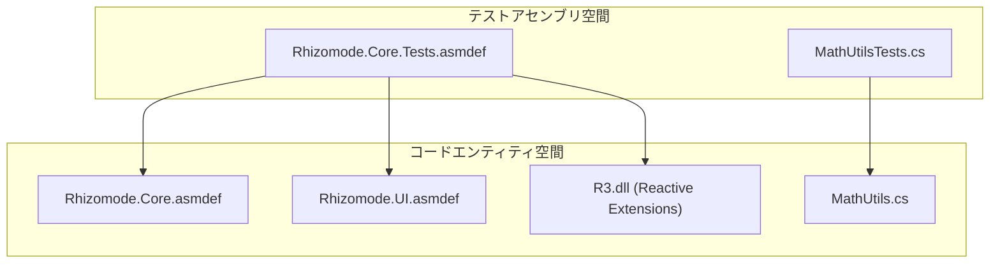
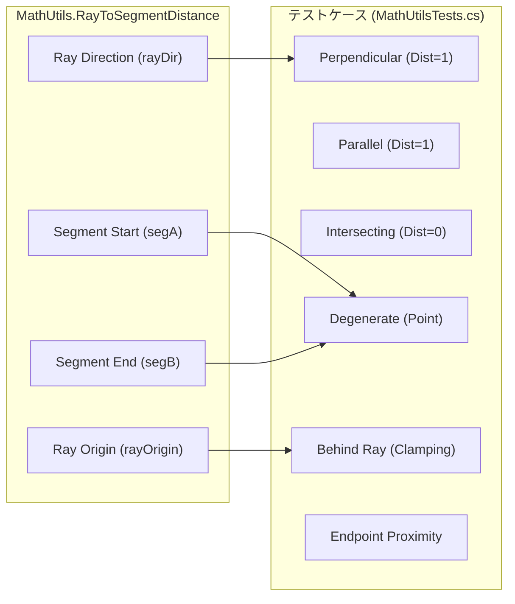

# コアレイヤーテスト (Core Layer Tests)

関連ソースファイル

このWikiページの生成にあたって、以下のファイルがコンテキストとして使用されました：

- [rhizomode/Assets/Runtime/UI/MathUtils.cs](../../rhizomode/Assets/Runtime/UI/MathUtils.cs)
- [rhizomode/Assets/Tests/Editor/Core/MathUtilsTests.cs](../../rhizomode/Assets/Tests/Editor/Core/MathUtilsTests.cs)
- [rhizomode/Assets/Tests/Editor/Core/MathUtilsTests.cs.meta](../../rhizomode/Assets/Tests/Editor/Core/MathUtilsTests.cs.meta)
- [rhizomode/Assets/Tests/Editor/Core/Rhizomode.Core.Tests.asmdef](../../rhizomode/Assets/Tests/Editor/Core/Rhizomode.Core.Tests.asmdef)

Rhizomode Core レイヤーのテスト戦略は、ノードグラフシステムを支える数学的基盤とリアクティブシグナルフローロジックの検証に重点を置きます。現状、テストスイートは **EditMode** テストとして実装されており、Unity XR ランタイムや物理ハードウェアのオーバヘッドなしにロジックの高速検証を可能にします。

## テストアセンブリ構成 (Test Assembly Configuration)

テストは、プロダクションコードとテストユーティリティを明確に分離するため専用のアセンブリ定義内に整理されています。これにより、テスト依存関係が最終ビルドへ漏れるのを防ぎます。

| プロパティ | 値 |
| :--- | :--- |
| **アセンブリ名** | `Rhizomode.Core.Tests` |
| **ネームスペース** | `Rhizomode.Core.Tests` |
| **プラットフォーム** | Editor 専用 |
| **参照** | `Rhizomode.Core`, `Rhizomode.UI`, `R3.Unity` |
| **フレームワーク** | NUnit, R3 |

### アセンブリ依存関係図
この図は、テストアセンブリが Core ロジックと UI ユーティリティを検証のためにどう橋渡しするかを示します。

ソース: [rhizomode/Assets/Tests/Editor/Core/Rhizomode.Core.Tests.asmdef:1-25](), [rhizomode/Assets/Tests/Editor/Core/MathUtilsTests.cs:1-10]()

## MathUtils 検証 (MathUtils Verification)

`MathUtils` クラスは、ユーザーの VR レイが接続線 (エッジ) の近傍をホバーしているかどうかを判定するために `EdgeVisualSystem` で使用される重要な幾何学計算を提供します (切断用途)。テスト対象の主要関数は `RayToSegmentDistance` です。

### RayToSegmentDistance の実装
このアルゴリズムは、両方の直線における最近接点を求め、線分パラメータを $[0, 1]$ にクランプすることで、無限レイと有限線分の最短距離を計算します。

| シナリオ | ロジック経路 |
| :--- | :--- |
| **退化線分** | 線分長がゼロに近い場合、`RayToPointDistance` にフォールバック。 |
| **平行線** | 分母がゼロに近い場合、レイから線分端点までの距離を計算。 |
| **レイの背後** | レイ上の最近接点が原点より前に発生する場合、レイパラメータ `rayT` を `0` にクランプ。 |

ソース: [rhizomode/Assets/Runtime/UI/MathUtils.cs:10-81]()

### テストカバレッジマトリックス
`MathUtilsTests` クラスは、エッジ切断インタラクションの安定性を保証するため複数のテストケースを実装します。

| テストメソッド | 説明 | 実装参照 |
| :--- | :--- | :--- |
| `RayToSegment_Perpendicular_ReturnsExactDistance` | 原点で前方を向くレイ、1 ユニットオフセットされた線分。期待値 `1.0`。 | [rhizomode/Assets/Tests/Editor/Core/MathUtilsTests.cs:12-19]() |
| `RayToSegment_Parallel_ReturnsMinDistance` | レイと線分が平行で 1 ユニットオフセット。期待値 `1.0`。 | [rhizomode/Assets/Tests/Editor/Core/MathUtilsTests.cs:21-29]() |
| `RayToSegment_Intersecting_ReturnsZero` | レイが線分を直接通過。期待値 `0.0`。 | [rhizomode/Assets/Tests/Editor/Core/MathUtilsTests.cs:31-39]() |
| `RayToSegment_DegenerateSegment_ReturnsPointDistance` | 線分の `segA` と `segB` が同一点。点とレイ間の距離を期待。 | [rhizomode/Assets/Tests/Editor/Core/MathUtilsTests.cs:41-49]() |
| `RayToSegment_BehindRay_UsesRayOrigin` | 線分がレイの開始点の背後。`rayOrigin` からの距離を期待。 | [rhizomode/Assets/Tests/Editor/Core/MathUtilsTests.cs:51-60]() |
| `RayToSegment_SegmentEndpoint_ClosestToEndpoint` | レイが線分の端点の一つを正確に指す。期待値 `0.0`。 | [rhizomode/Assets/Tests/Editor/Core/MathUtilsTests.cs:62-70]() |

ソース: [rhizomode/Assets/Tests/Editor/Core/MathUtilsTests.cs:11-71]()

## 計画中のテストカバレッジ (Planned Test Coverage)

現状の重点は幾何ユーティリティですが、今後の Core レイヤーテスト拡張領域として以下が特定されています：

1.  **ポート接続検証**:
    *   `GraphContext.TryConnect` が互換性のない `ParamType` 値間の接続を拒否することを検証。
    *   該当する場合に循環依存が処理または防止されることを保証。
2.  **Observable シグナルフロー**:
    *   `R3` を用いて入力シグナルをモックし、`OutputPort<T>` が接続された `InputPort<T>` インスタンスへ正しく値を伝播することを検証。
3.  **シリアライゼーションラウンドトリップ**:
    *   複数ノード・エッジを持つ `GraphContext` をインスタンス化。
    *   `Serialize()` を呼び出して `GraphData` を生成。
    *   新規コンテキストへ `Deserialize()` し、ノード型、位置、エッジ接続が元の状態と一致することをアサート。

ソース: [rhizomode/Assets/Tests/Editor/Core/Rhizomode.Core.Tests.asmdef:1-25]()

---
