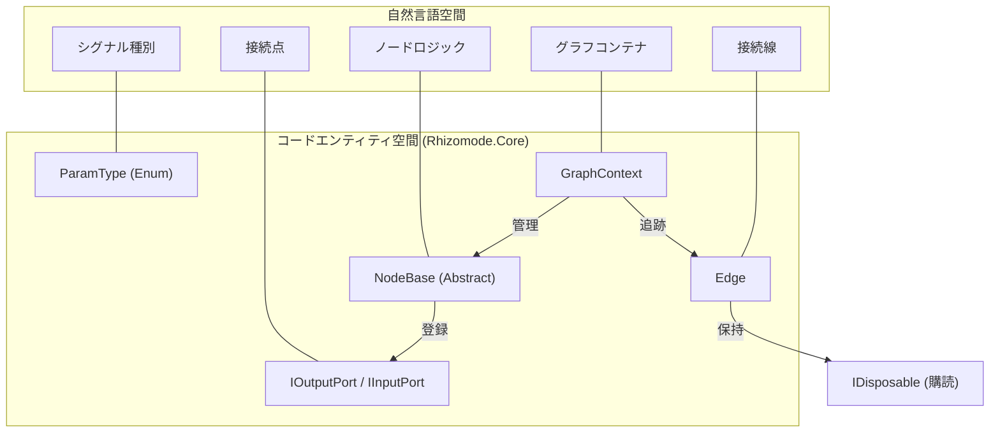
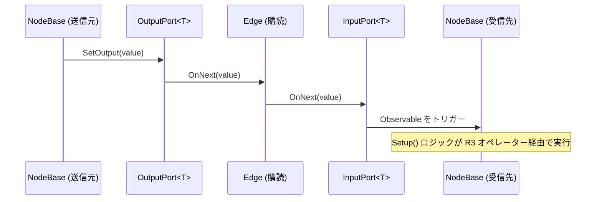

# コアレイヤー (Core Layer)

関連ソースファイル

このWikiページの生成にあたって、以下のファイルがコンテキストとして使用されました：

- [docs/CODING_GUIDELINES.md](../CODING_GUIDELINES.md)
- [docs/TECHNICAL_DESIGN.md](../TECHNICAL_DESIGN.md)
- [rhizomode/Assets/Runtime/Core/Edge.cs](../../rhizomode/Assets/Runtime/Core/Edge.cs)

`Rhizomode.Core` アセンブリは rhizomode アーキテクチャの基盤レイヤーとして機能します。基本的な型システム、[R3](https://github.com/Cysharp/R3) を用いたリアクティブなシグナルフローモデル、ノードおよびポートの抽象定義を提供します。プロジェクト内の他のすべてのアセンブリは Core に依存するため、循環参照を防ぐ厳格な単方向の依存フローが保証されます [docs/TECHNICAL_DESIGN.md:42-60]()。

### コアの責務 (Core Responsibilities)
*   **型システム**: `ParamType` 列挙体とポートインタフェースの定義 [docs/TECHNICAL_DESIGN.md:83-110]()。
*   **シグナルフロー**: 出力ポートから入力ポートへデータが伝播するプッシュベースのリアクティブモデルの実装 [docs/TECHNICAL_DESIGN.md:211-218]()。
*   **グラフ管理**: ノードのライフサイクル管理と、`GraphContext` を介したエッジの生成・破棄 [docs/TECHNICAL_DESIGN.md:165-190]()。
*   **永続化**: グラフ状態をJSONへシリアライズするための Data Transfer Object (DTO) とロジックの提供 [docs/TECHNICAL_DESIGN.md:186-189]()。

---

## システム抽象化 (System Abstractions)

次の図は、高レベルのシステム概念と、`Rhizomode.Core` 名前空間内の具象クラスとの対応関係を示します。

### マッピング: システム概念とコードエンティティ

**ソース:** [docs/TECHNICAL_DESIGN.md:79-210](), [rhizomode/Assets/Runtime/Core/Edge.cs:10-17]()

---

## 主要コンポーネント (Key Components)

### 型システムとポート (Type System & Ports)
rhizomode は厳格に型付けされたポートシステムを採用します。各ポートは `ParamType` (Float、Color、Bool) と関連付けられます。接続はグラフロジックの接続試行時に同じ型同士のポート間でのみ許可されます。
*   **リアクティブ基盤**: ポートは値の発行・受信に R3 の `Subject<T>` を使用します。
*   **インタフェース**: `IOutputPort` と `IInputPort` によりポートを多態的に扱える一方、具象な `OutputPort<T>` と `InputPort<T>` が型特化のデータを処理します。

詳細は [型システムとポート](./Type-System-&-Ports.md) を参照してください。

### NodeBase と GraphContext (NodeBase & Graph Context)
`NodeBase` はグラフ内のすべての機能ブロックの抽象ルートです。固有の ID、空間座標、`PortDefinition` のリストを自身で管理します。`GraphContext` は中心的なメディエーターとして次の役割を担います：
*   **ノードのライフサイクル**: ノードの登録と削除。
*   **エッジ管理**: `IDisposable` 購読をラップする `Edge` オブジェクトの生成。クリーンな切断を可能にします。
*   **シグナルのルーティング**: `GetInputObservable<T>` や `SetOutput<T>` のメソッドを提供し、ノード同士を直接結合させずに通信させます。

詳細は [NodeBaseとGraph Context](./NodeBase-&-Graph-Context.md) を参照してください。

### シリアライゼーションとデータ転送オブジェクト
パフォーマンスセットアップの保存・読み込みをサポートするため、Core レイヤーはフラットなシリアライゼーション構造を定義します。
*   **DTO**: `GraphData`、`NodeData`、`EdgeData` は Unity の `JsonUtility` と互換性のあるシンプルなコンテナです。
*   **プロセス**: `GraphContext.Serialize()` はライブのノード/エッジ状態を DTO へ変換し、`Deserialize()` は登録済みノードファクトリを呼び出してグラフを再構築します。

詳細は [シリアライゼーションとデータ転送オブジェクト](./Serialization-&-Data-Transfer-Objects.md) を参照してください。

### パフォーマンスモジュール (Performance Modules)
`IPerformanceModule` インタフェースは、ノードグラフを実際の Unity シーン上のエフェクト (VFX Graph や Shader など) と橋渡しします。
*   **ModuleDefinition**: モジュールが公開するパラメータを定義する `ScriptableObject`。
*   **動的ポート**: `VFXModuleNode` のようなノードは、これらの定義からランタイム時に入力ポートを生成し、グラフが外部 Unity コンポーネントを制御できるようにします。

詳細は [パフォーマンスモジュールとModuleDefinition](./Performance-Modules-&-ModuleDefinition.md) を参照してください。

---

## シグナルフローのアーキテクチャ (Signal Flow Architecture)

シグナルフローは "Push + EveryUpdate" ハイブリッドモデルに従います。ほとんどのノードは入力変化時のみ処理を行います (Push) が、時間依存ノード (LFO や Time) は毎フレーム値を発行します。

### データ伝播フロー

**ソース:** [docs/TECHNICAL_DESIGN.md:112-134](), [docs/TECHNICAL_DESIGN.md:211-218](), [docs/CODING_GUIDELINES.md:39-50]()

---

## 安定性と拡張ルール (Stability and Extension Rules)

Core レイヤーは **Open/Closed原則** に従って設計されています。
1.  **拡張**: 新しいノード型やパラメータ型を、`NodeBase` を継承するか `ParamType` 列挙体を拡張するだけで追加できます。`GraphContext` のロジックを変更する必要はありません [docs/CODING_GUIDELINES.md:11-36]()。
2.  **安定性**: 公開インタフェースとシリアライゼーション形式は不変として扱い、既存のセーブファイルや依存レイヤーを壊さないようにします [docs/CODING_GUIDELINES.md:110-122]()。
3.  **防御的プログラミング**: `SetParam` などのメソッドは try-catch で囲み、1つのノードの失敗がパフォーマンス全体をクラッシュさせないようにします [docs/CODING_GUIDELINES.md:172-202]()。

**ソース:** [docs/CODING_GUIDELINES.md:1-307]()

---
