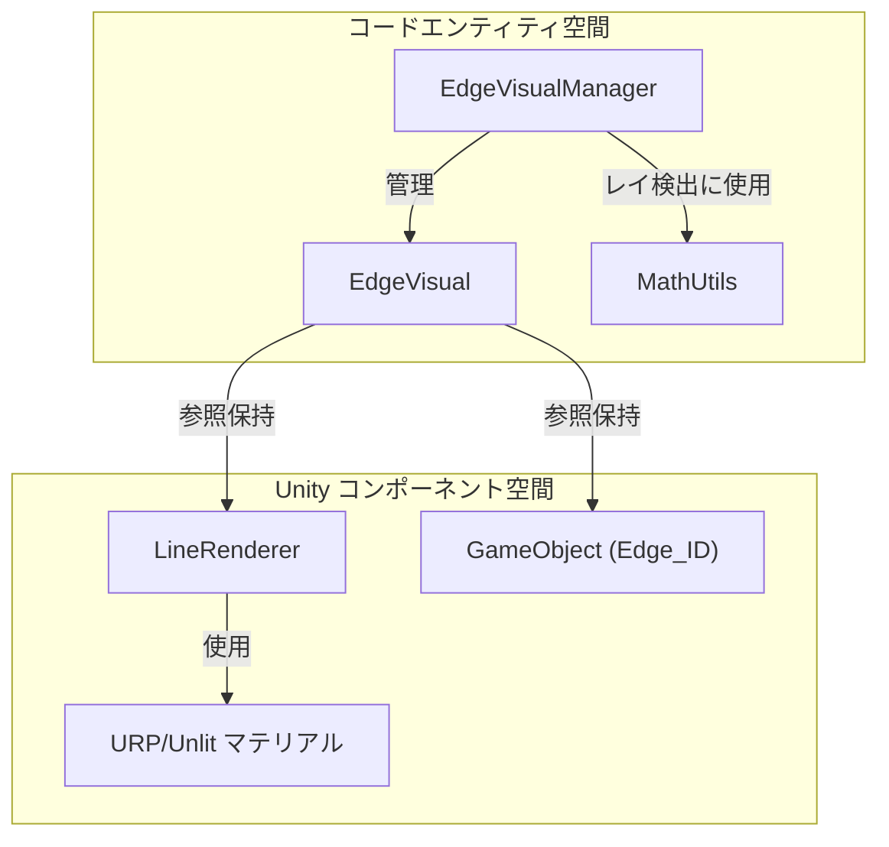
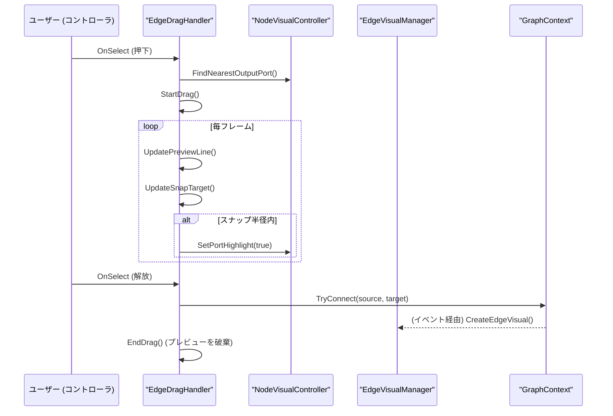

# エッジビジュアルシステム (Edge Visual System)

関連ソースファイル

このWikiページの生成にあたって、以下のファイルがコンテキストとして使用されました：

- [rhizomode/Assets/Runtime/UI/EdgeDragHandler.cs](../../rhizomode/Assets/Runtime/UI/EdgeDragHandler.cs)
- [rhizomode/Assets/Runtime/UI/EdgeVisual.cs](../../rhizomode/Assets/Runtime/UI/EdgeVisual.cs)
- [rhizomode/Assets/Runtime/UI/EdgeVisualManager.cs](../../rhizomode/Assets/Runtime/UI/EdgeVisualManager.cs)
- [rhizomode/Assets/Runtime/UI/MathUtils.cs](../../rhizomode/Assets/Runtime/UI/MathUtils.cs)

エッジビジュアルシステムは、XR 環境におけるノード間の物理的な接続を描画・管理する役割を担います。Unity の `LineRenderer` を活用してポート間のパスを描画し、エッジ作成中の接続プレビューと、エッジ切断時のインタラクション検出ロジックを提供します。

## EdgeVisualManager

`EdgeVisualManager` は、グラフ内のアクティブな全エッジのライフサイクルと視覚状態を管理する中央の権限機構です。エッジ ID と、それぞれの GameObject および LineRenderer を対応付ける `EdgeVisual` オブジェクトの辞書を保持します [rhizomode/Assets/Runtime/UI/EdgeVisualManager.cs:25-29]()。

### 視覚構成
転送中のデータ型が即座にわかるよう、エッジは接続の `ParamType` に基づいて色分けされます [rhizomode/Assets/Runtime/UI/EdgeVisualManager.cs:196-202]()：
*   **Float**: 水色 (`0.63f, 0.82f, 0.94f`) [rhizomode/Assets/Runtime/UI/EdgeVisualManager.cs:20]()。
*   **Color**: 金 (`0.94f, 0.78f, 0.39f`) [rhizomode/Assets/Runtime/UI/EdgeVisualManager.cs:21]()。
*   **Bool**: 赤 (`0.94f, 0.55f, 0.55f`) [rhizomode/Assets/Runtime/UI/EdgeVisualManager.cs:22]()。

### ライフサイクルと更新
*   **生成**: `CreateEdgeVisual` 呼び出し時、URP Unlit マテリアルを構成した `LineRenderer` を持つ新規 GameObject をインスタンス化 [rhizomode/Assets/Runtime/UI/EdgeVisualManager.cs:42-56](), [rhizomode/Assets/Runtime/UI/EdgeVisualManager.cs:179-194]()。
*   **位置追従**: VR 内ではノードを動かせるため、`EdgeVisualManager` は `LateUpdate` ですべての `LineRenderer` の始点・終点位置を更新 [rhizomode/Assets/Runtime/UI/EdgeVisualManager.cs:156-162]()。ポートの正確なワールド座標は `NodeVisualController.GetPortWorldPosition` から取得 [rhizomode/Assets/Runtime/UI/EdgeVisualManager.cs:164-177]()。
*   **ハイライト**: `EdgeCutHandler` のようなインタラクションでは、エッジをハイライト可能。ハイライト時は `LineRenderer` の幅を `0.003f` から `0.006f` に増やし、色を白に変更 [rhizomode/Assets/Runtime/UI/EdgeVisualManager.cs:77-99]()。

### エッジビジュアルのアーキテクチャ
次の図は、マネージャ、ビジュアルデータコンテナ、Unity コンポーネント間の関係を示します。

「エッジビジュアルエンティティのマッピング」

ソース: [rhizomode/Assets/Runtime/UI/EdgeVisualManager.cs:13-26](), [rhizomode/Assets/Runtime/UI/EdgeVisual.cs:10-20](), [rhizomode/Assets/Runtime/UI/MathUtils.cs:10-11]()

## インタラクションとレイ検出 (Interaction and Ray Detection)

VR でのエッジ「切断」をサポートするため、システムはユーザーのインタラクションレイに最も近いエッジを検出する必要があります。

### MathUtils.RayToSegmentDistance
エッジは体積を持つメッシュではなく細い線であるため、標準的な物理レイキャストは信頼性が低くなります。代わりに `EdgeVisualManager.GetEdgeIdNearRay` がすべてのエッジを走査し、`MathUtils.RayToSegmentDistance` を用いてコントローラのレイと、エッジが形成する線分との最短距離を計算します [rhizomode/Assets/Runtime/UI/EdgeVisualManager.cs:104-129]()。

`MathUtils` の実装は以下のケースを扱います：
1.  **退化ケース**: 線分が実質的に点となる場合 [rhizomode/Assets/Runtime/UI/MathUtils.cs:25-29]()。
2.  **平行な線**: レイとエッジが決して交差しない場合 [rhizomode/Assets/Runtime/UI/MathUtils.cs:43-48]()。
3.  **クランプ**: 最近接点がエッジ線分の有限境界内、かつレイの原点より前方にあることを保証 [rhizomode/Assets/Runtime/UI/MathUtils.cs:56-68]()。

ソース: [rhizomode/Assets/Runtime/UI/EdgeVisualManager.cs:104-129](), [rhizomode/Assets/Runtime/UI/MathUtils.cs:20-71]()

## EdgeDragHandler

`EdgeDragHandler` は新規接続作成の UX を管理します。互換性のある入力ポートにスナップするまでユーザーのレイに追従する「プレビュー線」を提供します。

### 接続ワークフロー
1.  **ドラッグ開始**: ユーザーが出力ポートを選択するとトリガー。プレビュー用に `LineRenderer` を持つ一時 `GameObject` が生成される [rhizomode/Assets/Runtime/UI/EdgeDragHandler.cs:78-93](), [rhizomode/Assets/Runtime/UI/EdgeDragHandler.cs:121-131]()。
2.  **スナップ**: 毎 `Update`、`PortSnapRadius` (0.1m) 以内かつ同じ `ParamType` の入力ポートを探索 [rhizomode/Assets/Runtime/UI/EdgeDragHandler.cs:158-187]()。
3.  **視覚フィードバック**: スナップ対象が見つかると、プレビュー線の終点がそのポート位置にロックされ、`NodeVisualController.SetPortHighlight` でポートがハイライトされる [rhizomode/Assets/Runtime/UI/EdgeDragHandler.cs:141-143](), [rhizomode/Assets/Runtime/UI/EdgeDragHandler.cs:189-195]()。
4.  **完了**: 離した時点でスナップ中であれば、`GraphContext.TryConnect` を呼び出して論理接続を確定 [rhizomode/Assets/Runtime/UI/EdgeDragHandler.cs:214-222]()。

「エッジ生成フロー」

ソース: [rhizomode/Assets/Runtime/UI/EdgeDragHandler.cs:15-28](), [rhizomode/Assets/Runtime/UI/EdgeDragHandler.cs:70-76](), [rhizomode/Assets/Runtime/UI/EdgeDragHandler.cs:158-196](), [rhizomode/Assets/Runtime/UI/EdgeVisualManager.cs:42-44]()

## 技術サマリーテーブル (Technical Summary Table)

| 機能 | 実装 | 主要数値・定数 |
| :--- | :--- | :--- |
| **レンダリング** | `LineRenderer` (ワールドスペース) | Width: `0.003f` [rhizomode/Assets/Runtime/UI/EdgeVisualManager.cs:15]() |
| **位置追従** | `LateUpdate` でフレーム毎に同期 | `GetPortWorldPosition` を使用 [rhizomode/Assets/Runtime/UI/EdgeVisualManager.cs:172-173]() |
| **選択** | Ray-to-Segment 距離 | しきい値: `0.02f` [rhizomode/Assets/Runtime/UI/EdgeVisualManager.cs:17]() |
| **プレビュー** | 動的な `EdgePreview` GameObject | スナップ半径: `0.10f` [rhizomode/Assets/Runtime/UI/EdgeDragHandler.cs:18]() |
| **マテリアル** | URP Unlit | `Universal Render Pipeline/Unlit` [rhizomode/Assets/Runtime/UI/EdgeVisualManager.cs:192]() |

ソース: [rhizomode/Assets/Runtime/UI/EdgeVisualManager.cs:13-23](), [rhizomode/Assets/Runtime/UI/EdgeDragHandler.cs:17-21](), [rhizomode/Assets/Runtime/UI/MathUtils.cs:20-21]()

---
