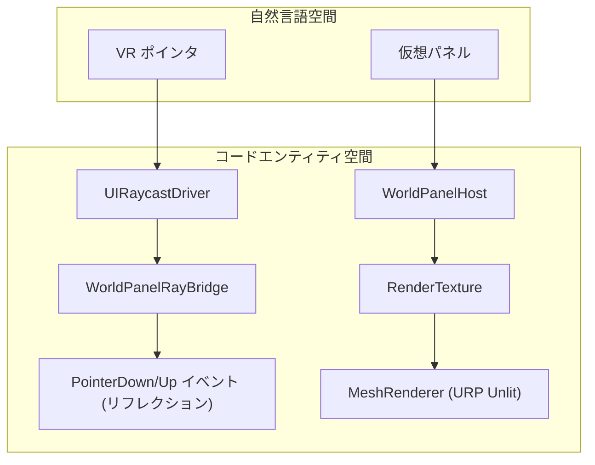
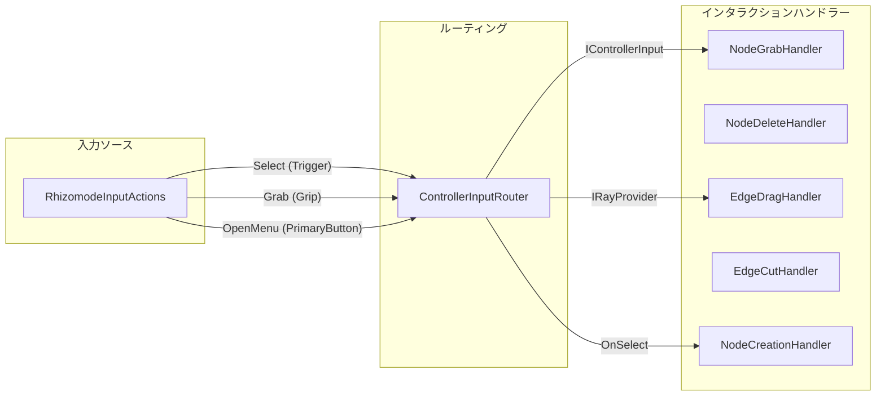

# 用語集 (Glossary)

関連ソースファイル

このWikiページの生成にあたって、以下のファイルがコンテキストとして使用されました：

- [CLAUDE.md](../../CLAUDE.md)
- [docs/CODING_GUIDELINES.md](../../docs/CODING_GUIDELINES.md)
- [docs/TECHNICAL_DESIGN.md](../../docs/TECHNICAL_DESIGN.md)
- [rhizomode/Assets/Runtime/UI/NodeCreationMenuController.cs](../../rhizomode/Assets/Runtime/UI/NodeCreationMenuController.cs)
- [rhizomode/Assets/Runtime/UI/NodeVisualController.cs](../../rhizomode/Assets/Runtime/UI/NodeVisualController.cs)
- [rhizomode/Assets/Runtime/UI/NodeVisualManager.cs](../../rhizomode/Assets/Runtime/UI/NodeVisualManager.cs)
- [rhizomode/Assets/Runtime/UI/USS/NodePanel.uss](../../rhizomode/Assets/Runtime/UI/USS/NodePanel.uss)
- [rhizomode/Assets/Runtime/UI/WorldPanelHost.cs](../../rhizomode/Assets/Runtime/UI/WorldPanelHost.cs)
- [rhizomode/Assets/Runtime/UI/WorldPanelRayBridge.cs](../../rhizomode/Assets/Runtime/UI/WorldPanelRayBridge.cs)
- [rhizomode/Assets/Runtime/XR/ControllerInputRouter.cs](../../rhizomode/Assets/Runtime/XR/ControllerInputRouter.cs)
- [rhizomode/Assets/Runtime/XR/GameBootstrap.cs](../../rhizomode/Assets/Runtime/XR/GameBootstrap.cs)
- [rhizomode/Assets/Runtime/XR/Input/RhizomodeInputActions.inputactions](../../rhizomode/Assets/Runtime/XR/Input/RhizomodeInputActions.inputactions)
- [rhizomode/Assets/Runtime/XR/UIRaycastDriver.cs](../../rhizomode/Assets/Runtime/XR/UIRaycastDriver.cs)
- [rhizomode/Assets/Scenes/SampleScene.unity](../../rhizomode/Assets/Scenes/SampleScene.unity)
- [rhizomode/Assets/Settings/PC_RPAsset.asset](../../rhizomode/Assets/Settings/PC_RPAsset.asset)
- [rhizomode/Packages/manifest.json](../../rhizomode/Packages/manifest.json)
- [rhizomode/Packages/packages-lock.json](../../rhizomode/Packages/packages-lock.json)
- [rhizomode/ProjectSettings/EditorBuildSettings.asset](../../rhizomode/ProjectSettings/EditorBuildSettings.asset)
- [rhizomode/ProjectSettings/URPProjectSettings.asset](../../rhizomode/ProjectSettings/URPProjectSettings.asset)

本ページは、**rhizomode** コードベース固有の用語、クラス名、アーキテクチャ概念に関する包括的なリファレンスを提供します。VR パフォーマンスの自然言語領域と、C# アセンブリ内の技術実装詳細との橋渡しとして機能します。

## コア概念とデータ構造 (Core Concepts & Data Structures)

| 用語 | 定義 |
|:---|:---|
| **GraphContext** | ノードグラフのライフサイクル中央権限。ノード登録、エッジ接続、シリアライゼーションを管理 [rhizomode/Assets/Runtime/Core/GraphContext.cs:12-15]()。 |
| **NodeBase** | グラフ内のすべての機能ユニットの抽象基底クラス。ポート登録およびライフサイクルを扱う [rhizomode/Assets/Runtime/Core/NodeBase.cs:10-14]()。 |
| **Port** | データフローのインタフェース。`InputPort<T>` は R3 Observable 経由でデータを消費し、`OutputPort<T>` はそれを生成 [rhizomode/Assets/Runtime/Core/Ports.cs:40-45]()。 |
| **ParamType** | サポートするデータ型を定義する Enum: `Float`、`Color`、`Bool` [rhizomode/Assets/Runtime/Core/ParamType.cs:7-12]()。 |
| **NodeTypeRegistry** | 利用可能なノード型、表示名、カテゴリのランタイムカタログ [rhizomode/Assets/Runtime/UI/NodeTypeRegistry.cs:10-14]()。 |
| **DummyNode** | 専門ロジックが実装される前の、テストおよび UI プロトタイピング用のプレースホルダーノード実装 [rhizomode/Assets/Runtime/Nodes/DummyNode.cs:10-13]()。 |

**ソース:** [rhizomode/Assets/Runtime/Core/GraphContext.cs:12-15](), [rhizomode/Assets/Runtime/Core/NodeBase.cs:10-14](), [rhizomode/Assets/Runtime/Core/Ports.cs:40-45](), [rhizomode/Assets/Runtime/Core/ParamType.cs:7-12](), [rhizomode/Assets/Runtime/UI/NodeTypeRegistry.cs:10-14](), [rhizomode/Assets/Runtime/Nodes/DummyNode.cs:10-13]()

---

## UI と視覚表現 (UI & Visual Representation)

UI システムは、Unity UI Toolkit と RenderTexture を用いて論理グラフを 3D ワールドスペース表現へ変換します。

### ワールドスペース UI パイプライン
システムは `UIDocument` をテクスチャへレンダリングし、それをプロシージャル Quad メッシュ上に表示します。

**主要クラス:**
*   **WorldPanelHost**: `RenderTexture` とプロシージャル Quad メッシュを管理。`RaycastHit` からピクセル座標を計算 [rhizomode/Assets/Runtime/UI/WorldPanelHost.cs:14-22]()。
*   **WorldPanelRayBridge**: protected な `PointerEventBase` プロパティへアクセスするためリフレクションを用いて、`UIDocument` へポインタイベントを注入 [rhizomode/Assets/Runtime/UI/WorldPanelRayBridge.cs:16-20]()。
*   **NodeVisualController**: `NodeBase` インスタンスとその UI 表現 (UXML) をバインドし、エッジ描画のためポートのワールド位置を更新 [rhizomode/Assets/Runtime/UI/NodeVisualController.cs:15-20]()。
*   **EdgeVisualManager**: ポート位置に基づいてノード間に `LineRenderer` コンポーネントを描画 [rhizomode/Assets/Runtime/UI/EdgeVisualManager.cs:12-15]()。

**ソース:** [rhizomode/Assets/Runtime/UI/WorldPanelHost.cs:14-22](), [rhizomode/Assets/Runtime/UI/WorldPanelRayBridge.cs:16-20](), [rhizomode/Assets/Runtime/UI/NodeVisualController.cs:15-20](), [rhizomode/Assets/Runtime/UI/EdgeVisualManager.cs:12-15]()

---

## XR インタラクションと入力 (XR Interaction & Input)

Rhizomode は VR コントローラインタラクションを処理するため、専用の入力ルーティングシステムを使用します。

### 入力からアクションへのマッピング
システムは `RhizomodeInputActions` を特定のグラフ操作ハンドラーへマッピングします。

**主要定義:**
*   **ControllerInputRouter**: `IControllerInput` と `IRayProvider` を実装。Unity Input System のアクションを購読し、R3 Observable として公開 [rhizomode/Assets/Runtime/XR/ControllerInputRouter.cs:15-20]()。
*   **UIRaycastDriver**: `IRayProvider` と `WorldPanelRayBridge` を橋渡しし、ノードパネルとのインタラクションを可能にするフレーム毎のドライバ [rhizomode/Assets/Runtime/XR/UIRaycastDriver.cs:15-20]()。
*   **GameBootstrap**: `NodeTypeRegistry` を初期化し、ハンドラーへ依存性を注入、`GraphContext` を視覚システムへ接続する「コンポジションルート」 [rhizomode/Assets/Runtime/XR/GameBootstrap.cs:11-23]()。

**ソース:** [rhizomode/Assets/Runtime/XR/ControllerInputRouter.cs:15-20](), [rhizomode/Assets/Runtime/XR/UIRaycastDriver.cs:15-20](), [rhizomode/Assets/Runtime/XR/GameBootstrap.cs:11-23](), [rhizomode/Assets/Runtime/XR/Input/RhizomodeInputActions.inputactions:1-10]()

---

## 技術用語と略語 (Technical Terms & Abbreviations)

| 略語 | 用語 | 文脈 |
|:---|:---|:---|
| **URP** | Universal Render Pipeline | rhizomode で使用されるレンダリングバックエンド [rhizomode/Assets/Settings/PC_RPAsset.asset:12-13]()。 |
| **R3** | R3 (Reactive Extensions) | シグナルフローと入力に使用されるリアクティブプログラミングライブラリ [rhizomode/Packages/packages-lock.json:13-16]()。 |
| **DTO** | Data Transfer Object | JSON シリアライゼーションで使用される `NodeData`、`EdgeData`、`GraphData` を指す [rhizomode/Assets/Runtime/Core/Serialization/GraphData.cs:1-10]()。 |
| **XRI** | XR Interaction Toolkit | VR インタラクションのための基盤 Unity パッケージ [rhizomode/Packages/packages-lock.json:238-240]()。 |
| **USS** | Unity Style Sheet | ワールドスペース UI のスタイリングに使用 [rhizomode/Assets/Runtime/UI/USS/NodePanel.uss:1-5]()。 |

**ソース:** [rhizomode/Assets/Settings/PC_RPAsset.asset:12-13](), [rhizomode/Packages/packages-lock.json:13-16](), [rhizomode/Assets/Runtime/Core/Serialization/GraphData.cs:1-10](), [rhizomode/Packages/packages-lock.json:238-240]()
