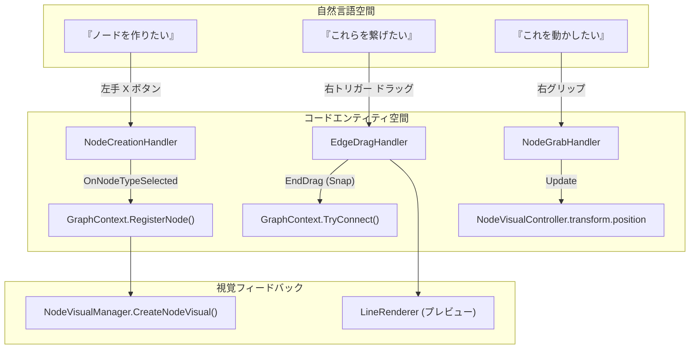
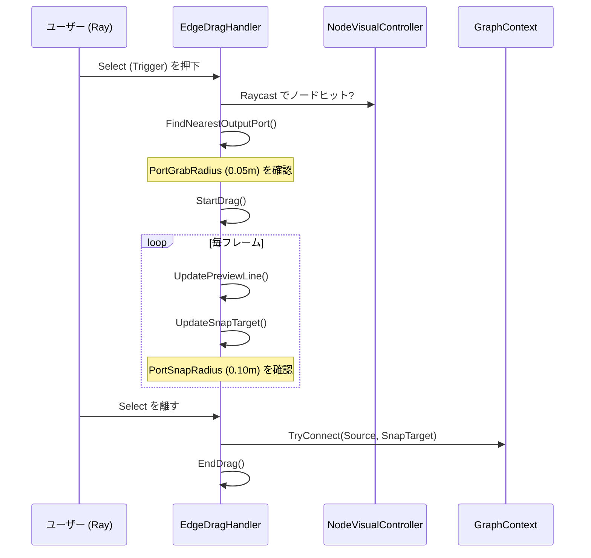

# インタラクションハンドラー (Interaction Handlers)

関連ソースファイル

このWikiページの生成にあたって、以下のファイルがコンテキストとして使用されました：

- [rhizomode/Assets/Runtime/UI/EdgeDragHandler.cs](../../rhizomode/Assets/Runtime/UI/EdgeDragHandler.cs)
- [rhizomode/Assets/Runtime/XR/EdgeCutHandler.cs](../../rhizomode/Assets/Runtime/XR/EdgeCutHandler.cs)
- [rhizomode/Assets/Runtime/XR/NodeCreationHandler.cs](../../rhizomode/Assets/Runtime/XR/NodeCreationHandler.cs)
- [rhizomode/Assets/Runtime/XR/NodeDeleteHandler.cs](../../rhizomode/Assets/Runtime/XR/NodeDeleteHandler.cs)
- [rhizomode/Assets/Runtime/XR/NodeGrabHandler.cs](../../rhizomode/Assets/Runtime/XR/NodeGrabHandler.cs)

インタラクションハンドラー は、生の XR コントローラ入力をグラフ操作アクションへ変換します。これらのコンポーネントは `Rhizomode.XR` アセンブリに属し、`IControllerInput` システムと `GraphContext` の橋渡しを行います。各ハンドラーは特化した `MonoBehaviour` であり、ユーザーのインタラクション語彙のうち特定のサブセットを担当します。

### インタラクションフロー概要

次の図は、ユーザーの意図が物理コントローラの動作からコードエンティティを経由し、最終的にグラフの修正へと至る流れを示します。

**インタラクションコマンドフロー**

ソース: `[rhizomode/Assets/Runtime/XR/NodeCreationHandler.cs:16-108]()`, `[rhizomode/Assets/Runtime/UI/EdgeDragHandler.cs:15-147]()`, `[rhizomode/Assets/Runtime/XR/NodeGrabHandler.cs:13-86]()`

---

### NodeCreationHandler
ノード生成メニューのライフサイクルと、その後のノード実体化を管理します。

*   **メニュートグル**: `IControllerInput.OnOpenMenu` (左手 X ボタン) を購読し、`NodeCreationMenuController` の表示を切り替え `[rhizomode/Assets/Runtime/XR/NodeCreationHandler.cs:35-36]()`。
*   **空間配置 (Spatial Spawning)**: ノード種別が選択されると、ユーザーの頭位置の `0.3m` 前方をスポーン位置として計算 `[rhizomode/Assets/Runtime/XR/NodeCreationHandler.cs:18-18]()`, `[rhizomode/Assets/Runtime/XR/NodeCreationHandler.cs:91-93]()`。
*   **ファクトリパターン**: `Func<string, NodeBase>` ファクトリのレジストリを用いて、`GraphContext` に登録する前に正しい `NodeBase` サブクラスをインスタンス化 `[rhizomode/Assets/Runtime/XR/NodeCreationHandler.cs:47-50]()`, `[rhizomode/Assets/Runtime/XR/NodeCreationHandler.cs:88-95]()`。

ソース: `[rhizomode/Assets/Runtime/XR/NodeCreationHandler.cs:1-121]()`

---

### NodeGrabHandler
コントローラのグリップボタンを使ってノードを空間操作できるようにします。

*   **レイキャスト選択**: グリップ押下時にレイキャストを行い、`NodeVisualController` を探索 `[rhizomode/Assets/Runtime/XR/NodeGrabHandler.cs:57-65]()`。
*   **オフセット保持**: ヒット点とノードのピボット間の距離およびベクトルオフセットを記憶し、掴んだ瞬間にノード中心がレイへスナップするのを防止 `[rhizomode/Assets/Runtime/XR/NodeGrabHandler.cs:69-70]()`。
*   **Transform 同期**: 更新ループ中、現在のレイの origin と direction に基づいて、掴んだビジュアルの `transform.position` を更新 `[rhizomode/Assets/Runtime/XR/NodeGrabHandler.cs:74-80]()`。

ソース: `[rhizomode/Assets/Runtime/XR/NodeGrabHandler.cs:1-94]()`

---

### NodeDeleteHandler
ノードと、それに紐付くエッジの削除を扱います。

*   **ターゲティング**: `Update()` 内で継続的にレイキャストを行い、ユーザーのレチクル下にあるノードを特定 `[rhizomode/Assets/Runtime/XR/NodeDeleteHandler.cs:45-59]()`。
*   **削除ロジック**: `IControllerInput.OnDeleteNode` (右手 A ボタン) によりトリガー `[rhizomode/Assets/Runtime/XR/NodeDeleteHandler.cs:41-43]()`。
*   **クリーンアップ手順**:
    1.  `GraphContext.Edges` 経由でそのノードに接続している全エッジを特定 `[rhizomode/Assets/Runtime/XR/NodeDeleteHandler.cs:72-75]()`。
    2.  `EdgeVisualManager` を介してエッジビジュアルを破棄 `[rhizomode/Assets/Runtime/XR/NodeDeleteHandler.cs:77-80]()`。
    3.  `GraphContext` からノードを削除 (これにより内部の R3 購読も破棄される) `[rhizomode/Assets/Runtime/XR/NodeDeleteHandler.cs:83-83]()`。
    4.  ノードのビジュアル GameObject を破棄 `[rhizomode/Assets/Runtime/XR/NodeDeleteHandler.cs:86-86]()`。

ソース: `[rhizomode/Assets/Runtime/XR/NodeDeleteHandler.cs:1-102]()`

---

### EdgeDragHandler
出力ポートと入力ポート間のインタラクティブな接続ロジックを実装します。

**エッジ接続ロジック**

ソース: `[rhizomode/Assets/Runtime/UI/EdgeDragHandler.cs:70-119]()`, `[rhizomode/Assets/Runtime/UI/EdgeDragHandler.cs:158-187]()`

*   **ポート近接性 (Port Proximity)**: `FindNearestOutputPort` を使用し、ノードビジュアル上の有効な output ポート定義の近くをユーザーがクリックしたかを判定 `[rhizomode/Assets/Runtime/UI/EdgeDragHandler.cs:95-119]()`。
*   **スナップ機構**: ドラッグ中、レイの終点から `PortSnapRadius` (0.10m) 以内かつ同じ `ParamType` の入力ポートを探索 `[rhizomode/Assets/Runtime/UI/EdgeDragHandler.cs:167-187]()`。
*   **視覚プレビュー**: 一時的な `LineRenderer` を用いて、ソースポートからスナップ先またはデフォルトのレイ距離までの線を描画 `[rhizomode/Assets/Runtime/UI/EdgeDragHandler.cs:133-147]()`。

ソース: `[rhizomode/Assets/Runtime/UI/EdgeDragHandler.cs:1-200]()`

---

### EdgeCutHandler
既存のエッジを切断するための仕組みを提供します。

*   **幾何的近接性**: `EdgeVisualManager.GetEdgeIdNearRay` を使用。内部で `MathUtils.RayToSegmentDistance` を活用し、コントローラのレイに近いエッジを検出 `[rhizomode/Assets/Runtime/XR/EdgeCutHandler.cs:44-45]()`。
*   **視覚フィードバック**: 対象エッジをハイライトするため、`EdgeVisualManager` の `SetHighlight(true)` を呼び出し `[rhizomode/Assets/Runtime/XR/EdgeCutHandler.cs:54-55]()`。
*   **実行**: `OnCutEdge` (右手 B ボタン) が発火すると、エッジビジュアルに保存されたメタデータ (From/To ノード ID とポート名) を用いて `GraphContext.Disconnect` を呼び出し `[rhizomode/Assets/Runtime/XR/EdgeCutHandler.cs:69-72]()`。

ソース: `[rhizomode/Assets/Runtime/XR/EdgeCutHandler.cs:1-88]()`

---
