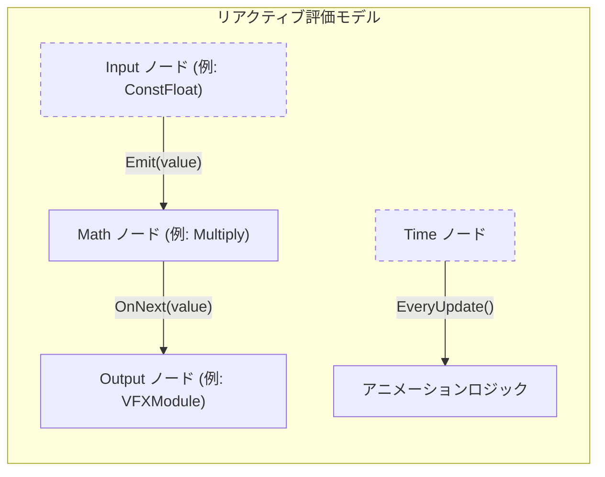
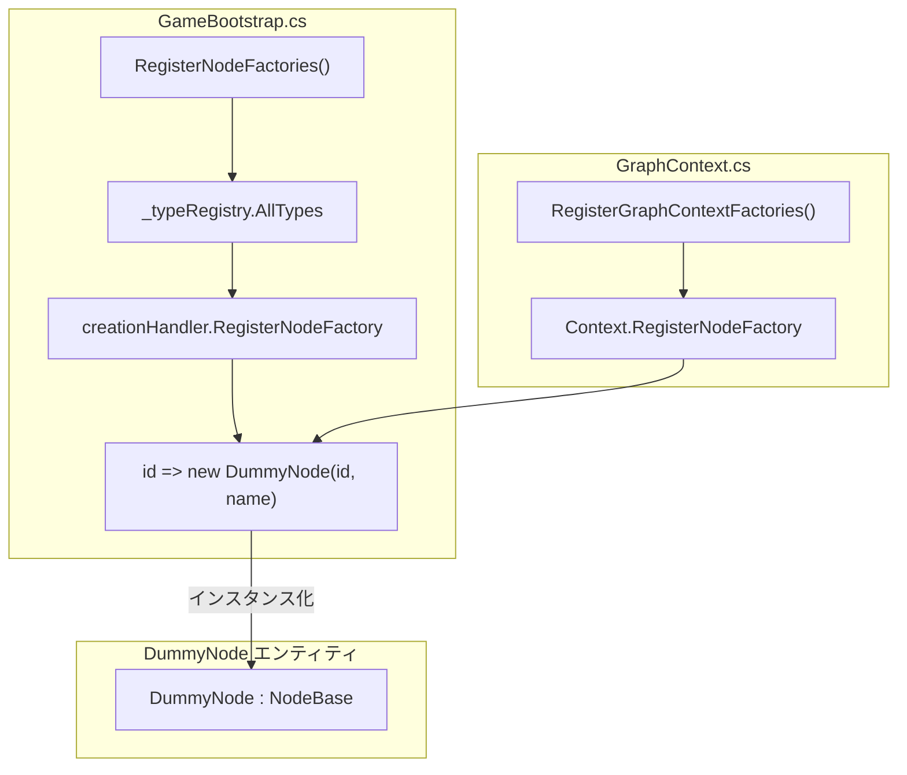
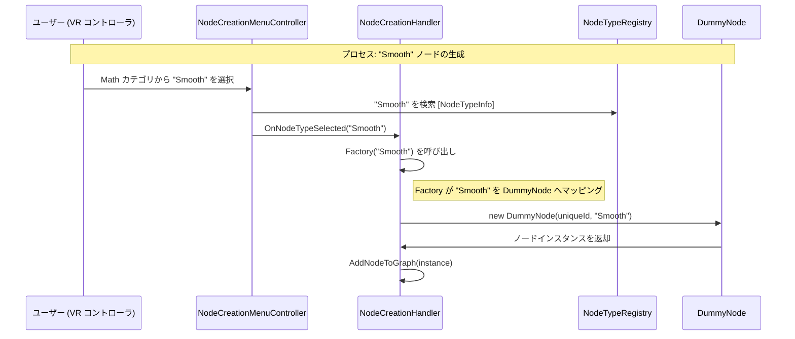

# ノードカタログと DummyNode (Node Catalog & DummyNode)

関連ソースファイル

このWikiページの生成にあたって、以下のファイルがコンテキストとして使用されました：

- [docs/CODING_GUIDELINES.md](../CODING_GUIDELINES.md)
- [docs/TECHNICAL_DESIGN.md](../TECHNICAL_DESIGN.md)
- [rhizomode/Assets/Runtime/XR/GameBootstrap.cs](../../rhizomode/Assets/Runtime/XR/GameBootstrap.cs)
- [rhizomode/Assets/Scenes/SampleScene.unity](../../rhizomode/Assets/Scenes/SampleScene.unity)

本ページは **rhizomode** システムで利用可能なノード型の詳細なリファレンスを提供します。各ノードのポート構成、シグナル伝播に使用されるリアクティブプッシュモデル、および最終的なノードロジックを洗練している間にも開発速度を維持するために用いられるプレースホルダー実装 `DummyNode` について解説します。

## リアクティブシグナルフローモデル (Reactive Signal Flow Model)

本システムは、プッシュベースのリアクティブフローと、時間依存シグナル向けのフレーム単位ポーリングを組み合わせたハイブリッド評価モデルを採用しています [docs/TECHNICAL_DESIGN.md:211-218]()。

*   **リアクティブプッシュ**: ほとんどのノードは **R3** Observable を使用。シグナル伝播は入力値が変化したときのみ行われ、無駄な計算を削減 [docs/TECHNICAL_DESIGN.md:215-218]()。
*   **EveryUpdate パターン**: 時間ベースノード (例: `Time`、`LFO`) は `Observable.EveryUpdate()` を利用して毎フレーム値を発行し、滑らかなアニメーションとトランジションを実現 [docs/TECHNICAL_DESIGN.md:216-216]()。

### シグナルフローロジック
ノードは `Setup(GraphContext context)` メソッド内でロジックを実装し、入力 Observable を購読しつつ、出力 Subject へ発行します [docs/TECHNICAL_DESIGN.md:163-163]()。

ソース: [docs/TECHNICAL_DESIGN.md:211-218](), [docs/CODING_GUIDELINES.md:39-51]()

---

## ノードカタログ (Node Catalog)

次の表は、機能的役割ごとに分類されたノード型の一覧です。すべてのノードはシステムブートストラップ時に `NodeTypeRegistry` を介して登録されます [rhizomode/Assets/Runtime/XR/GameBootstrap.cs:29-54]()。

### 1. Input カテゴリ (青)
グラフへの主要なシグナルソースとして機能するノード群。

| ノード種別 | ポート | 説明 |
|:---|:---|:---|
| `ConstFloat` | **Out:** `Value` (Float) | 内部スライダーを介して定数値 (0.0 〜 1.0) を提供 [docs/TECHNICAL_DESIGN.md:255-257]()。 |
| `AudioTrigger` | **In:** `FreqMin`, `FreqMax`, `Threshold` **Out:** `Level` (Float), `Trigger` (Bool) | 音声の周波数帯域を解析しピークを検出 [docs/TECHNICAL_DESIGN.md:236-241]()。 |
| `BeatDetector` | **In:** `Trigger` (Bool) **Out:** `BPM`, `Phase`, `Beat` (Bool) | 入力されるトリガーに基づいてテンポを算出 [docs/TECHNICAL_DESIGN.md:243-247]()。 |
| `TapTempo` | **Out:** `BPM`, `Phase`, `Beat` (Bool) | VR コントローラのボタン押下からテンポシグナルを生成 [docs/TECHNICAL_DESIGN.md:249-253]()。 |

### 2. Math & シグナル処理 (緑)
数値シグナルを変換・合成するノード群。

| ノード種別 | ポート | 説明 |
|:---|:---|:---|
| `Multiply` | **In:** `A`, `B` **Out:** `Result` (Float) | 2つの float 入力を乗算 [docs/TECHNICAL_DESIGN.md:258-261]()。 |
| `Smooth` | **In:** `Input`, `Damping` **Out:** `Value` (Float) | Lerp または EaseOut を用いて時間方向に値を補間 [docs/TECHNICAL_DESIGN.md:263-268]()。 |

### 3. Time & Utility (黄/灰)
時間制御とロジックゲート用ノード。

| ノード種別 | ポート | 説明 |
|:---|:---|:---|
| `Time` | **Out:** `Time` (Float) | 毎フレーム、現在の経過時間を発行 [docs/TECHNICAL_DESIGN.md:269-271]()。 |
| `Threshold` | **In:** `Value`, `Threshold` **Out:** `Gate` (Bool) | 入力がしきい値を超えた場合に `true` を出力 [docs/TECHNICAL_DESIGN.md:272-275]()。 |
| `Toggle` | **In:** `Trigger` (Bool) **Out:** `State` (Bool) | `true` トリガーごとに出力状態を反転 [docs/TECHNICAL_DESIGN.md:277-280]()。 |

ソース: [rhizomode/Assets/Runtime/XR/GameBootstrap.cs:34-54](), [docs/TECHNICAL_DESIGN.md:223-280]()

---

## DummyNode の実装 (DummyNode Implementation)

`DummyNode` は開発フェーズで利用される汎用プレースホルダークラスです。特定ノードのロジックが未実装でも、登録された `NodeTypeInfo` を用いて UI とグラフシステムを動作させることができます。

### 開発における役割
`GameBootstrap.Awake()` 内で、システムは `NodeTypeRegistry` に登録されたすべての型を走査し、それらを `DummyNode` インスタンスを生成するファクトリへマッピングします [rhizomode/Assets/Runtime/XR/GameBootstrap.cs:134-154]()。

### コードとの関連: ファクトリ登録
次の図は、`GameBootstrap` がレジストリ名と `DummyNode` エンティティをどのように橋渡しするかを示します。

ソース: [rhizomode/Assets/Runtime/XR/GameBootstrap.cs:134-154](), [docs/TECHNICAL_DESIGN.md:149-160]()

### 技術的特徴 (Technical Characteristics)
*   **ポート生成**: `DummyNode` はインスタンス化時に渡される `NodeTypeInfo` に基づき自動的にポートを生成。
*   **ライフサイクル**: `NodeBase` を継承し、`Setup()` と `Dispose()` には空実装を提供。グラフ実行中の null 参照エラーを防止 [docs/TECHNICAL_DESIGN.md:149-160]()。
*   **シリアライゼーション**: 標準の `NodeBase` 構造を使用するため、`DummyNode` も `NodeData` へシリアライズして復元可能。ノードロジックが未実装でもグラフレイアウトと接続は保持される [docs/TECHNICAL_DESIGN.md:186-190]()。

---

## システム統合図 (System Integration Diagram)

この図は、「ノード生成」という自然言語概念を、そのプロセスに関与する具体的なコードエンティティに対応付けます。

ソース: [rhizomode/Assets/Runtime/XR/GameBootstrap.cs:134-143](), [rhizomode/Assets/Runtime/XR/GameBootstrap.cs:29-54]()

---
