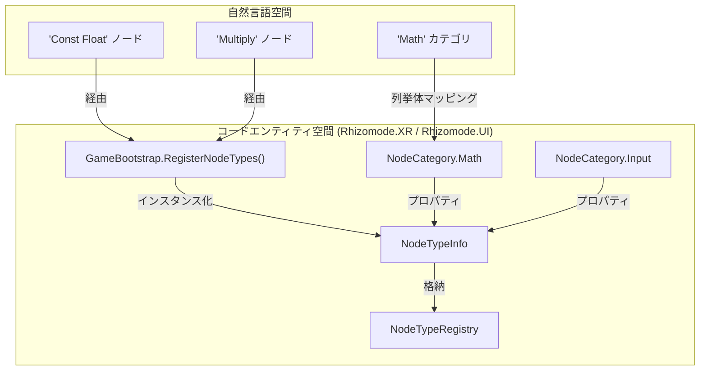
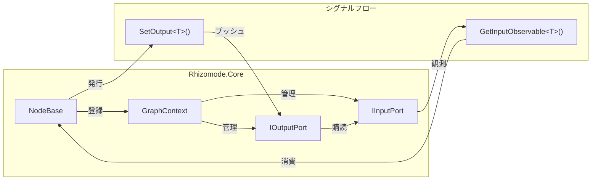

# ノードグラフシステム (Node Graph System)

関連ソースファイル

このWikiページの生成にあたって、以下のファイルがコンテキストとして使用されました：

- [docs/CODING_GUIDELINES.md](../CODING_GUIDELINES.md)
- [docs/TECHNICAL_DESIGN.md](../TECHNICAL_DESIGN.md)
- [rhizomode/Assets/Runtime/UI/NodeVisualManager.cs](../../rhizomode/Assets/Runtime/UI/NodeVisualManager.cs)
- [rhizomode/Assets/Runtime/XR/GameBootstrap.cs](../../rhizomode/Assets/Runtime/XR/GameBootstrap.cs)
- [rhizomode/Assets/Runtime/XR/Input/RhizomodeInputActions.inputactions](../../rhizomode/Assets/Runtime/XR/Input/RhizomodeInputActions.inputactions)
- [rhizomode/Assets/Scenes/SampleScene.unity](../../rhizomode/Assets/Scenes/SampleScene.unity)

**ノードグラフシステム** は rhizomode のリアクティブエンジンであり、ノードのライフサイクル、メタデータ、ノード間のシグナルフローを管理する責務を負います。[R3 ライブラリ](https://github.com/Cysharp/R3) を活用したプッシュ型リアクティブモデルを採用しており、パラメータ更新が最小限のオーバーヘッドでグラフを伝播することを保証します [docs/TECHNICAL_DESIGN.md:64-66]()。

## システム概要 (System Overview)

本システムは階層化アーキテクチャ上に構築され、`Rhizomode.Core` アセンブリが基本抽象を定義し、`Rhizomode.Nodes` が具象実装を提供します [docs/TECHNICAL_DESIGN.md:44-51]()。グラフはノードが型安全なポート経由で接続された有向グラフとして動作します。

### シグナルフローモデル
本システムは **Push + EveryUpdate のハイブリッドモデル** を採用します [docs/TECHNICAL_DESIGN.md:211-218]()：
- **リアクティブプッシュ**: ほとんどのノードは内部状態または入力が変化したときのみ値を発行し、無駄な計算を削減。
- **連続発行 (Continuous Emission)**: 時間ベースノード (例: `TimeNode`、`LFO`) は `Observable.EveryUpdate()` を用いて毎フレーム値を発行し、滑らかなアニメーションを実現 [docs/TECHNICAL_DESIGN.md:215-216]()。

### ビジュアルとコードのマッピング: ノード登録
この図は、自然言語のノードカテゴリや名称が、内部の `NodeTypeRegistry` と `GameBootstrap` のロジックへどのようにマッピングされるかを示します。

ソース: [rhizomode/Assets/Runtime/XR/GameBootstrap.cs:34-54](), [rhizomode/Assets/Runtime/UI/NodeVisualManager.cs:34-37]()

---

## ノードのカテゴリ分けとレジストリ (Node Categorization & Registry)

ノードは VR 上でのユーザーナビゲーションを容易にし、色分けによる視覚的な手がかりを提供するため、5つの主要カテゴリに整理されます [docs/TECHNICAL_DESIGN.md:225-231]()。

| カテゴリ | 色 | 代表的なノード種別 |
| :--- | :--- | :--- |
| **Input** | 青 | `ConstFloat`, `AudioTrigger`, `BeatDetector` |
| **Math** | 緑 | `Multiply`, `Smooth`, `Add` |
| **Module** | 紫 | `VFXModule`, `ShaderModule` |
| **Time** | 黄 | `Time`, `Timer`, `LFO` |
| **Utility** | 灰 | `Threshold`, `Toggle`, `ColorToFloats` |

`NodeTypeRegistry` はこれらカテゴリとメタデータの中央 Source of Truth として機能し、`GameBootstrap.Awake()` のシーケンスで読み込まれます [rhizomode/Assets/Runtime/XR/GameBootstrap.cs:27-32]()。

メタデータの保存と取得の詳細については **[ノードタイプレジストリとメタデータ](./Node-Type-Registry-&-Metadata.md)** を参照してください。

---

## リアクティブグラフのアーキテクチャ (Reactive Graph Architecture)

`GraphContext` が実際のシグナルルーティングを管理します。`NodeVisualManager` と連携することで「ノードグラフ」のロジックと「Unity シーン」の橋渡しを行います [rhizomode/Assets/Runtime/XR/GameBootstrap.cs:60-63]()。

### シグナルルーティングロジック
この図は、抽象クラス `NodeBase` の実装と、通信を仲介する `GraphContext` との関係を示します。

ソース: [docs/TECHNICAL_DESIGN.md:169-190](), [docs/TECHNICAL_DESIGN.md:99-134]()

### DummyNode プレースホルダー
現在の開発フェーズでは、システムは `DummyNode` 実装を活用します。これにより、各ノード種別の具体的な計算ロジックが完成していなくても、UI および XR インタラクションレイヤーをノードカタログ全体でテストすることが可能になります [rhizomode/Assets/Runtime/XR/GameBootstrap.cs:134-154]()。

計画中ノードの一覧と `DummyNode` 実装の詳細については **[ノードカタログとDummyNode](./Node-Catalog-&-DummyNode.md)** を参照してください。

---

## 関連ページ (Related Pages)
- **[ノードタイプレジストリとメタデータ](./Node-Type-Registry-&-Metadata.md)**: `NodeTypeInfo` の内部保存とカテゴリ色定義。
- **[ノードカタログとDummyNode](./Node-Catalog-&-DummyNode.md)**: 利用可能なノードの一覧、ポート、開発用プレースホルダーロジック。
- **[NodeBaseとGraph Context](./NodeBase-&-Graph-Context.md)**: グラフを駆動するコアクラスの詳説。

---
