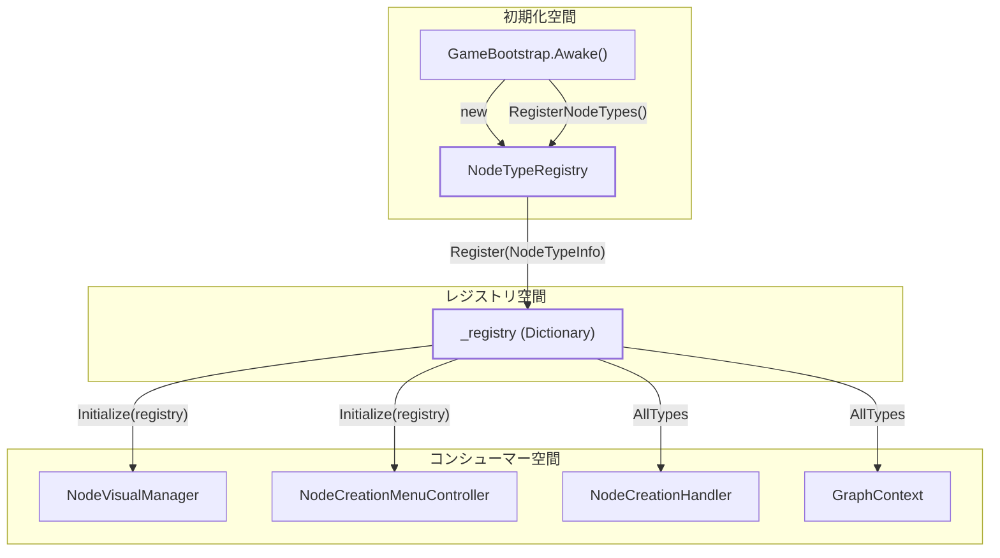
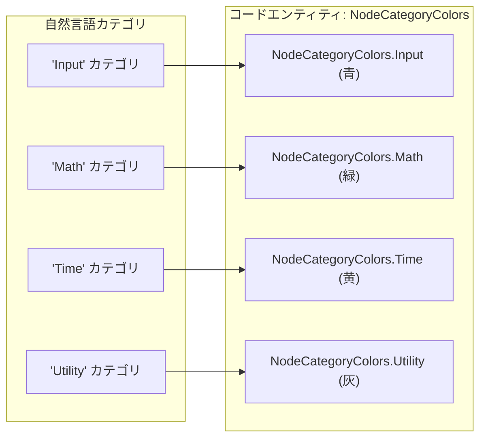

# ノードタイプレジストリとメタデータ (Node Type Registry & Metadata)

関連ソースファイル

このWikiページの生成にあたって、以下のファイルがコンテキストとして使用されました：

- [rhizomode/Assets/Runtime/UI/NodeCategory.cs](../../rhizomode/Assets/Runtime/UI/NodeCategory.cs)
- [rhizomode/Assets/Runtime/UI/NodeCategoryColors.cs](../../rhizomode/Assets/Runtime/UI/NodeCategoryColors.cs)
- [rhizomode/Assets/Runtime/UI/NodeTypeInfo.cs](../../rhizomode/Assets/Runtime/UI/NodeTypeInfo.cs)
- [rhizomode/Assets/Runtime/UI/NodeTypeRegistry.cs](../../rhizomode/Assets/Runtime/UI/NodeTypeRegistry.cs)
- [rhizomode/Assets/Runtime/XR/GameBootstrap.cs](../../rhizomode/Assets/Runtime/XR/GameBootstrap.cs)
- [rhizomode/Assets/Scenes/SampleScene.unity](../../rhizomode/Assets/Scenes/SampleScene.unity)

`NodeTypeRegistry` は、rhizomode 環境で利用可能なすべてのノード型に関する中央 Source of Truth として機能します。内部の型名を UI 表示名やカテゴリへマッピングし、生成メニューの動的構築や、ノードの機能目的に応じたビジュアルスタイリングを可能にします。

## システムアーキテクチャ (System Architecture)

レジストリは、コアロジック (ノード型) と UI レイヤー (視覚表現) を橋渡しする役割を担います。アプリケーションのブートストラップ段階でインスタンス化・データ投入され、その後さまざまな UI マネージャーから参照されます。

### データフロー: 初期化から消費まで

次の図は、ノードメタデータが `GameBootstrap` からレジストリへ、さらに視覚システムへどのように流れるかを示します。

**ノードメタデータ配信フロー**

**ソース:** [rhizomode/Assets/Runtime/XR/GameBootstrap.cs:27-32](), [rhizomode/Assets/Runtime/XR/GameBootstrap.cs:56-86]()

## コアエンティティ (Core Entities)

### NodeTypeRegistry
`NodeTypeRegistry` クラス [rhizomode/Assets/Runtime/UI/NodeTypeRegistry.cs:12-42]() は `NodeTypeInfo` オブジェクトのコレクションを管理し、次のメソッドを提供します：
*   **Register**: 新規ノードメタデータを追加 [rhizomode/Assets/Runtime/UI/NodeTypeRegistry.cs:21-24]()。
*   **Retrieve by Name (名前で取得)**: 一意な `TypeName` から info を取得 [rhizomode/Assets/Runtime/UI/NodeTypeRegistry.cs:29-32]()。
*   **Filter by Category (カテゴリで絞り込み)**: メニュー組織化のため、特定の `NodeCategory` に属する全ノードを取得 [rhizomode/Assets/Runtime/UI/NodeTypeRegistry.cs:37-41]()。

### NodeTypeInfo
シンプルなデータコンテナ [rhizomode/Assets/Runtime/UI/NodeTypeInfo.cs:8-25]() で、以下を保持します：
*   `TypeName`: シリアライゼーションとファクトリ検索で使う内部文字列ID (例: "ConstFloat")。
*   `DisplayName`: VR UI 上で表示される人間可読な文字列 (例: "Const Float")。
*   `Category`: ノードのグループと色を決定する `NodeCategory` 列挙値。

**ソース:** [rhizomode/Assets/Runtime/UI/NodeTypeRegistry.cs:12-42](), [rhizomode/Assets/Runtime/UI/NodeTypeInfo.cs:8-25]()

## カテゴリ分けとビジュアルコーディング (Categorization and Visual Coding)

ノードは `NodeCategory` 列挙体を介して機能カテゴリに整理されます。このカテゴリ分けは、`NodeCreationMenuController` による2段階ナビゲーションの構築 (Category → Node) や、`NodeVisualController` による色分けヘッダーの適用に利用されます。

### ノードカテゴリ
| カテゴリ | 目的 | 例 |
| :--- | :--- | :--- |
| `Input` | 外部シグナルソース (Audio, XR) | `AudioTrigger`, `TapTempo` |
| `Math` | シグナル処理と算術 | `Multiply`, `Smooth` |
| `Module` | パフォーマンスモジュールのコントローラ | (計画中の VFX/Shader モジュール) |
| `Time` | 時間ベースのシグナル生成 | `Time` |
| `Utility` | ロジックとフロー制御 | `Threshold`, `Toggle` |

**ソース:** [rhizomode/Assets/Runtime/UI/NodeCategory.cs:8-15](), [rhizomode/Assets/Runtime/XR/GameBootstrap.cs:34-54]()

### ビジュアルカラーマッピング
静的クラス `NodeCategoryColors` [rhizomode/Assets/Runtime/UI/NodeCategoryColors.cs:10-31]() が、各カテゴリの視覚的アイデンティティを定義します。これらの色は、VRワールドスペースUI上のノードパネルヘッダーに適用されます。

**カテゴリ→色 マッピング**

**ソース:** [rhizomode/Assets/Runtime/UI/NodeCategoryColors.cs:12-30]()

## 起動時初期化 (Startup Initialization)

レジストリはランタイムに `GameBootstrap.RegisterNodeTypes()` で投入されます。これにより、ユーザーが生成メニューを開こうとする時点で、UI レイヤーが利用可能な全ノードを把握済みであることが保証されます。

### 登録ロジック
`GameBootstrap.cs` ではレジストリにハードコード定義が投入されます：
*   **Input**: `ConstFloat`, `AudioTrigger`, `BeatDetector`, `TapTempo` [rhizomode/Assets/Runtime/XR/GameBootstrap.cs:39-42]()
*   **Math**: `Multiply`, `Smooth` [rhizomode/Assets/Runtime/XR/GameBootstrap.cs:45-46]()
*   **Time**: `Time` [rhizomode/Assets/Runtime/XR/GameBootstrap.cs:49]()
*   **Utility**: `Threshold`, `Toggle` [rhizomode/Assets/Runtime/XR/GameBootstrap.cs:52-53]()

登録後、これらの型は `GraphContext` と `NodeCreationHandler` におけるノードファクトリ登録にも利用され、定義済み型ごとに `DummyNode` インスタンスを生成できるようになります [rhizomode/Assets/Runtime/XR/GameBootstrap.cs:134-154]()。

**ソース:** [rhizomode/Assets/Runtime/XR/GameBootstrap.cs:34-54](), [rhizomode/Assets/Runtime/XR/GameBootstrap.cs:134-154]()

---
