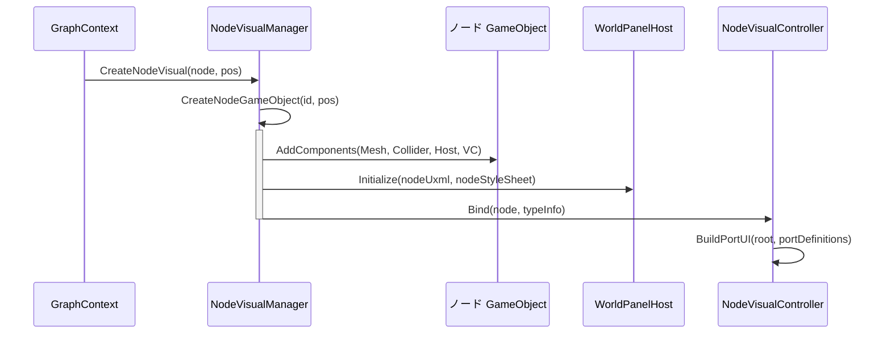
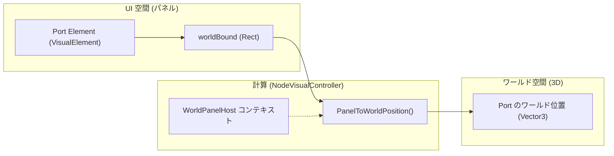

# ノードビジュアルシステム (Node Visual System)

関連ソースファイル

このWikiページの生成にあたって、以下のファイルがコンテキストとして使用されました：

- [rhizomode/Assets/Runtime/UI/NodeVisualController.cs](../../rhizomode/Assets/Runtime/UI/NodeVisualController.cs)
- [rhizomode/Assets/Runtime/UI/NodeVisualManager.cs](../../rhizomode/Assets/Runtime/UI/NodeVisualManager.cs)
- [rhizomode/Assets/Runtime/UI/USS/NodeCreationMenu.uss](../../rhizomode/Assets/Runtime/UI/USS/NodeCreationMenu.uss)
- [rhizomode/Assets/Runtime/UI/USS/NodePanel.uss](../../rhizomode/Assets/Runtime/UI/USS/NodePanel.uss)
- [rhizomode/Assets/Runtime/UI/UXML/NodePanel.uxml](../../rhizomode/Assets/Runtime/UI/UXML/NodePanel.uxml)
- [rhizomode/Assets/Runtime/XR/ControllerInputRouter.cs](../../rhizomode/Assets/Runtime/XR/ControllerInputRouter.cs)
- [rhizomode/Assets/Runtime/XR/Input/RhizomodeInputActions.inputactions](../../rhizomode/Assets/Runtime/XR/Input/RhizomodeInputActions.inputactions)

ノードビジュアルシステムは、3D ワールドスペース内におけるノード表現のライフサイクルとレンダリングを担当します。コアレイヤーから来る論理的な `NodeBase` データを Unity UI Toolkit へ橋渡しし、GameObject のインスタンス化、リアクティブデータの UXML テンプレートへのバインディング、エッジ描画用のポート空間位置計算を管理します。

## NodeVisualManager

`NodeVisualManager` は `GraphContext` 内のすべてのノード GameObject に対する中央ファクトリかつコントローラとして機能します。ノードの論理 ID とシーン内の物理表現とのマッピングを扱います。

### 責務
*   **ファクトリパターン**: 必要なコンポーネント (`MeshFilter`、`MeshRenderer`、`MeshCollider`、`WorldPanelHost`、`WorldPanelRayBridge`) を持つ GameObject をスポーン [rhizomode/Assets/Runtime/UI/NodeVisualManager.cs:113-133]()。
*   **ライフサイクル制御**: `CreateNodeVisual` と `DestroyNodeVisual` を提供 [rhizomode/Assets/Runtime/UI/NodeVisualManager.cs:42-90]()。
*   **レジストリ統合**: 生成時のノードスタイリングのため、`NodeTypeRegistry` からメタデータ (カテゴリ、表示名) を取得 [rhizomode/Assets/Runtime/UI/NodeVisualManager.cs:50-55]()。

### ノード GameObject 構造
各ノードは独立した GameObject であり、次を含みます：
1.  **WorldPanelHost**: RenderTexture と UIDocument を管理 [rhizomode/Assets/Runtime/UI/NodeVisualManager.cs:60-61]()。
2.  **WorldPanelRayBridge**: XR レイキャストを UI Toolkit イベントへ変換 [rhizomode/Assets/Runtime/UI/NodeVisualManager.cs:129]()。
3.  **NodeVisualController**: そのノード固有の UI ロジックを管理 [rhizomode/Assets/Runtime/UI/NodeVisualManager.cs:130]()。

### ノード生成のデータフロー
次の図は、論理的なノードが視覚エンティティへ変換される流れを示します。

**図: ノードビジュアルのインスタンス化フロー**

ソース: [rhizomode/Assets/Runtime/UI/NodeVisualManager.cs:42-74](), [rhizomode/Assets/Runtime/UI/NodeVisualController.cs:38-52]()

---

## NodeVisualController

`NodeVisualController` は、特定の `NodeBase` インスタンスと、それに対応する UI Toolkit の `VisualElement` ツリー間の橋渡しを行います。

### UI バインディングと構築
`Bind()` を呼び出すと、コントローラは以下のステップを実行します：
1.  **ヘッダースタイリング**: ノードタイトルを設定し、`NodeCategory` に基づく CSS クラス (例: `.node-header--math`、`.node-header--time`) を適用 [rhizomode/Assets/Runtime/UI/NodeVisualController.cs:104-120]()。
2.  **ポート生成**: ノードから提供される `PortDefinition` オブジェクトを走査し、各ポート用に `portUxml` テンプレートをインスタンス化 [rhizomode/Assets/Runtime/UI/NodeVisualController.cs:122-142]()。
3.  **位置同期**: `LateUpdate` 中に論理的な `NodeBase.Position` と GameObject の `transform.position` を同期し、VR の Grab インタラクションをサポート [rhizomode/Assets/Runtime/UI/NodeVisualController.cs:88-95]()。

### ポートの視覚化
ポートは `ParamType` に基づき動的にスタイリングされます：
| ParamType | CSS クラス | 色 (近似) |
| :--- | :--- | :--- |
| `Float` | `.port-dot--float` | 水色 [rhizomode/Assets/Runtime/UI/USS/NodePanel.uss:58-60]() |
| `Color` | `.port-dot--color` | 金/黄 [rhizomode/Assets/Runtime/UI/USS/NodePanel.uss:62-64]() |
| `Bool` | `.port-dot--bool` | 赤/ピンク [rhizomode/Assets/Runtime/UI/USS/NodePanel.uss:66-68]() |

### 空間計算
`EdgeVisualManager` がノード間に線を描けるよう、`NodeVisualController` は `GetPortWorldPosition(string portName)` を提供します。この関数は：
1.  ポートに対応する `VisualElement` を取得。
2.  UI パネル内の `worldBound` を取得。
3.  `WorldPanelHost` の Quad サイズを用いて、2D パネルピクセル座標を 3D ワールド座標へ変換 [rhizomode/Assets/Runtime/UI/NodeVisualController.cs:57-70](), [rhizomode/Assets/Runtime/UI/NodeVisualController.cs:198-214]()。

**図: UI からワールド空間への座標マッピング**

ソース: [rhizomode/Assets/Runtime/UI/NodeVisualController.cs:57-70](), [rhizomode/Assets/Runtime/UI/NodeVisualController.cs:198-214]()

---

## UXML と USS 構造 (UXML and USS Structure)

ノードの視覚的外観は Unity UI Toolkit のアセットを介して定義されます。

### NodePanel.uxml
階層は、ルートコンテナ、タイトル用ヘッダー、ポート用の2つの縦コンテナで構成されます [rhizomode/Assets/Runtime/UI/UXML/NodePanel.uxml:2-10]()。
*   `#node-root` (`.node-panel`)
    *   `#header` (`.node-header`)
    *   `#port-container` (`.port-container`)
        *   `#input-ports` (`.input-ports`)
        *   `#output-ports` (`.output-ports`)

### スタイリング (.uss)
スタイリングはノードの「ガラス」風外観 (暗めの半透明背景) と、カテゴリ別の色を定義します [rhizomode/Assets/Runtime/UI/USS/NodePanel.uss:1-15]()。

| カテゴリ | ヘッダー色 (RGB) |
| :--- | :--- |
| **Input** | `51, 102, 230` (青) [rhizomode/Assets/Runtime/UI/USS/NodePanel.uss:76-78]() |
| **Math** | `51, 191, 77` (緑) [rhizomode/Assets/Runtime/UI/USS/NodePanel.uss:80-82]() |
| **Module** | `153, 77, 204` (紫) [rhizomode/Assets/Runtime/UI/USS/NodePanel.uss:84-86]() |
| **Time** | `204, 179, 51` (黄) [rhizomode/Assets/Runtime/UI/USS/NodePanel.uss:88-90]() |
| **Utility** | `128, 128, 128` (灰) [rhizomode/Assets/Runtime/UI/USS/NodePanel.uss:92-94]() |

ソース: [rhizomode/Assets/Runtime/UI/UXML/NodePanel.uxml:1-11](), [rhizomode/Assets/Runtime/UI/USS/NodePanel.uss:1-100]()

---
