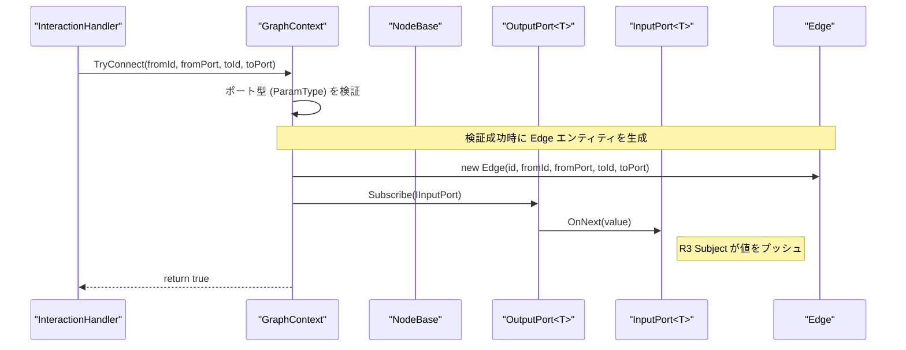
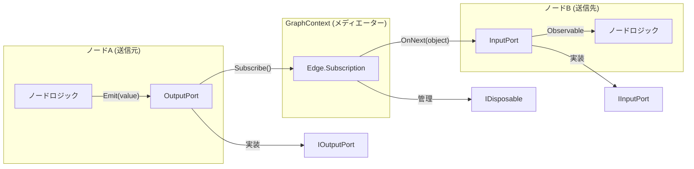

# NodeBase と Graph Context (NodeBase & Graph Context)

関連ソースファイル

このWikiページの生成にあたって、以下のファイルがコンテキストとして使用されました：

- [docs/CODING_GUIDELINES.md](../CODING_GUIDELINES.md)
- [docs/TECHNICAL_DESIGN.md](../TECHNICAL_DESIGN.md)
- [rhizomode/Assets/Runtime/Core/Edge.cs](../../rhizomode/Assets/Runtime/Core/Edge.cs)
- [rhizomode/Assets/Runtime/UI/GraphContextBehaviour.cs](../../rhizomode/Assets/Runtime/UI/GraphContextBehaviour.cs)

`NodeBase` クラスと `GraphContext` は、rhizomode のリアクティブグラフシステムの中核を成します。`NodeBase` が個々のロジック単位とそのポート定義のテンプレートを提供する一方、`GraphContext` は中心的なオーケストレーターとしてノードのライフサイクル管理、接続の検証、ノード間の R3 ベースのシグナルルーティングを担います。

## NodeBase: ノードの基盤 (NodeBase: The Node Foundation)

`NodeBase` は抽象クラスで、システム内のあらゆるノードに対して識別情報、空間データ、ポート構成を定義します [docs/TECHNICAL_DESIGN.md:150-161]()。`Setup()` と `Dispose()` メソッドによる標準ライフサイクルを提供し、リアクティブチェーンが適切に初期化・後始末されるよう保証します。

### 主な責務 (Key Responsibilities)
- **識別情報と状態**: 各ノードは固有の `Id`、ファクトリ検索用の `NodeType` 文字列、VR空間でのレンダリング向けの `Position` を保持 [rhizomode/Assets/Runtime/Core/NodeBase.cs:13-17]()。
- **ポート登録**: ノードは入力・出力それぞれの `List<PortDefinition>` でインタフェースを定義 [rhizomode/Assets/Runtime/Core/NodeBase.cs:18-19]()。
- **ライフサイクル管理**:
    - `Setup(GraphContext context)`: ノードが内部ロジックを初期化し、入力 Observable を購読する場所 [rhizomode/Assets/Runtime/Core/NodeBase.cs:21]()。
    - `Dispose()`: ノードがリソースを解放し、内部購読を終了する場所 [rhizomode/Assets/Runtime/Core/NodeBase.cs:22]()。
- **シリアライゼーション**: `ToNodeData()` メソッドが、ノードのランタイム状態を JSON 保存用の `NodeData` DTO へ変換 [rhizomode/Assets/Runtime/Core/NodeBase.cs:24-33]()。

### ノードロジックの実装
具象ノードは `Setup()` を実装し、入力から出力へのデータの流れを定義します。例えば、数学ノードは複数の入力 Observable を R3 オペレーターで結合し、結果を出力ポートへプッシュします [docs/CODING_GUIDELINES.md:39-51]()。

**ソース:** [docs/TECHNICAL_DESIGN.md:147-164](), [docs/CODING_GUIDELINES.md:31-51](), [rhizomode/Assets/Runtime/Core/NodeBase.cs:7-34]()

---

## GraphContext: 中央オーケストレーター (GraphContext: The Central Orchestrator)

`GraphContext` はノードグラフ全体のライフサイクルを管理します。ノード同士が互いに直接参照を持つ必要が無いようにする中継役 (メディエーター) として動作します。代わりに、ノードはコンテキストへ入力ストリームを要求するか、出力値をプッシュします [docs/TECHNICAL_DESIGN.md:165-190]()。

### シグナルルーティングと接続
コンテキストは R3 の購読 (Subscription) 管理の複雑さを引き受けます。2つのポートが接続されると、`GraphContext` はそのリンクと関連する `IDisposable` 購読を追跡する `Edge` オブジェクトを生成します [rhizomode/Assets/Runtime/Core/Edge.cs:10-27]()。

| 関数 | 役割 |
| :--- | :--- |
| `RegisterNode` | ノードを内部レジストリへ追加し `Setup()` を呼び出す [rhizomode/Assets/Runtime/Core/GraphContext.cs:41-47]()。 |
| `TryConnect` | ポート型を検証し、ノード間のリアクティブリンクを生成 [rhizomode/Assets/Runtime/Core/GraphContext.cs:76-114]()。 |
| `Disconnect` | 該当する `Edge` 購読を破棄してグラフから除外 [rhizomode/Assets/Runtime/Core/GraphContext.cs:116-126]()。 |
| `GetInputObservable<T>` | ノードに特定の入力ポート向けの `Observable<T>` を提供 [rhizomode/Assets/Runtime/Core/GraphContext.cs:144-149]()。 |
| `SetOutput<T>` | ノードが型 `T` の値を出力ポートへプッシュ可能にする [rhizomode/Assets/Runtime/Core/GraphContext.cs:151-156]()。 |

### グラフライフサイクル図: コードエンティティのマッピング
この図は、「ノードを接続する」という高レベル概念が、Core レイヤー内の具体的なメソッド呼び出しおよびオブジェクト状態変化にどのようにマッピングされるかを示します。

**ソース:** [docs/TECHNICAL_DESIGN.md:169-190](), [rhizomode/Assets/Runtime/Core/GraphContext.cs:76-114](), [rhizomode/Assets/Runtime/Core/Edge.cs:10-27]()

---

## リアクティブデータフロー (Reactive Data Flow)

本システムは R3 を用いた **プッシュ型リアクティブモデル** を採用します。データは入力が変化したときのみ処理され、グラフ中の静的な部分の CPU 負荷を最小化します [docs/TECHNICAL_DESIGN.md:211-218]()。

### ポートの相互作用
1. **OutputPort<T>**: R3 の `Subject<T>` をラップ。`Emit(T value)` が呼ばれると、購読中のすべての `InputPort<T>` に通知 [docs/TECHNICAL_DESIGN.md:112-124]()。
2. **InputPort<T>**: 同じく `Subject<T>` をラップ。`OnNext(object value)` で値を受け取り (object を `T` にキャスト)、ノードの内部ロジックへ `Observable<T>` として公開 [docs/TECHNICAL_DESIGN.md:126-133]()。

### 接続ルール
- **1対多**: 1つの output を複数の input に接続可能 (分配) [docs/TECHNICAL_DESIGN.md:138]()。
- **多対1**: 複数の output を1つの input に接続可能。シグナルがマージされ、最新値が「勝つ」 [docs/TECHNICAL_DESIGN.md:139-140]()。
- **型安全**: `GraphContext.TryConnect` はポート間で `ParamType` が一致することを厳格に強制 [rhizomode/Assets/Runtime/Core/GraphContext.cs:91-95]()。

### シグナルルーティングのアーキテクチャ
この図は、「シグナルフロー」という自然言語的概念を、`Rhizomode.Core` 内に定義された具体的なクラスやインタフェースに対応付けます。

**ソース:** [docs/TECHNICAL_DESIGN.md:97-133](), [docs/TECHNICAL_DESIGN.md:199-209](), [rhizomode/Assets/Runtime/Core/IOutputPort.cs:5-15](), [rhizomode/Assets/Runtime/Core/IInputPort.cs:5-14]()

---

## シーン統合: GraphContextBehaviour (Scene Integration)

Unity 環境では `GraphContext` は `GraphContextBehaviour` でラップされます。この `MonoBehaviour` により、グラフのライフサイクルが Unity シーンと結びつきます [rhizomode/Assets/Runtime/UI/GraphContextBehaviour.cs:11-12]()。

- **遅延初期化**: `Context` プロパティが初回アクセス時に `GraphContext` をインスタンス化 [rhizomode/Assets/Runtime/UI/GraphContextBehaviour.cs:18]()。
- **クリーンアップ**: GameObject が破棄される際 (シーン切替やアプリ終了など)、`OnDestroy()` がコンテキストの `Dispose()` を呼び出し、すべてのノードとエッジを破棄してメモリリークを防止 [rhizomode/Assets/Runtime/UI/GraphContextBehaviour.cs:20-23]()。

**ソース:** [rhizomode/Assets/Runtime/UI/GraphContextBehaviour.cs:1-25]()

---
