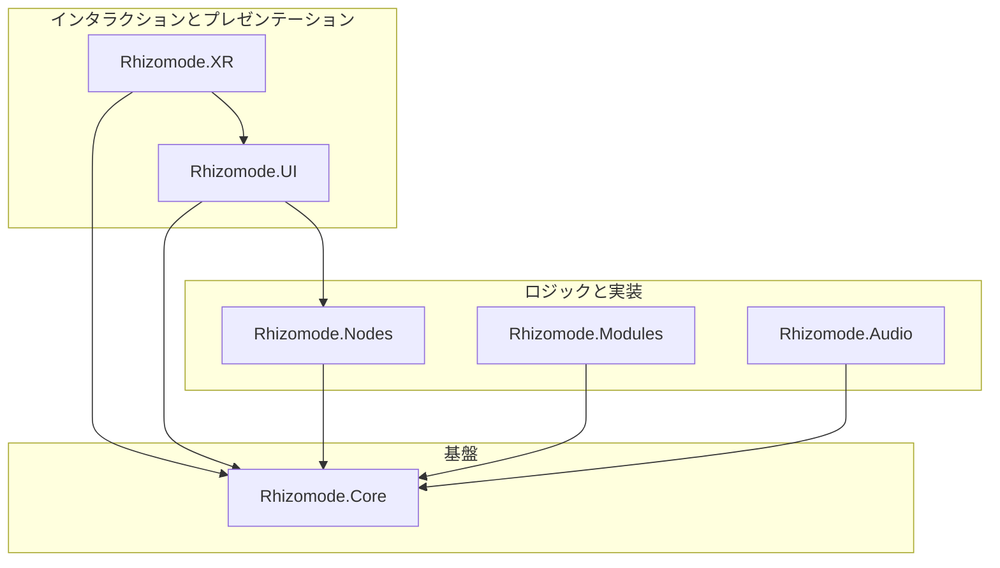
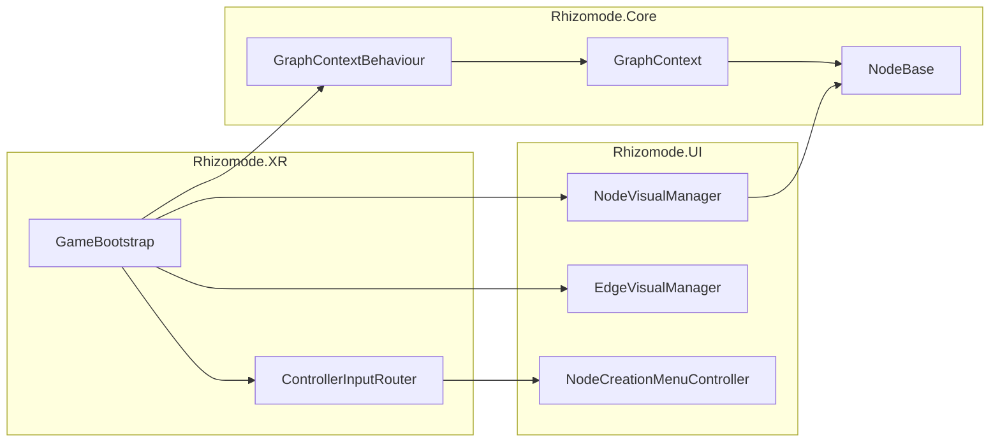

# 概要 (Overview)

関連ソースファイル

このWikiページの生成にあたって、以下のファイルがコンテキストとして使用されました：

- [CLAUDE.md](../../CLAUDE.md)
- [docs/CODING_GUIDELINES.md](../CODING_GUIDELINES.md)
- [docs/TECHNICAL_DESIGN.md](../TECHNICAL_DESIGN.md)
- [rhizomode/.gitignore](../../rhizomode/.gitignore)
- [rhizomode/Assets/Runtime/XR/GameBootstrap.cs](../../rhizomode/Assets/Runtime/XR/GameBootstrap.cs)
- [rhizomode/Assets/Scenes/SampleScene.unity](../../rhizomode/Assets/Scenes/SampleScene.unity)

**rhizomode** は、アーティストがリアルタイム3D環境内でノードグラフを構築・操作するためのVRライブパフォーマンスツールです [docs/TECHNICAL_DESIGN.md:3-5]()。中核となる思想は「構築こそパフォーマンス (construction-as-performance)」であり、ノードを接続しシグナルをルーティングする行為そのものが観客への視覚的なショーとなります [docs/TECHNICAL_DESIGN.md:7-7]()。

本システムは **Unity 6** と **Universal Render Pipeline (URP)** をベースとし、ノード間の高頻度なシグナルフローを **R3** (Reactive Extensions for Unity) で処理します [CLAUDE.md:15-17]()。

## 目的と主要コンセプト (Purpose and Key Concepts)

本ツールは PCVR (Quest Link) を使うソロパフォーマー向けに最適化されています [CLAUDE.md:7-10]()。従来の静的なノードエディタとは異なり、rhizomode は以下を実現します：
*   **Live Building (ライブ構築)**: パフォーマンス中にロジックや映像ルーティングをゼロから構築する [docs/TECHNICAL_DESIGN.md:9-9]()。
*   **Reactive Signal Flow (リアクティブなシグナルフロー)**: プッシュベースモデルにより、変更がグラフ全体に即座に伝播する [docs/TECHNICAL_DESIGN.md:213-215]()。
*   **Performance Modules (パフォーマンスモジュール)**: ノードインタフェースを通じて VFX Graph、Shader、Cinemachine を直接制御する [docs/TECHNICAL_DESIGN.md:31-32]()。

初期セットアップ、ハードウェア要件、パッケージ依存関係の詳細については **[プロジェクト設定と構成](./Project-Setup-&-Configuration.md)** を参照してください。

## システムアーキテクチャ (System Architecture)

rhizomode は循環依存を防止し安定した「Open/Closed原則」に基づく設計を保証するため、Assembly Definition (`.asmdef`) によって強制される厳格な階層アーキテクチャに従います [docs/TECHNICAL_DESIGN.md:42-60]()。

### 階層依存図 (Layered Dependency Diagram)
この図は、高レベルのインタラクション層から基盤コアへの依存関係の流れを示します。

ソース: [docs/TECHNICAL_DESIGN.md:44-58](), [CLAUDE.md:22-26]()

### アセンブリの内訳 (Assembly Breakdown)
| アセンブリ | 責務 |
| :--- | :--- |
| `Rhizomode.Core` | 基本型 (`ParamType`)、インタフェース (`IOutputPort`, `IInputPort`)、`GraphContext` [docs/TECHNICAL_DESIGN.md:45-45]()。 |
| `Rhizomode.Nodes` | math・time・utility 系ノードの具象実装 [docs/TECHNICAL_DESIGN.md:46-46]()。 |
| `Rhizomode.Modules` | ノードグラフと Unity 描画コンポーネント (VFX, Shader) を橋渡し [docs/TECHNICAL_DESIGN.md:47-47]()。 |
| `Rhizomode.UI` | ワールドスペースVR UI、ノードビジュアル、生成メニュー [docs/TECHNICAL_DESIGN.md:48-48]()。 |
| `Rhizomode.XR` | コントローラ入力の取得とインタラクションハンドラーへのルーティング [docs/TECHNICAL_DESIGN.md:49-49]()。 |
| `Rhizomode.Audio` | オーディオ入力を解析し、トリガーやレベルをグラフへ提供 [docs/TECHNICAL_DESIGN.md:50-50]()。 |

アセンブリ構造と依存ルールの詳細については **[アーキテクチャとアセンブリ定義](./Architecture-&-Assembly-Definitions.md)** を参照してください。

## コアエンティティとシグナルフロー (Core Entities and Signal Flow)

本システムは複数の主要クラスを通じて、VRインタラクションとコード実行のギャップを埋めます。`GameBootstrap` クラスは、ランタイム時にこれらのシステムを結線する中心的オーケストレーターとして機能します [rhizomode/Assets/Runtime/XR/GameBootstrap.cs:11-12]()。

### システム結線図 (System Wiring Diagram)
高レベルの XR コンポーネントが、基盤となる Core/UI エンティティとどのように連携するかを示します。

ソース: [rhizomode/Assets/Runtime/XR/GameBootstrap.cs:13-23](), [rhizomode/Assets/Runtime/XR/GameBootstrap.cs:80-86](), [docs/TECHNICAL_DESIGN.md:170-190]()

## 主要な外部依存 (Key External Dependencies)

本プロジェクトはリアクティビティとVRハードウェア対応のため、特定のライブラリ群に依存しています：
*   **R3**: UniRx の後継。すべてのノード間通信に使用 [docs/TECHNICAL_DESIGN.md:66-66]()。
*   **XR Interaction Toolkit (XRI)**: VR コントローラトラッキングとレイキャストの基盤を提供 [docs/TECHNICAL_DESIGN.md:68-68]()。
*   **NuGetForUnity**: R3 および関連C#ライブラリ依存の管理 [docs/TECHNICAL_DESIGN.md:67-67]()。
*   **Unity UI Toolkit**: ノード向けの高品質なワールドスペースUIパネルのレンダリングに使用 [docs/TECHNICAL_DESIGN.md:71-71]()。

## 子ページ (Child Pages)
*   **[プロジェクト設定と構成](./Project-Setup-&-Configuration.md)**: Unity のバージョン、パッケージマニフェスト、初期環境セットアップの詳細。
*   **[アーキテクチャとアセンブリ定義](./Architecture-&-Assembly-Definitions.md)**: `asmdef` 構造、Open/Closed原則、コーディング規約の詳説。

---
