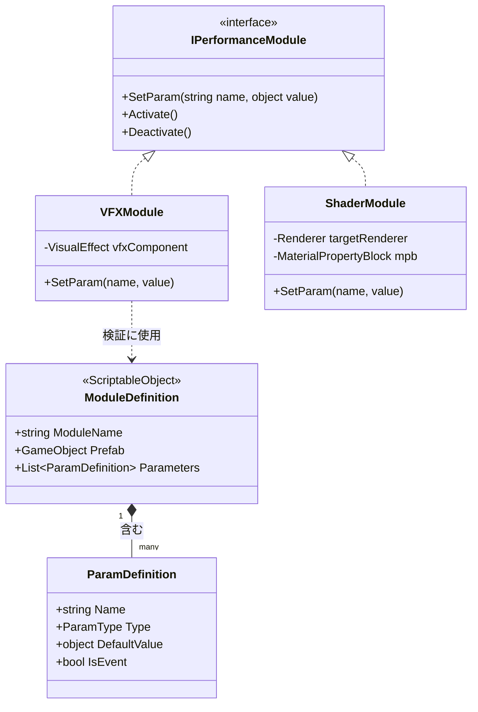

# パフォーマンスモジュールと ModuleDefinition (Performance Modules & ModuleDefinition)

<details>
<summary>関連ソースファイル</summary>

このWikiページの生成にあたって、以下のファイルがコンテキストとして使用されました：

- [docs/CODING_GUIDELINES.md](../CODING_GUIDELINES.md)
- [docs/TECHNICAL_DESIGN.md](../TECHNICAL_DESIGN.md)
- [rhizomode/Assets/Runtime/Core/Edge.cs](../../rhizomode/Assets/Runtime/Core/Edge.cs)

</details>


**パフォーマンスモジュール** システムは、リアクティブなノードグラフとリアルタイムな視覚・聴覚エフェクトの橋渡しを担います。外部システム (VFX Graph、Shader、Cinemachine) がグラフのシグナルによって制御されるための標準インタフェースを定義する一方、`Rhizomode.Modules` および `Rhizomode.Core` アセンブリにより厳格なアーキテクチャ的疎結合が維持されます。

### システム概要とデータフロー

パフォーマンスモジュールはノードグラフのシグナルの「シンク (受信先)」として機能します。`IPerformanceModule` インタフェースにより、`ModuleDefinition` で定義された同一のパラメータセットを通じて、基盤技術を問わずあらゆるコンポーネントを制御できます。

**モジュール制御のデータフロー**
1. ノード (例: `VFXModuleNode`) がグラフから値を受け取る。
2. ノードが `IPerformanceModule.SetParam` を呼び出す。
3. モジュール実装 (例: `VFXModule`) がパラメータ名を内部状態 (例: `VisualEffect.SetFloat`) へマッピング。
4. 防御的チェックにより、未知のパラメータや型不一致がパフォーマンスをクラッシュさせないよう保証。

**自然言語からコードエンティティへのマッピング**
| 概念 | コードエンティティ | 役割 |
|:---|:---|:---|
| **モジュールインタフェース** | `IPerformanceModule` | パラメータ設定とライフサイクルの契約。 |
| **パラメータメタデータ** | `ModuleDefinition` | モジュールが持つ入力を定義する ScriptableObject。 |
| **データ仕様** | `ParamDefinition` | ポートの名前・型・デフォルト値を定義。 |
| **安全なフォールバック** | `ParamDefaults` | データが欠落・無効な場合に使用される静的定数。 |

**パフォーマンスモジュールのインタラクション図**
タイトル: パフォーマンスモジュールのシグナルフロー
```mermaid
graph LR
    subgraph "グラフレイヤー"
        [NodeBase] -- "SetOutput<T>" --> [GraphContext]
        [GraphContext] -- "Observable<T>" --> [VFXModuleNode]
    end

    subgraph "モジュールレイヤー"
        [VFXModuleNode] -- "SetParam(name, value)" --> [IPerformanceModule]
        [IPerformanceModule] -- "実装" --> [VFXModule_Concrete]
        [ModuleDefinition] -- "定義" --> [VFXModule_Concrete]
    end

    subgraph "エンジンレイヤー"
        [VFXModule_Concrete] -- "適用" --> [VisualEffect_Component]
        [VFXModule_Concrete] -- "適用" --> [MaterialPropertyBlock]
    end
```
ソース: [docs/TECHNICAL_DESIGN.md:21-40](), [docs/TECHNICAL_DESIGN.md:169-190](), [docs/CODING_GUIDELINES.md:97-106]()

---

### IPerformanceModule インタフェース

`IPerformanceModule` インタフェースはコアロジックと視覚実装の主要な境界です。**Open/Closed原則** に従い、コアグラフロジックを修正することなく新たな視覚システムを追加できます。

*   **`SetParam(string paramName, object value)`**: モジュールへデータをプッシュする主要メソッド。実装側で型キャストを内部処理することが期待される [docs/CODING_GUIDELINES.md:103-105]()。
*   **`Activate() / Deactivate()`**: 視覚効果の有効化/無効化に使うライフサイクルメソッド。多くの場合グラフ内の `Bool` シグナルによってトリガーされる [docs/TECHNICAL_DESIGN.md:94-94]()。

**防御的実装パターン**
ライブパフォーマンス中の安定性を保証するため、モジュールは `SetParam` を `try-catch` ブロックで実装し、例外がリアクティブストリームへ逆伝播しないようにする必要があります。
ソース: [docs/CODING_GUIDELINES.md:127-132](), [docs/CODING_GUIDELINES.md:177-194]()

---

### ModuleDefinition と ParamDefinition

`ModuleDefinition` はパフォーマンスモジュール用のマニフェストとして機能する `ScriptableObject` です。エディタおよびノードグラフが、特定のモジュールインスタンス用にどのポートを生成すべきかを把握できるようにします。

#### ParamDefinition
モジュール内の各パラメータは `ParamDefinition` 構造体／クラスで定義され、以下を含みます：
*   **Name**: `SetParam` で使用される識別子。
*   **ParamType**: (Float、Color、Bool) [docs/TECHNICAL_DESIGN.md:83-90]()。
*   **Default Value**: シグナルが接続されていない場合のフォールバック値。
*   **isEvent (フラグ)**: `Bool` 型専用。連続的な状態ではなくワンショットイベント (VFX Graph Event など) としてパラメータを発火させるかを示す。

#### ParamDefaults
接続が切断された場合やモジュール初期化時、システムは既知の状態を保つために `ParamDefaults` を参照します。

| 型 | デフォルト値 |
|:---|:---|
| **Float** | `0.0f` |
| **Color** | `Color.black` |
| **Bool** | `false` |

ソース: [docs/TECHNICAL_DESIGN.md:281-286](), [docs/CODING_GUIDELINES.md:209-214](), [docs/CODING_GUIDELINES.md:251-251]()

---

### 計画中の実装 (Planned Implementations)

本アーキテクチャは `IPerformanceModule` インタフェースの複数の具象実装をサポートし、それぞれが特定の Unity サブシステムへマッピングされます。

#### 1. VFXModule
**Unity VFX Graph** を制御。
*   `Float` パラメータを `VisualEffect.SetFloat` へマッピング。
*   `Bool` (isEvent) を `VisualEffect.SendEvent` へマッピング。
*   モジュールノード生成時、グラフ内に `ConstFloat` または `ConstColor` ノードを自動生成し、即座に制御を提供 [docs/TECHNICAL_DESIGN.md:281-284]()。

#### 2. ShaderModule
`MaterialPropertyBlock` を介して **Renderer のマテリアル** を制御。
*   `MaterialPropertyBlock` を用いてシェーダ uniform を更新し、マテリアルインスタンスを生成しないため、長時間パフォーマンスでもメモリリークが発生しません [docs/CODING_GUIDELINES.md:304-307]()。
*   主な用途: 音声解析に基づくグローバルカラー、ディストーション強度、テクスチャタイリングなどの変更。

#### 3. CinemachineModule と EnvironmentModule
*   **Cinemachine**: 仮想カメラのウェイト、FOV、ノイズプロファイルを制御。
*   **Environment**: Skybox の露光量、Fog の密度、Global Illumination 設定などを制御 [docs/TECHNICAL_DESIGN.md:229-231]()。

**エンティティ関連図**
タイトル: ModuleDefinition と具象実装

ソース: [docs/TECHNICAL_DESIGN.md:31-33](), [docs/TECHNICAL_DESIGN.md:229-231](), [docs/CODING_GUIDELINES.md:34-36](), [docs/CODING_GUIDELINES.md:97-106]()

---
