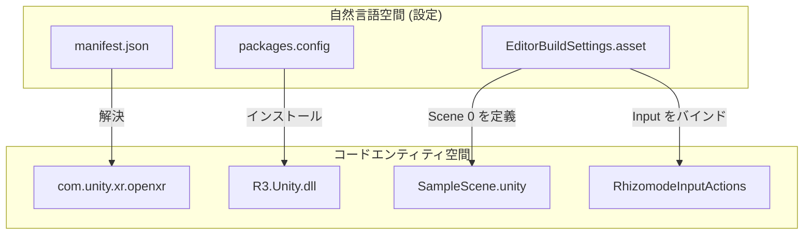
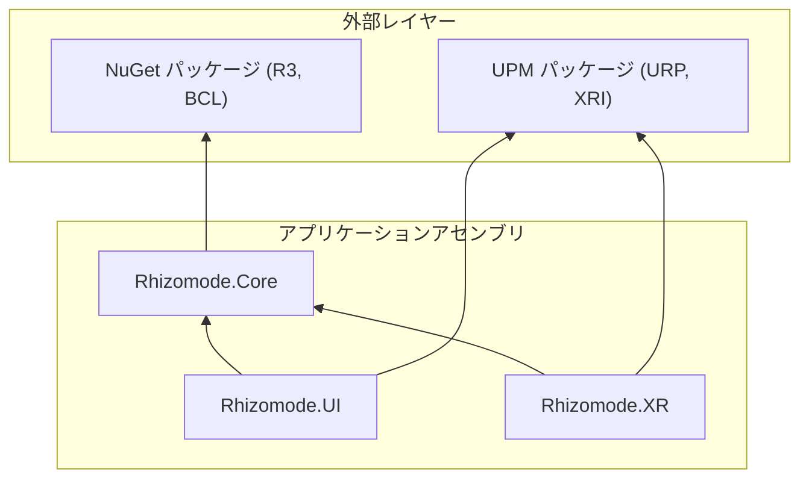

# プロジェクト設定と構成 (Project Setup & Configuration)

関連ソースファイル

このWikiページの生成にあたって、以下のファイルがコンテキストとして使用されました：

- [rhizomode/.gitignore](../../rhizomode/.gitignore)
- [rhizomode/Packages/manifest.json](../../rhizomode/Packages/manifest.json)
- [rhizomode/Packages/nuget-packages/NuGet.config](../../rhizomode/Packages/nuget-packages/NuGet.config)
- [rhizomode/Packages/nuget-packages/package.json](../../rhizomode/Packages/nuget-packages/package.json)
- [rhizomode/Packages/nuget-packages/packages.config](../../rhizomode/Packages/nuget-packages/packages.config)
- [rhizomode/Packages/packages-lock.json](../../rhizomode/Packages/packages-lock.json)
- [rhizomode/ProjectSettings/EditorBuildSettings.asset](../../rhizomode/ProjectSettings/EditorBuildSettings.asset)

本ページでは、**rhizomode** プロジェクトを開発・ビルドするために必要な技術的環境と構成を説明します。ディレクトリ構造、Unity のバージョニング、UPM と NuGet によるパッケージ管理、XR ハードウェア構成について網羅します。

## 環境とバージョン (Environment & Versioning)

rhizomode は **Unity 6** (内部の URP コンポーネントはバージョン 17.3.0) を用いて構築されており、PC およびスタンドアロンVR にまたがるクロスプラットフォーム性能のために **Universal Render Pipeline (URP)** を採用しています。

| コンポーネント | バージョン / 仕様 |
| :--- | :--- |
| **Unity Editor** | Unity 6 (2023.3+) |
| **Render Pipeline** | Universal Render Pipeline (URP) [Packages/manifest.json:12]() |
| **Scripting Backend** | IL2CPP (ビルド推奨) |
| **API Compatibility** | .NET Standard 2.1 [Packages/nuget-packages/NuGet.config:16]() |

## ディレクトリ構成と Git 構成 (Directory Layout & Git Configuration)

本プロジェクトは標準的な Unity の構成に従い、一時ファイルや IDE 固有ファイルを除外するよう設定されています。

### バージョン管理からの除外
`.gitignore` は、リポジトリを清浄に保つため、一般的な Unity 成果物と IDE 固有メタデータを除外するよう設定されています：
*   **Unity 成果物**: `Library/`, `Temp/`, `Obj/`, `Build/` [rhizomode/.gitignore:6-9]()。
*   **IDE メタデータ**: `.vs/`, `.gradle/`, `*.csproj`, `*.sln` [rhizomode/.gitignore:35-45]()。
*   **NuGet 成果物**: `Packages/nuget-packages/InstalledPackages*` [rhizomode/.gitignore:105]()。

### 主要ディレクトリ構造
*   `Assets/`: `SampleScene.unity` を含むプロジェクト固有アセット [ProjectSettings/EditorBuildSettings.asset:9]()。
*   `Packages/`: UPM 用 `manifest.json` と R3 依存用の `nuget-packages/` サブディレクトリを含む。
*   `ProjectSettings/`: XR と Input 設定を含むグローバルなプロジェクト構成。

## パッケージ依存 (Package Dependencies)

本プロジェクトは2つの主要システムで依存を管理しています：Unity 固有機能向けの **Unity Package Manager (UPM)** と、R3 リアクティブフレームワーク向けの **NuGetForUnity** です。

### Unity Package Manager (UPM)
主要な依存は `Packages/manifest.json` で定義され、`Packages/packages-lock.json` でロックされています。

*   **Reactive Framework (R3)**: Git URL 経由で統合 [Packages/manifest.json:4]()。
*   **XR インフラ**: `com.unity.xr.interaction.toolkit` (3.3.1)、`com.unity.xr.management` (4.5.0)、`com.unity.xr.openxr` (1.13.2) [Packages/manifest.json:17-20]()。
*   **ユーティリティ**: Model-Context Protocol サポート用の `com.coplaydev.unity-mcp` [Packages/manifest.json:3]()。
*   **ツール**: .NET アセンブリ管理用の `com.github-glitchenzo.nugetforunity` [Packages/manifest.json:5]()。

### NuGetForUnity と R3
本プロジェクトは **R3** を主要なリアクティブエンジンとして使用します。R3 の Unity 固有コンポーネントは Git で取得し、コアの .NET アセンブリは NuGet で管理されます。

**設定済み NuGet パッケージ:**
*   `R3` (v1.3.0) [Packages/nuget-packages/packages.config:5]()。
*   `Microsoft.Bcl.TimeProvider` (v8.0.0) [Packages/nuget-packages/packages.config:4]()。
*   `System.Threading.Channels` (v8.0.0) [Packages/nuget-packages/packages.config:7]()。

ソース: [Packages/manifest.json:1-56](), [Packages/packages-lock.json:1-28](), [Packages/nuget-packages/packages.config:1-8]()

## XR 構成とビルド設定 (XR Configuration & Build Settings)

rhizomode は VR ファーストのアプリケーションとして設計されており、ハードウェア抽象化に OpenXR 規格を採用しています。

### XR Loader 設定
本プロジェクトは複数の XR Loader をサポートし、ビルド設定の `m_configObjects` で構成します：
1.  **OpenXR**: クロスプラットフォーム互換性のための主要 Loader [ProjectSettings/EditorBuildSettings.asset:15]()。
2.  **Oculus/Meta**: Quest ハードウェアに特化した最適化 [ProjectSettings/EditorBuildSettings.asset:12]()。
3.  **XR Management**: `com.unity.xr.management.loader_settings` のライフサイクル管理 [ProjectSettings/EditorBuildSettings.asset:14]()。

### ビルド構成
アプリケーションの主要エントリーポイントは `Assets/Scenes/SampleScene.unity` です [ProjectSettings/EditorBuildSettings.asset:9]()。Input System は `guid: 052faaac586de48259a63d0c4782560b` にある特定の Actions アセットを使うよう設定されています [ProjectSettings/EditorBuildSettings.asset:13]()。

### セットアップのデータフロー
次の図は、設定ファイルがランタイム上の「コードエンティティ空間」へどのようにマッピングされるかを示します。

**設定からランタイムエンティティへのマッピング**

ソース: [ProjectSettings/EditorBuildSettings.asset:1-17](), [Packages/manifest.json:17-20]()

## 依存フローアーキテクチャ (Dependency Flow Architecture)

プロジェクト構成は、循環参照を防ぎ安定性を確保するために、厳格な依存階層を保証します。

**システム依存グラフ**

### 主要なセットアップ関数
設定の大部分はファイルベースですが、プロジェクト初期化は次のロジックに依存します（詳細は後続セクションで説明）：
*   **NuGet 復元**: プロジェクトを開いた際に `NuGetForUnity` が管理し、アセンブリを `Packages/nuget-packages` に配置 [Packages/nuget-packages/NuGet.config:13]()。
*   **XR 初期化**: プロジェクト設定で定義された `XRGeneralSettings` と `XRLoader` ライフサイクルにより管理 [ProjectSettings/EditorBuildSettings.asset:14]()。

ソース: [Packages/nuget-packages/NuGet.config:1-18](), [Packages/packages-lock.json:1-21]()

---
