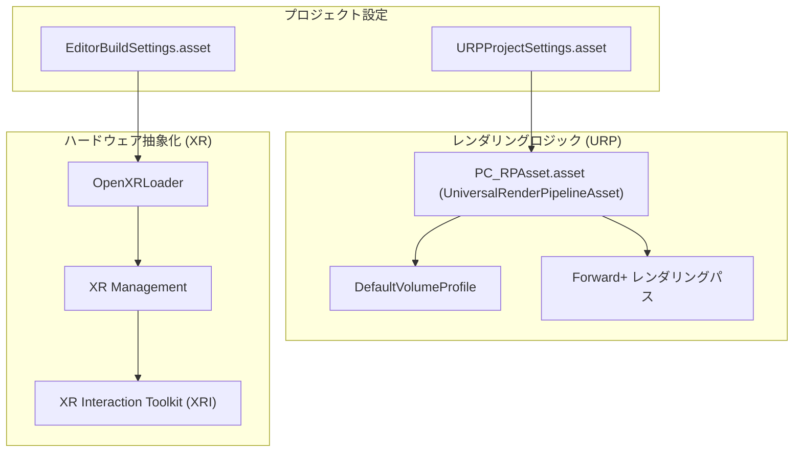

# レンダリングとプロジェクト設定 (Rendering & Project Settings)

関連ソースファイル

このWikiページの生成にあたって、以下のファイルがコンテキストとして使用されました：

- [rhizomode/Assets/Settings/PC_RPAsset.asset](../../rhizomode/Assets/Settings/PC_RPAsset.asset)
- [rhizomode/Packages/manifest.json](../../rhizomode/Packages/manifest.json)
- [rhizomode/Packages/packages-lock.json](../../rhizomode/Packages/packages-lock.json)
- [rhizomode/ProjectSettings/EditorBuildSettings.asset](../../rhizomode/ProjectSettings/EditorBuildSettings.asset)
- [rhizomode/ProjectSettings/URPProjectSettings.asset](../../rhizomode/ProjectSettings/URPProjectSettings.asset)

このセクションでは、Rhizomode のプロジェクト全体に関わるレンダリングおよびハードウェア設定を概説します。本プロジェクトは **Universal Render Pipeline (URP)** バージョン 17.3.0 [rhizomode/Packages/manifest.json:12-12]() を利用し、PC ベースのパフォーマンス向け高品質ビジュアルと、VR ヘッドセットのパフォーマンス要件のバランスを取っています。

Rhizomode は OpenXR 標準を通じてローカル PC レンダリングと XR ハードウェアの両方をサポートするよう構成されており、様々な VR デバイスにわたる互換性を確保しつつ、ノードグラフとパフォーマンスモジュールに一貫した視覚スタイルを維持します。

### システム概要図: レンダリングとハードウェア
次の図は、Unity プロジェクト設定、URP アセット、XR ハードウェア抽象化レイヤー間の関係を示します。

**レンダリングとハードウェアのアーキテクチャ**

**ソース:** [rhizomode/ProjectSettings/URPProjectSettings.asset:12-16](), [rhizomode/Assets/Settings/PC_RPAsset.asset:12-17](), [rhizomode/ProjectSettings/EditorBuildSettings.asset:12-15](), [rhizomode/Packages/manifest.json:17-20]()。

---

## 6.1 URP レンダーパイプライン設定 (URP Render Pipeline Configuration)
主なレンダリング設定は `PC_RPAsset.asset` で定義されます。本プロジェクトは高品質な PC VR 出力向けにチューニングされており、パフォーマンス環境での奥行きと明瞭さを保証するため、**HDR レンダリング**や **4 段カスケードシャドウ** などの機能を活用します [rhizomode/Assets/Settings/PC_RPAsset.asset:26-26, 58-58]()。

主要なパフォーマンス最適化：
*   **SRP Batcher:** ドローコール送信時の CPU オーバヘッド削減のため有効化 [rhizomode/Assets/Settings/PC_RPAsset.asset:72-72]()。
*   **アップスケーリング:** **FSR (FidelityFX Super Resolution)** をシャープネス 0.92 でサポートし、低内部解像度でも視覚的忠実度を維持 [rhizomode/Assets/Settings/PC_RPAsset.asset:30-32]()。
*   **ポストプロセス:** `DefaultVolumeProfile` 経由で管理。アンビエントオクルージョンの品質改善のため、青色ノイズディザリング付き SSAO 設定を含む [rhizomode/Assets/Settings/PC_RPAsset.asset:95-95, 118-119]()。

具体的なレンダリング機能、シェーダーバリアントの除去、モバイル向けアセットとの比較については [URP レンダーパイプライン設定](./URP-Render-Pipeline-Configuration.md) を参照してください。

**ソース:** [rhizomode/Assets/Settings/PC_RPAsset.asset:1-144]()。

---

## 6.2 XR ハードウェアと OpenXR 設定 (XR Hardware & OpenXR Configuration)
Rhizomode は **OpenXR** 標準を活用し、幅広い VR ハードウェアをターゲットにします [rhizomode/Packages/manifest.json:20-20]()。XR 設定は Unity XR Management システムを通じて管理され、`OpenXRLoader` と `Oculus` プロバイダーのロードを調整します [rhizomode/ProjectSettings/EditorBuildSettings.asset:12-15]()。

インタラクションレイヤーは **XR Interaction Toolkit (XRI)** の上に構築されており、物理ハードウェア入力を統一的なシステムに抽象化し、`Rhizomode.XR` アセンブリで利用されます [rhizomode/Packages/manifest.json:17-17]()。これにより、ハードウェア固有のコード無しに、同一のノード操作ロジックが異なるコントローラ (例: Meta Quest、Valve Index) で動作します。

OpenXR パッケージ設定、インタラクションレイヤーマスク、エディタテスト用 XR Device Simulator の詳細は [XR ハードウェアと OpenXR 設定](./XR-Hardware-&-OpenXR-Configuration.md) を参照してください。

**ソース:** [rhizomode/Packages/manifest.json:17-20](), [rhizomode/ProjectSettings/EditorBuildSettings.asset:12-15]()。

---

### プロジェクト構成サマリー

| 機能 | 構成 / 値 |
| :--- | :--- |
| **Unity バージョン** | Unity 6 (Render Pipeline 17.3.0) |
| **レンダーパイプライン** | Universal Render Pipeline (URP) |
| **メインレンダーアセット** | `PC_RPAsset` [rhizomode/Assets/Settings/PC_RPAsset.asset:13-13]() |
| **シャドウ品質** | 4 カスケード、2048 解像度 [rhizomode/Assets/Settings/PC_RPAsset.asset:46-58]() |
| **XR プロバイダー** | OpenXR / Oculus [rhizomode/Packages/manifest.json:19-20]() |
| **入力システム** | Unity Input System 1.18.0 [rhizomode/Packages/manifest.json:10-10]() |

**ソース:** [rhizomode/Packages/manifest.json:1-56](), [rhizomode/Assets/Settings/PC_RPAsset.asset:1-144]()。

---
