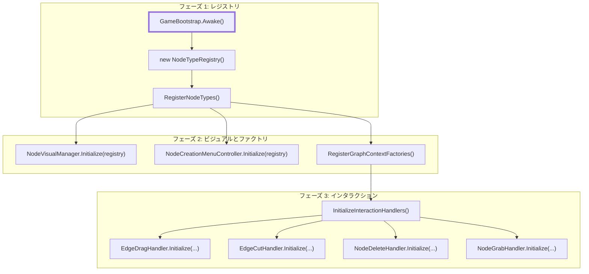
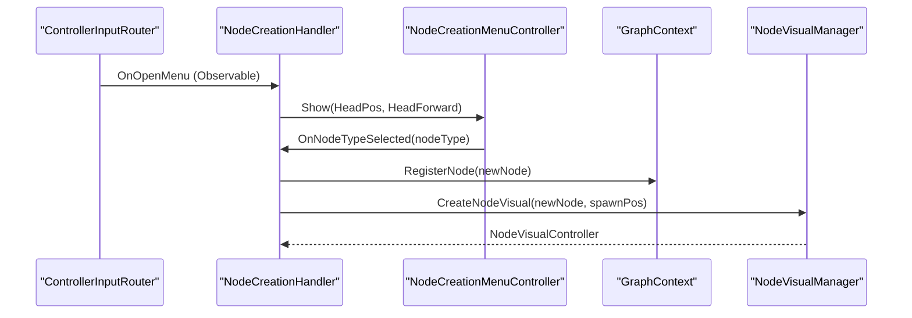

# シーンブートストラップと初期化順序 (Scene Bootstrap & Initialization Order)

関連ソースファイル

このWikiページの生成にあたって、以下のファイルがコンテキストとして使用されました：

- [rhizomode/Assets/Runtime/UI/NodeVisualController.cs](../../rhizomode/Assets/Runtime/UI/NodeVisualController.cs)
- [rhizomode/Assets/Runtime/UI/USS/NodePanel.uss](../../rhizomode/Assets/Runtime/UI/USS/NodePanel.uss)
- [rhizomode/Assets/Runtime/XR/ControllerInputRouter.cs](../../rhizomode/Assets/Runtime/XR/ControllerInputRouter.cs)
- [rhizomode/Assets/Runtime/XR/GameBootstrap.cs](../../rhizomode/Assets/Runtime/XR/GameBootstrap.cs)
- [rhizomode/Assets/Runtime/XR/NodeCreationHandler.cs](../../rhizomode/Assets/Runtime/XR/NodeCreationHandler.cs)
- [rhizomode/Assets/Scenes/SampleScene.unity](../../rhizomode/Assets/Scenes/SampleScene.unity)

本ページでは rhizomode システムの初期化シーケンスを解説します。ブートストラップ処理は `GameBootstrap` クラスを中心とし、ノードタイプレジストリの生成、システム配線、インタラクションハンドラーへの依存性注入をオーケストレートします。

## 初期化シーケンス概要 (Initialization Sequence Overview)

初期化は厳密な順序に従い、ユーザーインタラクション開始までに、コアロジック・視覚システム・インタラクションハンドラーが適切に接続されていることを保証します。このシーケンスは `GameBootstrap.Awake()` によってトリガーされます [rhizomode/Assets/Runtime/XR/GameBootstrap.cs:27-32]()。

### 1. レジストリの構築
`NodeTypeRegistry` がインスタンス化され、利用可能なすべてのノード型のメタデータが投入されます。このレジストリは UI とファクトリシステムの「Source of Truth」となります [rhizomode/Assets/Runtime/XR/GameBootstrap.cs:34-54]()。

### 2. ビジュアルと UI の初期化
構築済みレジストリを用いて `NodeVisualManager` と `NodeCreationMenuController` を初期化します。これにより、ノードカテゴリ毎のボタンを生成メニューが動的に組み立てられるようになります [rhizomode/Assets/Runtime/XR/GameBootstrap.cs:60-68]()。

### 3. ファクトリ登録
`NodeCreationHandler` (VRメニューからの新規ノード生成用) と `GraphContext` (グラフレベル操作用) の両方にファクトリを登録します。現状では `DummyNode` 実装が使用されます [rhizomode/Assets/Runtime/XR/GameBootstrap.cs:134-154]()。

### 4. インタラクションハンドラーへの注入
最後に `InitializeInteractionHandlers()` が呼び出され、XR インタラクションレイヤー全体で依存性注入を行い、コントローラ、Ray Provider、ビジュアルマネージャを結線します [rhizomode/Assets/Runtime/XR/GameBootstrap.cs:88-132]()。

## システム配線図 (System Wiring Diagram)

次の図は、ブートストラップの各フェーズを具体的なコードエンティティとメソッド呼び出しにマッピングします。

**ブートストラップフローと依存性注入**

ソース: [rhizomode/Assets/Runtime/XR/GameBootstrap.cs:27-32](), [rhizomode/Assets/Runtime/XR/GameBootstrap.cs:56-86](), [rhizomode/Assets/Runtime/XR/GameBootstrap.cs:88-132]()

## シーンオブジェクト階層 (Scene Object Hierarchy)

`SampleScene.unity` はこのブートストラップ処理を支援するよう構成されています。主要コンポーネントは設定を集約するため "Game Manager" オブジェクト配下に配置されています。

| オブジェクト名 | 主要コンポーネント | 責務 |
|:---|:---|:---|
| **Game Manager** | `GameBootstrap` | 起動シーケンス全体をオーケストレート [rhizomode/Assets/Runtime/XR/GameBootstrap.cs:11-23]()。 |
| | `GraphContextBehaviour` | ランタイムの `GraphContext` 状態を保持 [rhizomode/Assets/Runtime/XR/GameBootstrap.cs:13]()。 |
| | `NodeVisualManager` | ノード GameObject のインスタンス化を管理 [rhizomode/Assets/Runtime/XR/GameBootstrap.cs:14]()。 |
| | `EdgeVisualManager` | グラフ接続用 LineRenderer を管理 [rhizomode/Assets/Runtime/XR/GameBootstrap.cs:18]()。 |
| **XR Origin** | `ControllerInputRouter` | OpenXR アクションを R3 Observable にマッピング [rhizomode/Assets/Runtime/XR/ControllerInputRouter.cs:15]()。 |
| **Node Creation Menu**| `NodeCreationMenuController`| VR ワールドスペースのノード選択 UI を処理 [rhizomode/Assets/Runtime/XR/GameBootstrap.cs:15]()。 |

ソース: [rhizomode/Assets/Scenes/SampleScene.unity:136-153](), [rhizomode/Assets/Runtime/XR/GameBootstrap.cs:13-23]()

## 詳細データフロー: ノード生成 (Detailed Data Flow: Node Creation)

メニューからノードが生成される際、データはブートストラップ時に初期化された複数のシステムを経由して流れます。

**ノードスポーンロジック**

ソース: [rhizomode/Assets/Runtime/XR/NodeCreationHandler.cs:31-42](), [rhizomode/Assets/Runtime/XR/NodeCreationHandler.cs:52-69](), [rhizomode/Assets/Runtime/XR/NodeCreationHandler.cs:71-108]()

## 主要な初期化関数 (Key Initialization Functions)

### RegisterNodeTypes()
ハードコードされた `NodeTypeInfo` エントリで `NodeTypeRegistry` を構築します。これにより、ファクトリシステムが使用するカテゴリ (Input、Math、Time、Utility) と内部型文字列が定義されます [rhizomode/Assets/Runtime/XR/GameBootstrap.cs:34-54]()。

### InitializeInteractionHandlers()
VR インタラクションに必要な複雑な依存関係を解決するメソッドです。
* **Ray Provider**: `ControllerInputRouter` を `IRayProvider` にキャストし、レイキャストが必要な全ハンドラー (Delete、Grab、Edge Cut) に渡す [rhizomode/Assets/Runtime/XR/GameBootstrap.cs:92]()。
* **相互参照**: `EdgeDragHandler` などのハンドラーは、ポート位置取得用に `NodeVisualManager`、接続コミット用に `GraphContext` への参照を受け取る [rhizomode/Assets/Runtime/XR/GameBootstrap.cs:99-105]()。

### RegisterGraphContextFactories()
`GraphContext` が型文字列からノードロジックをインスタンス化できることを保証します。これは手動生成と将来の JSON デシリアライゼーション両方で必須です [rhizomode/Assets/Runtime/XR/GameBootstrap.cs:145-154]()。

ソース: [rhizomode/Assets/Runtime/XR/GameBootstrap.cs:34-54](), [rhizomode/Assets/Runtime/XR/GameBootstrap.cs:88-132](), [rhizomode/Assets/Runtime/XR/GameBootstrap.cs:145-154]()

---
