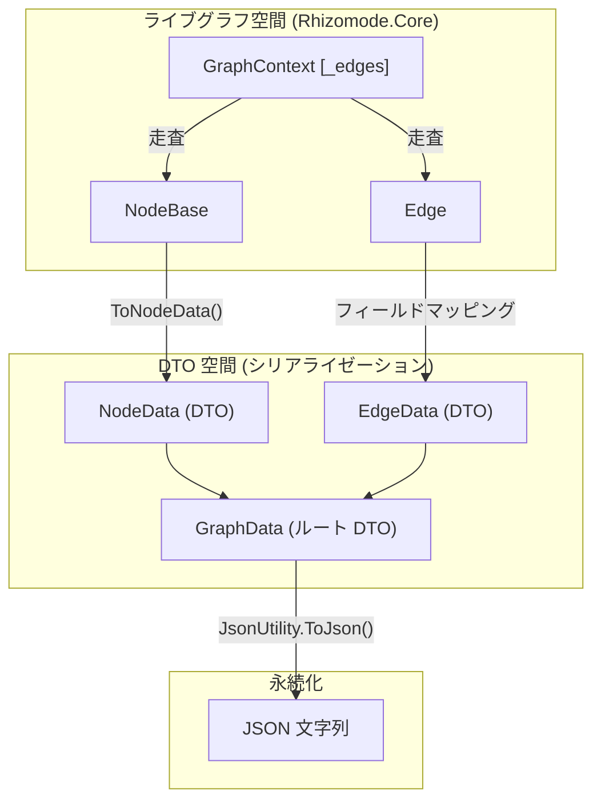
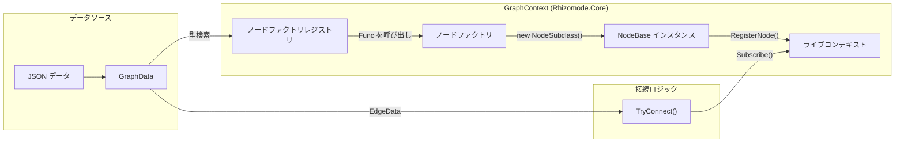

# シリアライゼーションとデータ転送オブジェクト (Serialization & Data Transfer Objects)

関連ソースファイル

このWikiページの生成にあたって、以下のファイルがコンテキストとして使用されました：

- [docs/CODING_GUIDELINES.md](../CODING_GUIDELINES.md)
- [docs/TECHNICAL_DESIGN.md](../TECHNICAL_DESIGN.md)
- [rhizomode/Assets/Runtime/Core/Edge.cs](../../rhizomode/Assets/Runtime/Core/Edge.cs)

**rhizomode** のシリアライゼーションシステムは、ノードグラフの状態をポータブルな JSON 形式へ永続化するために設計されています。これにより、パフォーマンスセットアップを保存し、別のセッションでも読み込めるようになります。本システムはフラットなデータ転送オブジェクト (DTO) 構造を用いてノードと接続を表現し、複雑なリアクティブグラフを確実に再構築できるよう保証します。

### シリアライゼーション概要

| コンポーネント | 役割 |
| :--- | :--- |
| **DTOs** | `GraphData`、`NodeData`、`EdgeData` は JSON 変換のための plain-old-data コンテナとして機能 [docs/TECHNICAL_DESIGN.md:187-190]()。 |
| **GraphContext** | ライブな `NodeBase` インスタンスと `GraphData` DTO 間の変換をオーケストレーション [rhizomode/Assets/Runtime/Core/GraphContext.cs:115-116]()。 |
| **ノードファクトリ** | デシリアライズ時に文字列の型識別子から対応する `NodeBase` サブクラスをインスタンス化するために登録される関数群 [rhizomode/Assets/Runtime/Core/GraphContext.cs:15-16]()。 |

---

### データ転送オブジェクト (DTOs)

シリアライゼーション形式は、ネストされたツリーではなく、ノードとエッジを単純な配列に格納する「フラット」構造を採用します。これにより JSON 構造がシンプル化され、シリアライズ時の循環参照問題が回避されます [docs/TECHNICAL_DESIGN.md:149-161]()。

#### GraphData
シリアライズされたグラフのルートコンテナ。
- **Version**: 将来の破壊的変更に対応する形式バージョン用文字列フィールド [docs/CODING_GUIDELINES.md:112-121]()。
- **Nodes**: `NodeData` オブジェクトの配列。
- **Edges**: `EdgeData` オブジェクトの配列。

#### NodeData
個々のノードの状態を表現 [rhizomode/Assets/Runtime/Core/NodeBase.cs:150-161]()。
- **Id**: ノードの一意な文字列識別子。
- **NodeType**: クラスの文字列名 (例: `"ConstFloat"`、`"Multiply"`)。
- **Position**: VR 空間でのノードの `Vector3` 座標。

#### EdgeData
2つのポート間の接続を表現 [rhizomode/Assets/Runtime/Core/Edge.cs:10-27]()。
- **FromNodeId**: 送信元ノードの ID。
- **FromPort**: 出力ポート名。
- **ToNodeId**: 送信先ノードの ID。
- **ToPort**: 入力ポート名。

**ソース:** [docs/TECHNICAL_DESIGN.md:187-210](), [rhizomode/Assets/Runtime/Core/Edge.cs:10-27](), [rhizomode/Assets/Runtime/Core/NodeBase.cs:150-161]()

---

### シリアライゼーションのフロー

`GraphContext` クラスが保存・読み込みの主要インタフェースを提供します。内部にある `NodeBase` および `Edge` のコレクションを走査し、DTO を生成します。

#### データフロー: ライブグラフ → JSON
1. **Serialize() 呼び出し**: `GraphContext` 上でトリガー [rhizomode/Assets/Runtime/Core/GraphContext.cs:115]()。
2. **ノード変換**: `_nodes` 辞書中の各 `NodeBase` が `ToNodeData()` メソッドにより `NodeData` へ変換 [rhizomode/Assets/Runtime/Core/NodeBase.cs:150-161]()。
3. **エッジ変換**: `_edges` リスト中の各 `Edge` が `EdgeData` DTO へマッピング [rhizomode/Assets/Runtime/Core/Edge.cs:10-27]()。
4. **JSON エクスポート**: 生成された `GraphData` オブジェクトを Unity の `JsonUtility` へ渡して文字列化 [docs/TECHNICAL_DESIGN.md:75]()。

#### システムマッピング: シリアライゼーションロジック
次の図は、`GraphContext` 内のライブオブジェクトから永続的な JSON 形式へのデータフローをマッピングします。

「シリアライゼーションロジックのマッピング」

**ソース:** [rhizomode/Assets/Runtime/Core/GraphContext.cs:115-130](), [docs/TECHNICAL_DESIGN.md:75](), [rhizomode/Assets/Runtime/Core/NodeBase.cs:150-161]()

---

### デシリアライゼーションとノードファクトリ (Deserialization & Node Factories)

`NodeBase` は抽象クラスのため、`GraphContext` は文字列の型名からノードを直接インスタンス化できません。そのため、特定のノード生成ロジックをランタイムで登録するファクトリパターンを採用します。

#### ノードファクトリの登録
システム初期化時 (通常は `GameBootstrap`)、ノードファクトリが `GraphContext` に登録されます [rhizomode/Assets/Runtime/Core/GraphContext.cs:15-20]()。
- **メソッド**: `RegisterNodeFactory(string nodeType, Func<NodeData, NodeBase> factory)` [rhizomode/Assets/Runtime/Core/GraphContext.cs:25-29]()。
- **目的**: `"VFXModule"` のような文字列を、新しい `VFXModuleNode` インスタンスを返す関数へマッピング。

#### デシリアライゼーション手順
1. **状態クリア**: `GraphContext` 内の既存ノードとエッジをクリア [rhizomode/Assets/Runtime/Core/GraphContext.cs:120]()。
2. **ノードのインスタンス化**: 各 `NodeData` について、コンテキストが `NodeType` に対応する登録済みファクトリを検索しインスタンスを生成 [rhizomode/Assets/Runtime/Core/GraphContext.cs:122-125]()。
3. **ノード登録**: 新規インスタンスをコンテキストの内部レジストリへ追加。
4. **エッジ再構築**: 各 `EdgeData` について、`TryConnect()` を呼び出して R3 `Observable` 購読をポート間で再確立 [rhizomode/Assets/Runtime/Core/GraphContext.cs:127-130]()。

#### システムマッピング: ノード再構築
この図は、`GraphContext` が登録済みファクトリを用いて、フラットなデータを機能するコードエンティティへ復元する流れを示します。

「ノード再構築のマッピング」

**ソース:** [rhizomode/Assets/Runtime/Core/GraphContext.cs:25-29](), [rhizomode/Assets/Runtime/Core/GraphContext.cs:115-130](), [docs/TECHNICAL_DESIGN.md:165-190]()

---

### JSON 形式仕様 (JSON Format Specification)

本システムは安定性と前方互換性を保証するため、バージョン付き JSON スキーマを使用します。

| フィールド | 型 | 説明 |
| :--- | :--- | :--- |
| `version` | `string` | 形式バージョン (例: `"0.1.0"`)。スキーマ変更時にマイグレーションロジックを起動するために使用 [docs/CODING_GUIDELINES.md:112-121]()。 |
| `nodes` | `Array<NodeData>` | 全ノードのリスト。Position は `Vector3` として保存 [docs/TECHNICAL_DESIGN.md:150-161]()。 |
| `edges` | `Array<EdgeData>` | 全接続のリスト。ノードのリンクには `Id` 参照を使用 [rhizomode/Assets/Runtime/Core/Edge.cs:10-27]()。 |

#### 防御的ロード (Defensive Loading)
ライブパフォーマンス中の安定性を維持するため、デシリアライゼーション処理は防御的なブロックで包まれます。ノード型が未知 (ファクトリ未登録) であったり、ポート名が変更されていたりした場合でも、システムは警告ログを記録しつつ、グラフ残りの読み込みを継続します [docs/CODING_GUIDELINES.md:172-202]()。

**ソース:** [docs/CODING_GUIDELINES.md:112-121](), [docs/CODING_GUIDELINES.md:172-202](), [docs/TECHNICAL_DESIGN.md:149-210]()

---
