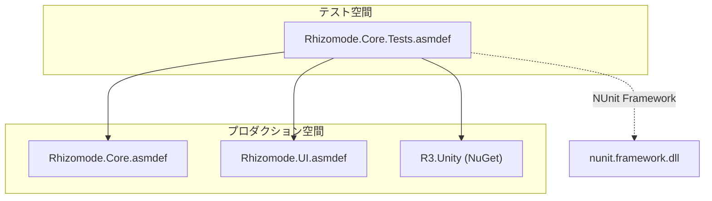
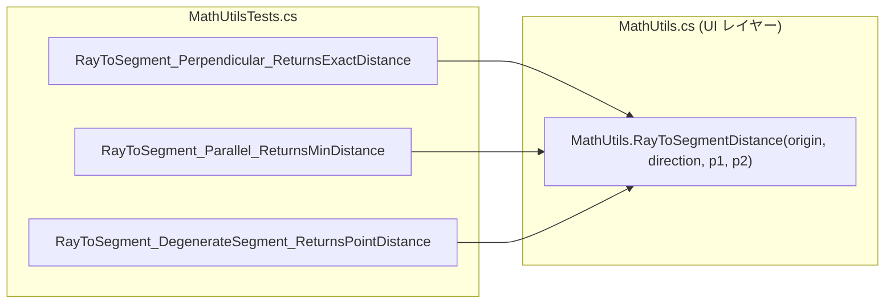

# テスト (Testing)

関連ソースファイル

このWikiページの生成にあたって、以下のファイルがコンテキストとして使用されました：

- [rhizomode/Assets/Tests/Editor/Core/MathUtilsTests.cs](../../rhizomode/Assets/Tests/Editor/Core/MathUtilsTests.cs)
- [rhizomode/Assets/Tests/Editor/Core/Rhizomode.Core.Tests.asmdef](../../rhizomode/Assets/Tests/Editor/Core/Rhizomode.Core.Tests.asmdef)

**rhizomode** のテスト戦略は、自動化された **EditMode** テストを通じて数学ユーティリティとコアロジックの安定性を確保することに重点を置きます。XR ハードウェアおよび空間インタラクションへの依存度が高いため、複雑な UX フローは現状 VR 内の手動テストで検証され、基礎レイヤーは単体テストによってシグナル処理およびデータ管理のリグレッションから守られます。

### テストアーキテクチャ (Testing Architecture)

自動テストは専用のアセンブリ定義に隔離されています。これにより、テストコードがプロダクションビルドに混入するのを防ぎ、VR ヘッドセット無しでも Unity Editor 内でロジック検証の高速イテレーションを可能にします。

| コンポーネント | 戦略 | 説明 |
| :--- | :--- | :--- |
| **コアロジック** | 自動 (EditMode) | 数学、シリアライゼーション、リアクティブシグナルフローの単体テスト。 |
| **UI/UX** | 手動 (VR) | ワールドスペースパネルのレンダリングとレイキャスト精度の検証。 |
| **XR インタラクション** | 手動 (VR/シミュレータ) | XR Device Simulator または Quest ハードウェアでのグラブ、ドラッグ、カットジェスチャー検証。 |
| **パフォーマンス** | 手動 | 複雑なグラフ実行時のフレームレートおよびサーマルスロットリングの監視。 |

#### テストアセンブリ定義
`Rhizomode.Core.Tests` アセンブリは **Editor** プラットフォームでのみ実行されるよう構成されており、レイヤー横断的ユーティリティのテストを促進するため `Rhizomode.Core` および `Rhizomode.UI` アセンブリへの参照を含みます。

**図: テストアセンブリの依存関係**

ソース: [rhizomode/Assets/Tests/Editor/Core/Rhizomode.Core.Tests.asmdef:1-25]()

---

### 7.1 コアレイヤーテスト (Core Layer Tests)

自動テストの主な対象は、エッジ操作で使われる重要な空間計算を扱う `MathUtils` クラスです。これらのテストは、VR でのエッジ切断に不可欠な `RayToSegmentDistance` ロジックが、様々な幾何学的なエッジケースにわたって正確であり続けることを保証します。

#### MathUtils の検証
`MathUtilsTests` クラスは、ユーザーのインタラクションレイとグラフ内の視覚的エッジ (線分) との間の距離計算を検証するための複数のテストケースを実装します。

*   **垂直および平行ケース**: レイがエッジに直交または平行な場合に距離が正しく計算されることを保証。
*   **退化線分**: 「ゼロ長」の線分 (始点と終点が同一) をシステムがクラッシュせずに処理することを検証。
*   **レイ背後のクランプ**: レイの原点より後方にある線分が無視または正しくクランプされることを確認。

**図: MathUtilsTests のロジックマッピング**

具体的なテスト実装とシリアライゼーション・シグナルフローの計画中カバレッジについては [コアレイヤーテスト](./Core-Layer-Tests.md) を参照してください。

ソース: [rhizomode/Assets/Tests/Editor/Core/MathUtilsTests.cs:9-71](), [rhizomode/Assets/Tests/Editor/Core/Rhizomode.Core.Tests.asmdef:1-25]()

---

### 7.2 コーディングガイドラインと安定性ルール (Coding Guidelines & Stability Rules)

テスト可能で安定したコードベースを維持するため、**rhizomode** はプロジェクトのコーディング標準で定義された厳格なアーキテクチャルールに従います。これらのルールは **Open/Closed 原則** を強調し、コアグラフエンジンを変更することなく新規ノード型を追加可能にします。

主な安定性パターン：
*   **インタフェース境界**: レイヤー間 (例: XR から Core) の通信はすべてインタフェース経由で行い、テストでのモック化を可能にする。
*   **防御的プログラミング**: `try-catch` ブロックと `ParamDefaults` を広範に利用し、特定ノードが失敗してもグラフが動作し続けることを保証。
*   **リアクティブな整合性**: `R3` Observable でシグナルフローを管理し、複雑なノードベースシステムにありがちな「スパゲッティコード」を防ぐ。

命名規則、メソッド長制限、Git コミット規約の詳細は [コーディングガイドラインと安定性ルール](./Coding-Guidelines-&-Stability-Rules.md) を参照してください。

ソース: [rhizomode/Assets/Tests/Editor/Core/Rhizomode.Core.Tests.asmdef:1-25]() (アセンブリ分離により暗黙的に強制)

---
