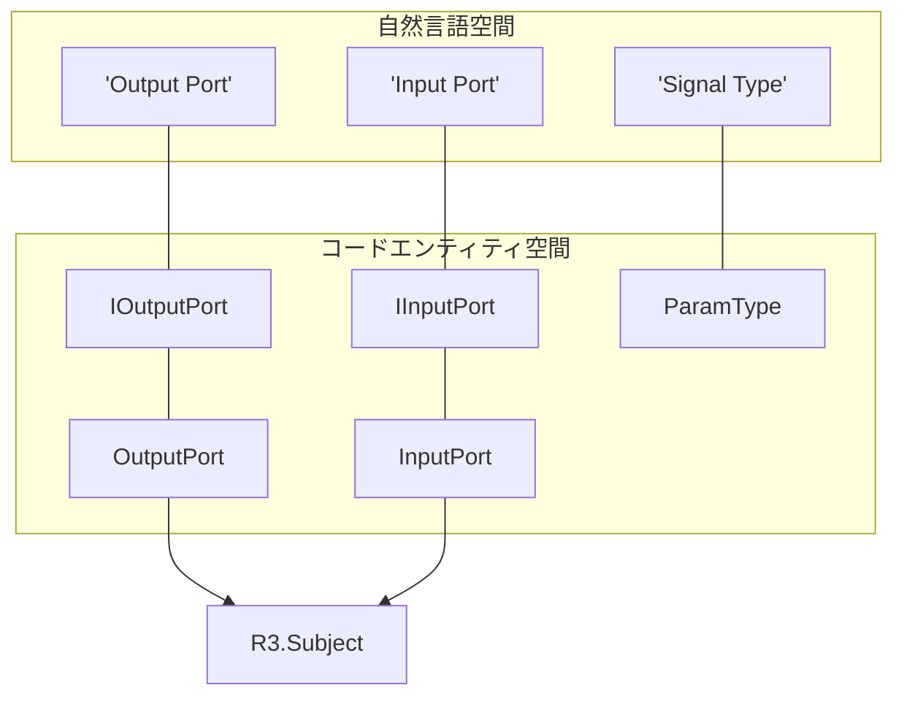
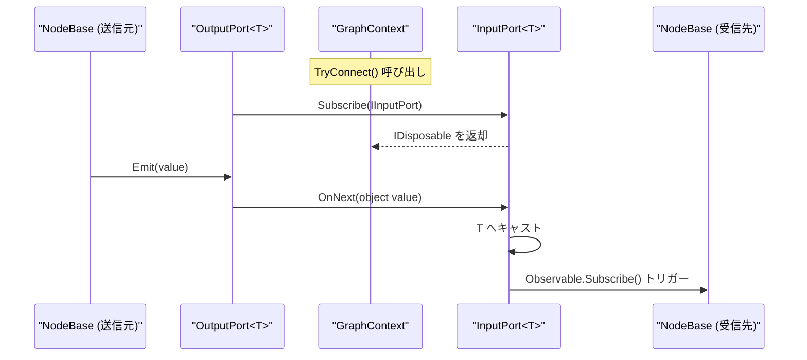

# 型システムとポート (Type System & Ports)

関連ソースファイル

このWikiページの生成にあたって、以下のファイルがコンテキストとして使用されました：

- [docs/CODING_GUIDELINES.md](../CODING_GUIDELINES.md)
- [docs/TECHNICAL_DESIGN.md](../TECHNICAL_DESIGN.md)
- [rhizomode/Assets/Runtime/Core/Edge.cs](../../rhizomode/Assets/Runtime/Core/Edge.cs)
- [rhizomode/Assets/Runtime/UI/IRayProvider.cs](../../rhizomode/Assets/Runtime/UI/IRayProvider.cs)

**rhizomode の型システム**は、ノード間データフローの基盤フレームワークを提供します。「拡張には開いており、修正には閉じている (Open/Closed原則)」の原則に基づいて設計されており、コア接続ロジックを変更することなく新しいデータ型を追加できます。シグナル伝播には **R3 (Reactive Extensions for Unity)** を採用し、データ更新が効率的にグラフ上をプッシュ伝播するよう設計されています。

## ParamType とデータエンティティ (ParamType & Data Entities)

rhizomode は、グラフを流れるすべてのデータを `ParamType` 列挙体で離散的に分類します。これらの型はポート間のやり取りや、エッジ色などのビジュアル描画方法を決定します。

### サポートされる型
現在、本システムは3つの主要型をサポートします：
- **Float**: パラメータモジュレーションに使われる連続値 (0.0 〜 1.0)。
- **Color**: 視覚効果のための HSV/RGB カラーデータ。
- **Bool**: バイナリのトリガーまたはゲート (VFX イベントやトグルなど)。

[docs/TECHNICAL_DESIGN.md:83-95]()

### デフォルト値
エッジケースや未接続状態でシステムがクラッシュしないよう、`ParamDefaults` がフォールバック定数を提供します。
- `Float`: 0.0f
- `Color`: 黒
- `Bool`: false

[docs/CODING_GUIDELINES.md:209-215]()

## ポートのインタフェースと実装 (Port Interfaces and Implementations)

ポートはあらゆるシグナルフローの端点 (エンドポイント) です。rhizomode はインタフェースベースの疎結合設計を採用しており、`GraphContext` はデータの具体的なジェネリック型を知る必要がありません。

### IOutputPort と IInputPort
これらのインタフェースはシグナル交換の契約を定めます。`IOutputPort` は購読を許可し、`IInputPort` はデータを受信するためのジェネリックな `OnNext(object)` メソッドを提供します。

[docs/TECHNICAL_DESIGN.md:99-110]()

### 具象実装
- **`OutputPort<T>`**: R3 の `Subject<T>` をラップします。ノード内部ロジック向けに `Observable<T>` を公開し、購読時に `IInputPort` へデータを変換します。
- **`InputPort<T>`**: 同じく R3 の `Subject<T>` をラップします。`OnNext` で汎用オブジェクトを受け取り、`T` にキャストして内部ストリームへプッシュします。

[docs/TECHNICAL_DESIGN.md:112-134]()

### ポートのマッピング (自然言語 ↔ コード)

次の図は、ユーザードキュメント上の概念的な「ポート」を、`Rhizomode.Core` アセンブリ内の具体的なクラスやインタフェースと対応付けます。

「ポートエンティティのマッピング」

ソース: [docs/TECHNICAL_DESIGN.md:99-134](), [docs/CODING_GUIDELINES.md:17-29]()

## 接続ロジックと型安全性 (Connection Logic & Type Safety)

接続は `GraphContext` で管理されます。接続が試行されると、システムは厳格な型安全性ルールを強制します。

### 接続ルール
1.  **型一致**: `IOutputPort` は、`ParamType` プロパティが同一の `IInputPort` にのみ接続可能。
2.  **Fan-out (分配)**: 1つの Output を複数の Input に接続可能 (シグナルの分配)。
3.  **Fan-in (合流)**: 複数の Output を1つの Input に接続可能。この場合シグナルはマージされ、`InputPort` が受信した最新値が支配的になります。
4.  **ライフサイクル**: すべての接続は `IDisposable` 購読を保持する `Edge` オブジェクトを生成します。

[docs/TECHNICAL_DESIGN.md:136-141](), [rhizomode/Assets/Runtime/Core/Edge.cs:10-27]()

### シグナルフローのアーキテクチャ

下の図は、R3 リアクティブ基盤を用いて、シグナルがプロデューサーノードからコンシューマーノードへ伝わる過程を示します。

「リアクティブシグナルフロー」

ソース: [docs/TECHNICAL_DESIGN.md:118-133](), [docs/TECHNICAL_DESIGN.md:176-180](), [docs/CODING_GUIDELINES.md:39-51]()

## ポート定義とメタデータ (Port Definitions & Metadata)

ノードはアクティブなポートのインスタンスをシリアライズ状態として保存しません。代わりに、`PortDefinition` を使ってインタフェースを記述します。

### PortDefinition
ポートのメタデータを記述する軽量な構造体／クラス：
- **Name**: ノード内でポートを一意に識別する識別子。
- **Direction**: `PortDirection` 列挙体で定義 (`Input` または `Output`)。
- **Type**: ポートの `ParamType`。

[docs/TECHNICAL_DESIGN.md:149-161]()

### エッジ管理 (Edge Management)
`Edge` クラスは定義同士をつなぐ「のり」として機能します。`FromNodeId`、`FromPort`、`ToNodeId`、`ToPort` を追跡します。実際のリアクティブ接続 (すなわち `IDisposable` 購読) は、`GraphContext` が管理する `Edge` インスタンス内に保存されます。

[rhizomode/Assets/Runtime/Core/Edge.cs:10-27](), [docs/TECHNICAL_DESIGN.md:200-209]()

## 実装サマリーテーブル (Implementation Summary Table)

| クラス／インタフェース | 役割 | 主な責務 |
| :--- | :--- | :--- |
| `ParamType` | Enum | データカテゴリ (Float, Color, Bool) を定義。 |
| `IOutputPort` | Interface | 型非依存にシグナルを購読する手段を提供。 |
| `IInputPort` | Interface | 型非依存にノードへデータをプッシュする手段を提供。 |
| `OutputPort<T>` | Class | `R3.Subject` を用いる具象シグナルプロデューサー。 |
| `InputPort<T>` | Class | `R3.Subject` を用いる具象シグナルコンシューマー。 |
| `PortDefinition` | Data | ポートの name・type・direction を記述するメタデータ。 |
| `Edge` | Class | 2つのポート間の `IDisposable` リンクを保持。 |

ソース: [docs/TECHNICAL_DESIGN.md:83-134](), [docs/TECHNICAL_DESIGN.md:200-209](), [rhizomode/Assets/Runtime/Core/Edge.cs:1-27]()

---
