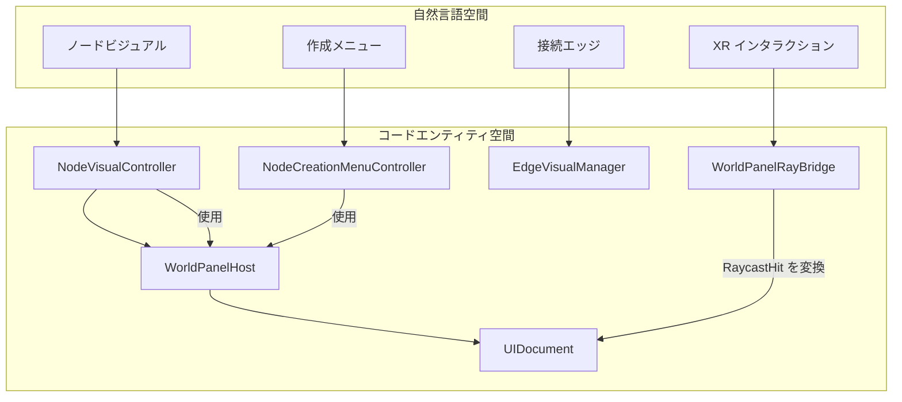
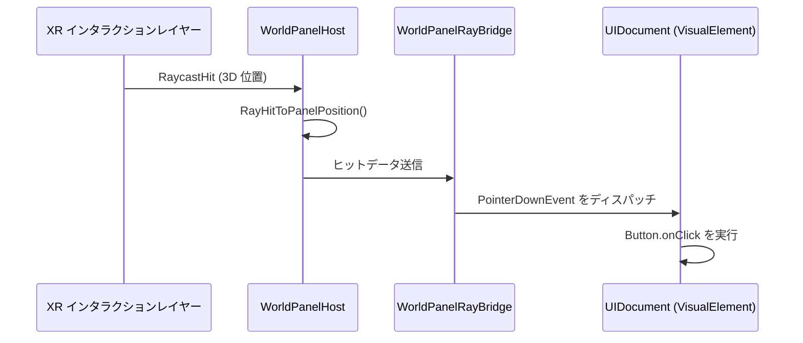

# UI レイヤー (UI Layer)

関連ソースファイル

このWikiページの生成にあたって、以下のファイルがコンテキストとして使用されました：

- [rhizomode/Assets/Runtime/UI/DefaultPanelSettings.asset](../../rhizomode/Assets/Runtime/UI/DefaultPanelSettings.asset)
- [rhizomode/Assets/Runtime/UI/DefaultPanelSettings.asset.meta](../../rhizomode/Assets/Runtime/UI/DefaultPanelSettings.asset.meta)
- [rhizomode/Assets/Runtime/UI/NodeCreationMenuController.cs](../../rhizomode/Assets/Runtime/UI/NodeCreationMenuController.cs)
- [rhizomode/Assets/Runtime/UI/NodeVisualManager.cs](../../rhizomode/Assets/Runtime/UI/NodeVisualManager.cs)
- [rhizomode/Assets/Runtime/UI/WorldPanelHost.cs](../../rhizomode/Assets/Runtime/UI/WorldPanelHost.cs)
- [rhizomode/Assets/Runtime/XR/Input/RhizomodeInputActions.inputactions](../../rhizomode/Assets/Runtime/XR/Input/RhizomodeInputActions.inputactions)

`Rhizomode.UI` アセンブリは、3D VR 環境内でのノードグラフの視覚表現を管理します。**Unity UI Toolkit** を活用し、物理的な XR レイキャストを標準 UI イベントに橋渡しするカスタムインフラを通じてワールドスペースへレンダリングします。本レイヤーは、ノードビジュアルのライフサイクル、接続エッジの描画、空間的なノード作成メニューを扱います。

### システム概要 (System Overview)

UI システムは「ワールドスペースパネル」アーキテクチャに基づいて構築されています。従来のスクリーンスペース UI ではなく、各インタフェース要素 (ノード、メニュー) は `WorldPanelHost` コンポーネントを持つ 3D GameObject であり、`UIDocument` を `RenderTexture` にマッピングし、これをプロシージャル Quad に適用します。

#### UI アーキテクチャブリッジ

**ソース:** [rhizomode/Assets/Runtime/UI/WorldPanelHost.cs:14-162](), [rhizomode/Assets/Runtime/UI/NodeVisualController.cs:1-20]()

---

### ワールドスペース UI インフラストラクチャ (World-Space UI Infrastructure)
UI レイヤーの基盤は `WorldPanelHost` で、2D の UXML レイアウトを 3D ワールドオブジェクトへ変換する処理を管理します。ランタイムで `RenderTexture` を生成し [rhizomode/Assets/Runtime/UI/WorldPanelHost.cs:92-99]()、`PanelSettings` を介して `UIDocument` に割り当て [rhizomode/Assets/Runtime/UI/WorldPanelHost.cs:101-115]()、URP の Unlit 透過マテリアルを用いてプロシージャル Quad メッシュに適用します [rhizomode/Assets/Runtime/UI/WorldPanelHost.cs:142-162]()。

インタラクションは `WorldPanelRayBridge` と `UIRaycastDriver` が担当します。これらのコンポーネントは XR レイキャストヒットを `PointerDownEvent` および `PointerUpEvent` インスタンスへ変換し、標準の `Button` や `VisualElement` のコールバックを 3D 空間で動作させます [rhizomode/Assets/Runtime/UI/WorldPanelHost.cs:81-90]()。

詳細は [ワールドスペース UI インフラストラクチャ](./World-Space-UI-Infrastructure.md) を参照してください。

**ソース:** [rhizomode/Assets/Runtime/UI/WorldPanelHost.cs:14-162](), [rhizomode/Assets/Runtime/UI/DefaultPanelSettings.asset:1-52]()

---

### ノードビジュアルシステム (Node Visual System)
`NodeVisualManager` はノード GameObject のファクトリとして機能します。ノードがグラフに追加されると、マネージャは `MeshRenderer`、`WorldPanelHost`、`NodeVisualController` を含む GameObject をインスタンス化します [rhizomode/Assets/Runtime/UI/NodeVisualManager.cs:113-133]()。

`NodeVisualController` は背後の `NodeBase` データを `NodePanel.uxml` レイアウトへバインドします。ノードの `PortDefinitions` に基づいてポート UI 要素を動的に生成し、`NodeCategory` に応じた視覚スタイル (色) を適用します [rhizomode/Assets/Runtime/UI/NodeVisualManager.cs:50-67]()。また、エッジレンダリングシステムに対してポートのワールド座標も提供します。

詳細は [ノードビジュアルシステム](./Node-Visual-System.md) を参照してください。

**ソース:** [rhizomode/Assets/Runtime/UI/NodeVisualManager.cs:15-90](), [rhizomode/Assets/Runtime/UI/NodeVisualController.cs:1-100]()

---

### ノード作成メニュー (Node Creation Menu)
`NodeCreationMenuController` は、新規ノードをスポーンするための空間メニューを管理します。2段階ナビゲーションシステムを備えます：
1.  **カテゴリリスト**: カテゴリ (Math、Input、Module など) を表示 [rhizomode/Assets/Runtime/UI/NodeCreationMenuController.cs:106-148]()。
2.  **ノードリスト**: 選択カテゴリ内で利用可能な具体的ノード種別を表示。`NodeTypeRegistry` から取得 [rhizomode/Assets/Runtime/UI/NodeCreationMenuController.cs:150-177]()。

メニューはアクティブ化時にユーザーの頭位置から 0.6m 前方にスポーンされます [rhizomode/Assets/Runtime/UI/NodeCreationMenuController.cs:17-19]()。

詳細は [ノード作成メニュー](./Node-Creation-Menu.md) を参照してください。

**ソース:** [rhizomode/Assets/Runtime/UI/NodeCreationMenuController.cs:15-184](), [rhizomode/Assets/Runtime/XR/Input/RhizomodeInputActions.inputactions:139-146]()

---

### エッジビジュアルシステム (Edge Visual System)
エッジはノード間のシグナルフローを表します。`EdgeVisualManager` は Unity の `LineRenderer` コンポーネントを用いてこれら接続を描画します。エッジは `ParamType` で色分けされます (例: Float = 青、Color = 金、Bool = 赤)。

このシステムは、`NodeVisualController` にポートのワールド位置を問い合わせることで、エッジ位置の毎フレーム更新を行います。また「エッジカット」機能では、`MathUtils.RayToSegmentDistance` を使用してユーザーのインタラクションレイと線分との距離を計算し、対象エッジを特定します。

詳細は [エッジビジュアルシステム](./Edge-Visual-System.md) を参照してください。

#### UI データフロー

**ソース:** [rhizomode/Assets/Runtime/UI/WorldPanelHost.cs:81-90](), [rhizomode/Assets/Runtime/UI/NodeCreationMenuController.cs:129-132]()

---
