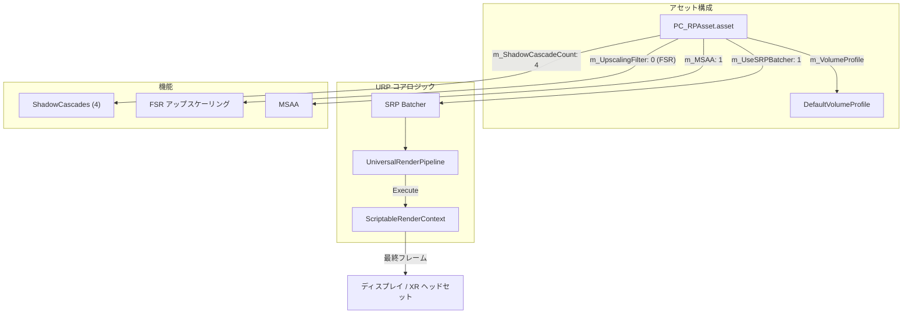
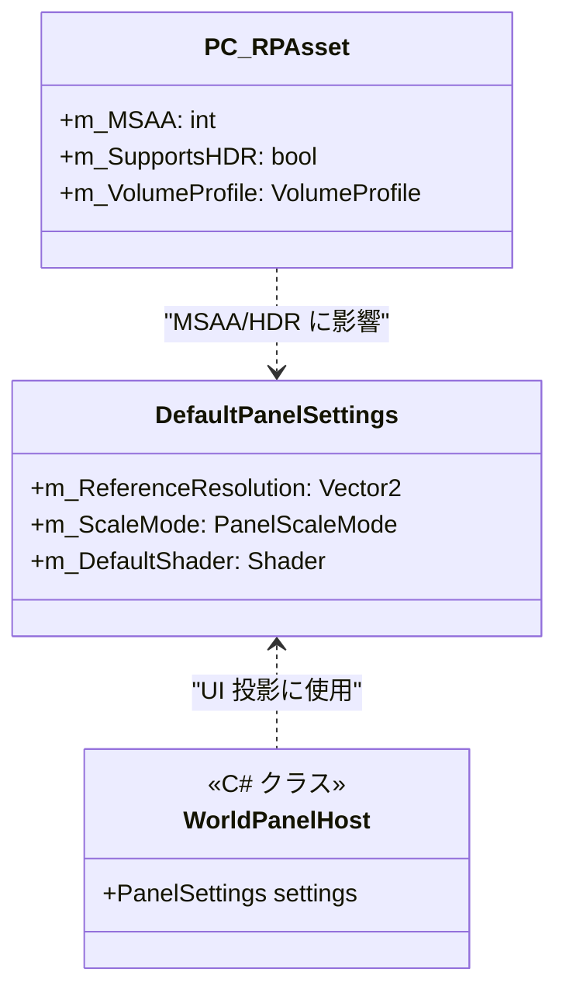

# URP レンダーパイプライン設定 (URP Render Pipeline Configuration)

関連ソースファイル

このWikiページの生成にあたって、以下のファイルがコンテキストとして使用されました：

- [rhizomode/Assets/Runtime/UI/DefaultPanelSettings.asset](../../rhizomode/Assets/Runtime/UI/DefaultPanelSettings.asset)
- [rhizomode/Assets/Runtime/UI/DefaultPanelSettings.asset.meta](../../rhizomode/Assets/Runtime/UI/DefaultPanelSettings.asset.meta)
- [rhizomode/Assets/Settings/PC_RPAsset.asset](../../rhizomode/Assets/Settings/PC_RPAsset.asset)
- [rhizomode/ProjectSettings/URPProjectSettings.asset](../../rhizomode/ProjectSettings/URPProjectSettings.asset)

このセクションでは、Rhizomode プロジェクトにおける Universal Render Pipeline (URP) の設定を詳述します。本プロジェクトは、PC およびモバイルターゲット双方で視覚品質とパフォーマンスのバランスを取るため、専用のパイプラインアセットを利用しており、特に MSAA、高品質シャドウ、アップスケーリング技術といった VR 対応機能に重点を置いています。

## PC レンダーパイプラインアセット (PC_RPAsset)

`PC_RPAsset` は、デスクトップおよびハイエンド VR 実行のための主要構成です。High Dynamic Range (HDR) レンダリングをサポートし、ドローコール送信最適化のために Scriptable Render Pipeline (SRP) Batcher を活用するよう構成されています [rhizomode/Assets/Settings/PC_RPAsset.asset:26-72]()。

### レンダリングおよび品質設定
このアセットでは深度およびオパークテクスチャの要求を有効化しており、これらは SSAO や深度ベースの UI インタラクションといった高度なエフェクトに必須です [rhizomode/Assets/Settings/PC_RPAsset.asset:22-23]()。

| 機能 | 設定 | 説明 |
| :--- | :--- | :--- |
| **HDR** | 有効 | ハイダイナミックレンジカラーバッファをサポート [rhizomode/Assets/Settings/PC_RPAsset.asset:26]()。 |
| **MSAA** | 有効 | エッジ平滑化のためのマルチサンプルアンチエイリアシング [rhizomode/Assets/Settings/PC_RPAsset.asset:28]()。 |
| **LOD クロスフェード** | 有効 | ディザリングを使った LOD レベル間のスムーズ遷移 [rhizomode/Assets/Settings/PC_RPAsset.asset:33-34]()。 |
| **アップスケーリング** | FSR | FidelityFX Super Resolution。シャープネス値 0.92 [rhizomode/Assets/Settings/PC_RPAsset.asset:30-32]()。 |
| **SRP Batcher** | 有効 | 静的・動的オブジェクトの CPU パフォーマンスを最適化 [rhizomode/Assets/Settings/PC_RPAsset.asset:72]()。 |

### シャドウ構成
パイプラインは 4 カスケードのシャドウシステムを実装しており、視点近傍では高解像度シャドウを維持しつつ、シャドウ距離を 50 ユニットまで延長します [rhizomode/Assets/Settings/PC_RPAsset.asset:57-58]()。

*   **解像度**: メインライトのシャドウマップ解像度は 2048 [rhizomode/Assets/Settings/PC_RPAsset.asset:46]()。
*   **カスケード**: 4 カスケード。スプリットは約 12%、29%、53% [rhizomode/Assets/Settings/PC_RPAsset.asset:61]()。
*   **ソフトシャドウ**: 「High」品質 (Quality Level 3) で有効化 [rhizomode/Assets/Settings/PC_RPAsset.asset:66-69]()。

### 高度なエフェクトとストリッピング
構成には DBuffer Decals および Screen Space Ambient Occlusion (SSAO) のサポートが含まれます [rhizomode/Assets/Settings/PC_RPAsset.asset:109-123]()。パフォーマンスとメモリ最適化のため、XR・SSAO・HDR 向けの事前フィルタリングキーワード経由でシェーダーバリアントストリッピングが構成されています [rhizomode/Assets/Settings/PC_RPAsset.asset:106-112]()。視覚的なノイズ分布を改善するため、64x64 テクスチャによる青色ノイズディザリングが統合されています [rhizomode/Assets/Settings/PC_RPAsset.asset:142]()。

**ソース:**
*   [rhizomode/Assets/Settings/PC_RPAsset.asset:1-144]()

## データフロー: レンダーパイプライン構成 (Data Flow: Render Pipeline Configuration)

次の図は、`PC_RPAsset` が URP システムとシーンの Volume Profile とどのように相互作用し、最終的なレンダリング出力を生成するかを示します。

**レンダーパイプラインアセットのデータフロー**

**ソース:**
*   [rhizomode/Assets/Settings/PC_RPAsset.asset:30-72]()
*   [rhizomode/Assets/Settings/PC_RPAsset.asset:95]()

## 比較: PC vs. モバイルパイプライン

`PC_RPAsset` が高品質 VR をターゲットとする一方、プロジェクト構成には `Mobile_RPAsset` (構成内で参照される) が含まれており、シャドウカスケード削減、上級ポストプロセス無効化といったプラットフォーム固有最適化を可能にし、スタンドアロン XR ハードウェアでの高フレームレートを維持します。

## ポストプロセスと UI レンダリング (Post-Processing and UI Rendering)

### Volume Profiles
グローバルレンダリング環境は、`PC_RPAsset` に割り当てられた `DefaultVolumeProfile` によって統御されます [rhizomode/Assets/Settings/PC_RPAsset.asset:95]()。このプロファイルには `SampleScene` 全体で使われる基本ポストプロセススタックが含まれます。

### UI Panel 設定
ワールドスペースのノードビジュアルに使用される UI Toolkit 統合は、`DefaultPanelSettings.asset` に依存します。このアセットは、参照解像度や UI アトラスのレンダリングに使うシェーダーなど、UI 要素がシーンへどうレンダリングされるかを定義します [rhizomode/Runtime/UI/DefaultPanelSettings.asset:13-27]()。

**UI レンダリング構成マッピング**

**ソース:**
*   [rhizomode/Assets/Settings/PC_RPAsset.asset:95]()
*   [rhizomode/Assets/Runtime/UI/DefaultPanelSettings.asset:13-44]()

## グローバル設定のまとめ

| カテゴリ | ファイルパス | 主な目的 |
| :--- | :--- | :--- |
| **パイプラインアセット** | `Assets/Settings/PC_RPAsset.asset` | PC 向けのレンダリング品質、シャドウ、機能サポートを定義。 |
| **プロジェクト設定** | `ProjectSettings/URPProjectSettings.asset` | プロジェクト全体のグローバル URP 構成 [rhizomode/ProjectSettings/URPProjectSettings.asset:12]()。 |
| **UI 設定** | `Assets/Runtime/UI/DefaultPanelSettings.asset` | ワールドスペースパネル向けの UI Toolkit スケーリング・シェーダー定義 [rhizomode/Assets/Runtime/UI/DefaultPanelSettings.asset:15-27]()。 |

**ソース:**
*   [rhizomode/ProjectSettings/URPProjectSettings.asset:1-17]()
*   [rhizomode/Assets/Settings/PC_RPAsset.asset:1-144]()
*   [rhizomode/Assets/Runtime/UI/DefaultPanelSettings.asset:1-53]()

---
