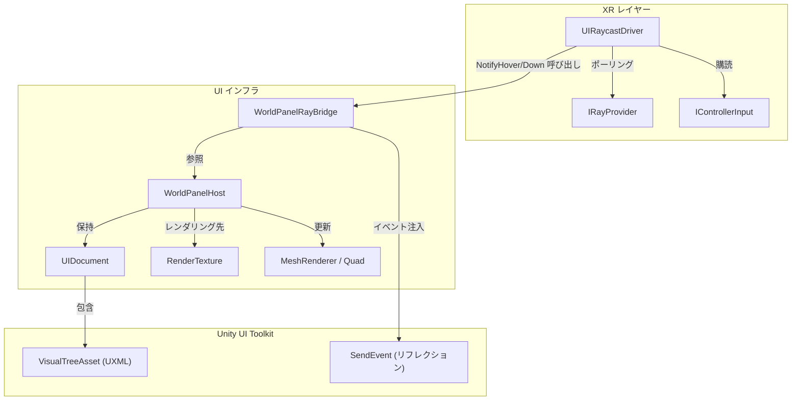
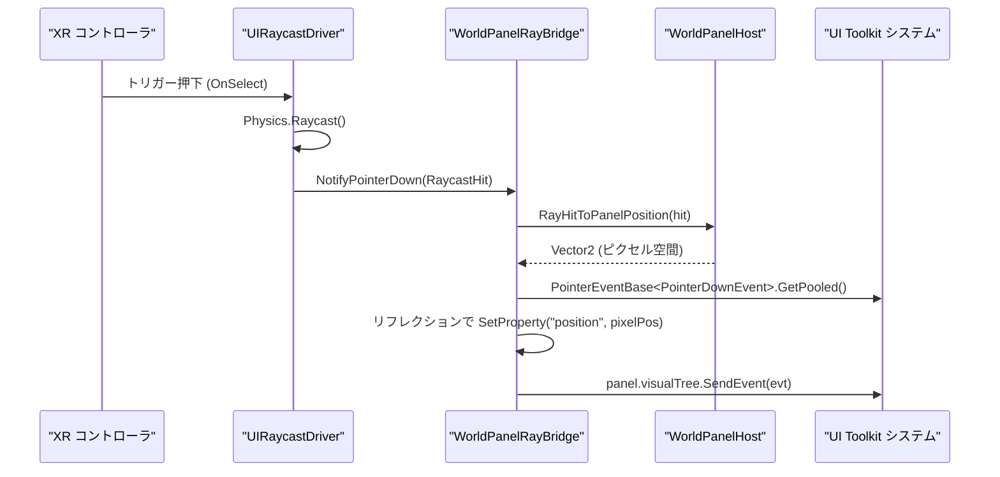

# ワールドスペース UI インフラストラクチャ (World-Space UI Infrastructure)

関連ソースファイル

このWikiページの生成にあたって、以下のファイルがコンテキストとして使用されました：

- [rhizomode/Assets/Runtime/UI/DefaultPanelSettings.asset](../../rhizomode/Assets/Runtime/UI/DefaultPanelSettings.asset)
- [rhizomode/Assets/Runtime/UI/DefaultPanelSettings.asset.meta](../../rhizomode/Assets/Runtime/UI/DefaultPanelSettings.asset.meta)
- [rhizomode/Assets/Runtime/UI/NodeCreationMenuController.cs](../../rhizomode/Assets/Runtime/UI/NodeCreationMenuController.cs)
- [rhizomode/Assets/Runtime/UI/WorldPanelHost.cs](../../rhizomode/Assets/Runtime/UI/WorldPanelHost.cs)
- [rhizomode/Assets/Runtime/UI/WorldPanelRayBridge.cs](../../rhizomode/Assets/Runtime/UI/WorldPanelRayBridge.cs)
- [rhizomode/Assets/Runtime/XR/UIRaycastDriver.cs](../../rhizomode/Assets/Runtime/XR/UIRaycastDriver.cs)
- [rhizomode/Assets/Runtime/XR/UIRaycastDriver.cs.meta](../../rhizomode/Assets/Runtime/XR/UIRaycastDriver.cs.meta)

ワールドスペース UI インフラストラクチャは、Unity 標準の UI Toolkit (`UIDocument`) と 3D VR 環境の橋渡しを担います。ワールドスペースオブジェクトへの高性能な UI レンダリングを可能にし、VR コントローラからの物理ベースのレイキャストを、ホバー、クリック、ドラッグといった標準 UI イベントへ変換します。

## コアコンポーネントとデータフロー (Core Components and Data Flow)

本システムは3つの主要レイヤーで構成されます：**Host** (レンダリング)、**Bridge** (イベント変換)、**Driver** (入力ポーリング)。

### レンダリングパイプライン: WorldPanelHost
`WorldPanelHost` は `UIDocument` の 3D 空間内での視覚表現を担当します。動的に `RenderTexture` を生成し、プロシージャル生成された Quad メッシュに URP の Unlit 透過マテリアルを介して適用します。

*   **初期化**: `Initialize` メソッド [rhizomode/Assets/Runtime/UI/WorldPanelHost.cs:58-66]() で `RenderTexture` を設定し、`PanelSettings` を複製 [rhizomode/Assets/Runtime/UI/WorldPanelHost.cs:101-115]()、`UIDocument` を構成します。
*   **メッシュ生成**: 標準的な Quad メッシュを生成し [rhizomode/Assets/Runtime/UI/WorldPanelHost.cs:169-198]()、`worldWidth` と `worldHeight` に基づき `Transform` をスケーリング [rhizomode/Assets/Runtime/UI/WorldPanelHost.cs:138-139]()。
*   **座標マッピング**: `RayHitToPanelPosition` 関数 [rhizomode/Assets/Runtime/UI/WorldPanelHost.cs:81-90]() が `RaycastHit.textureCoord` (UV) を UI Toolkit 用のピクセル座標へ変換。UV 空間 (左下原点) と UI Toolkit 空間 (左上原点) 間の Y 軸反転を考慮します。

### イベント変換: WorldPanelRayBridge
`WorldPanelRayBridge` は、生の `RaycastHit` データをリフレクション経由で `PointerDownEvent` および `PointerUpEvent` へ変換します。UI Toolkit のイベントプロパティは通常 protected のため、この方法を採用しています。

*   **Picking**: `panel.Pick(position)` を用いて [rhizomode/Assets/Runtime/UI/WorldPanelRayBridge.cs:47]() レイ下にある `VisualElement` を特定。
*   **イベント注入**: `PointerEventBase` の `pointerId` や `position` などのプロパティが protected のため、`SendPointerEventWithReflection<T>` [rhizomode/Assets/Runtime/UI/WorldPanelRayBridge.cs:91-114]() で `BindingFlags.NonPublic` を用いて値を設定してから、`SendEvent` でディスパッチ [rhizomode/Assets/Runtime/UI/WorldPanelRayBridge.cs:108]()。
*   **ホバー管理**: `.hover` CSS クラスを管理し [rhizomode/Assets/Runtime/UI/WorldPanelRayBridge.cs:18]()、レイが要素の境界に出入りする際に手動で追加/削除 [rhizomode/Assets/Runtime/UI/WorldPanelRayBridge.cs:121-128]()。

### 入力ドライバ: UIRaycastDriver
`UIRaycastDriver` は XR レイヤー内のオーケストレーターとして機能し、入力プロバイダーをポーリングしてアクティブなブリッジを更新します。

*   **ポーリング**: 毎フレーム、`IRayProvider` からレイを取得し [rhizomode/Assets/Runtime/XR/UIRaycastDriver.cs:42]()、`Physics.Raycast` を実行 [rhizomode/Assets/Runtime/XR/UIRaycastDriver.cs:44]()。
*   **状態管理**: `_currentBridge` を追跡し、ユーザーが特定パネルを指し示すのをやめた際に `NotifyHoverExit` を確実に呼び出す [rhizomode/Assets/Runtime/XR/UIRaycastDriver.cs:95-103]()。
*   **リアクティブ入力**: R3 を用いて `IControllerInput.OnSelect` を購読 [rhizomode/Assets/Runtime/XR/UIRaycastDriver.cs:34-36]()、対象ブリッジで `NotifyPointerDown` および `NotifyPointerUp` をトリガー。

**ソース:**
* [rhizomode/Assets/Runtime/UI/WorldPanelHost.cs:14-198]()
* [rhizomode/Assets/Runtime/UI/WorldPanelRayBridge.cs:16-129]()
* [rhizomode/Assets/Runtime/XR/UIRaycastDriver.cs:15-108]()

## システムアーキテクチャ図 (System Architecture Diagrams)

### コンポーネント関連
この図は、UI のレンダリングとインタラクションのためにインフラコンポーネントがどのように連携するかを示します。

**ソース:**
* [rhizomode/Assets/Runtime/UI/WorldPanelHost.cs:117-127]()
* [rhizomode/Assets/Runtime/UI/WorldPanelRayBridge.cs:11-14]()
* [rhizomode/Assets/Runtime/XR/UIRaycastDriver.cs:29-36]()

### 入力イベントフロー
この図は、ハードウェアのトリガー押下が UI ボタンクリックへ変換される過程を追跡します。

**ソース:**
* [rhizomode/Assets/Runtime/XR/UIRaycastDriver.cs:70-93]()
* [rhizomode/Assets/Runtime/UI/WorldPanelRayBridge.cs:64-75]()
* [rhizomode/Assets/Runtime/UI/WorldPanelHost.cs:81-90]()

## 設定とデフォルト (Configuration and Defaults)

### DefaultPanelSettings
ワールドスペースパネル全体で一貫したレンダリングを保証するため、本プロジェクトでは専用の `PanelSettings` アセットを使用します。

| プロパティ | 値 | 説明 |
| :--- | :--- | :--- |
| **Scale Mode** | `ConstantPixelSize` [rhizomode/Assets/Runtime/UI/WorldPanelHost.cs:114]() | 画面解像度に基づく UI スケーリングを抑止。 |
| **Target Texture** | ランタイムで割当 | `WorldPanelHost` が生成した `RenderTexture` を設定 [rhizomode/Assets/Runtime/UI/WorldPanelHost.cs:112]()。 |
| **Clear Color** | `True` [rhizomode/Assets/Runtime/UI/WorldPanelHost.cs:113]() | 透過処理を正しく扱うために有効化。 |
| **Reference Res** | 1200 x 800 [rhizomode/Assets/Runtime/UI/DefaultPanelSettings.asset:27]() | レイアウト計算の基本解像度。 |

### マテリアルとシェーダー
`WorldPanelHost` は、VR シーン内での透過をサポートするため、特定のキーワード付き URP Unlit シェーダーを使用します：
*   **シェーダー**: `Universal Render Pipeline/Unlit` [rhizomode/Assets/Runtime/UI/WorldPanelHost.cs:146]()
*   **Surface Type**: `Transparent` (`_Surface = 1f` と `_SURFACE_TYPE_TRANSPARENT` 経由) [rhizomode/Assets/Runtime/UI/WorldPanelHost.cs:150-153]()
*   **Culling**: `Off` (両面描画) [rhizomode/Assets/Runtime/UI/WorldPanelHost.cs:152]()
*   **Render Queue**: `3000` [rhizomode/Assets/Runtime/UI/WorldPanelHost.cs:154]()

**ソース:**
* [rhizomode/Assets/Runtime/UI/WorldPanelHost.cs:141-163]()
* [rhizomode/Assets/Runtime/UI/DefaultPanelSettings.asset:1-53]()

## 実装の詳細 (Implementation Details)

### テクスチャサイズ
デフォルトのテクスチャサイズはノードパネル向けに最適化されています：
*   **デフォルト幅**: 512px [rhizomode/Assets/Runtime/UI/WorldPanelHost.cs:16]()
*   **デフォルト高さ**: 308px [rhizomode/Assets/Runtime/UI/WorldPanelHost.cs:17]()

`NodeCreationMenuController` のような大きなメニューでは、より高い解像度を使用：
*   **メニューテクスチャ**: 400x560px [rhizomode/Assets/Runtime/UI/NodeCreationMenuController.cs:20-21]()
*   **メニューワールドサイズ**: 0.25m x 0.35m [rhizomode/Assets/Runtime/UI/NodeCreationMenuController.cs:18-19]()

### ライフサイクル管理
`WorldPanelHost` は自身のクリーンアップを管理し、GameObject が削除される際に `RenderTexture`、インスタンス化された `Material` および `PanelSettings` が確実に破棄されるようにします [rhizomode/Assets/Runtime/UI/WorldPanelHost.cs:200-210]()。

**ソース:**
* [rhizomode/Assets/Runtime/UI/WorldPanelHost.cs:16-21]()
* [rhizomode/Assets/Runtime/UI/NodeCreationMenuController.cs:17-21]()

---
