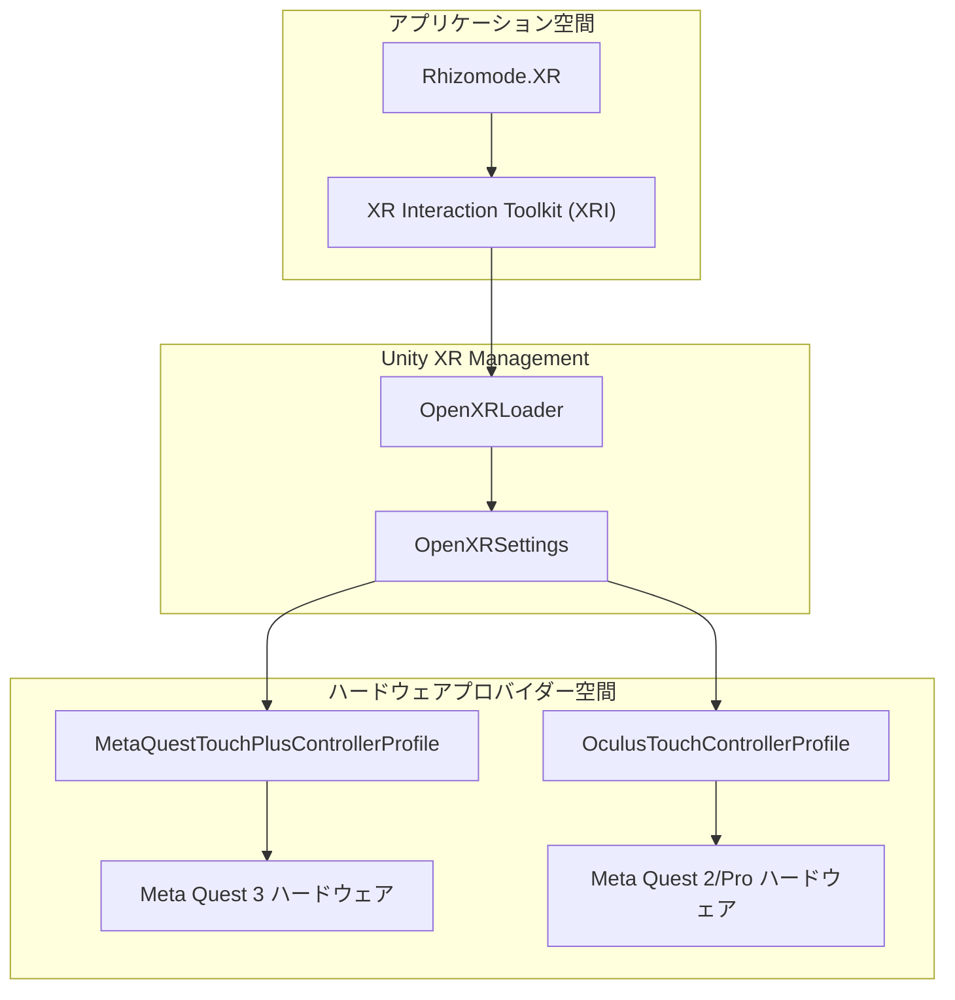
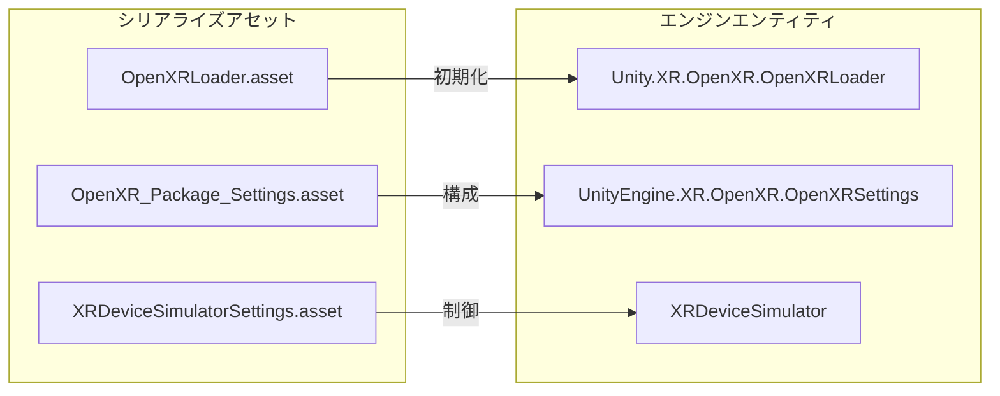

# XR ハードウェアと OpenXR 設定 (XR Hardware & OpenXR Configuration)

関連ソースファイル

このWikiページの生成にあたって、以下のファイルがコンテキストとして使用されました：

- [rhizomode/Assets/XR/Loaders/OpenXRLoader.asset](../../rhizomode/Assets/XR/Loaders/OpenXRLoader.asset)
- [rhizomode/Assets/XR/Settings/OpenXR Package Settings.asset](../../rhizomode/Assets/XR/Settings/OpenXR%20Package%20Settings.asset)
- [rhizomode/Assets/XRI/Settings/Resources/InteractionLayerSettings.asset](../../rhizomode/Assets/XRI/Settings/Resources/InteractionLayerSettings.asset)
- [rhizomode/Assets/XRI/Settings/Resources/XRDeviceSimulatorSettings.asset](../../rhizomode/Assets/XRI/Settings/Resources/XRDeviceSimulatorSettings.asset)
- [rhizomode/Packages/manifest.json](../../rhizomode/Packages/manifest.json)
- [rhizomode/Packages/packages-lock.json](../../rhizomode/Packages/packages-lock.json)
- [rhizomode/ProjectSettings/EditorBuildSettings.asset](../../rhizomode/ProjectSettings/EditorBuildSettings.asset)
- [rhizomode/ProjectSettings/XRPackageSettings.asset](../../rhizomode/ProjectSettings/XRPackageSettings.asset)

本ページでは、Rhizomode プロジェクトにおける XR 管理およびハードウェア設定を詳述します。本システムは OpenXR 標準上に構築された Unity XR Interaction Toolkit (XRI) を利用し、Meta Quest ハードウェアを中心としたクロスプラットフォーム互換性を確保します。

## XR Plugin Management とローダー (XR Plugin Management & Loaders)

Rhizomode は `com.unity.xr.management` を用いて XR サブシステムのライフサイクルを扱います。プロジェクトに構成された主ローダーは `OpenXRLoader` です [rhizomode/Assets/XR/Loaders/OpenXRLoader.asset:1-15]()。

### 構成データフロー
`EditorBuildSettings` アセットは、Oculus および OpenXR 固有の構成を含む特定の XR 設定をプロジェクトのビルドパイプラインへリンクします [rhizomode/ProjectSettings/EditorBuildSettings.asset:11-15]()。

| 設定種別 | アセット参照 |
| :--- | :--- |
| **XR Management Loader** | `com.unity.xr.management.loader_settings` |
| **OpenXR Settings** | `com.unity.xr.openxr.settings4` |
| **Oculus Settings** | `Unity.XR.Oculus.Settings` |

**ソース:** [rhizomode/ProjectSettings/EditorBuildSettings.asset:11-15](), [rhizomode/Assets/XR/Loaders/OpenXRLoader.asset:1-15]()

## OpenXR パッケージ設定 (OpenXR Package Settings)

OpenXR の構成は、Standalone ターゲット向けに有効化されたインタラクションプロファイルおよび機能を定義します。Rhizomode はノードグラフ操作システムでの高品質な入力マッピングを保証するため、Meta ハードウェア向けプロファイルを明示的に有効化します。

### 有効化されたインタラクションプロファイル
プロジェクトは `OpenXR Package Settings.asset` で次のプロファイルを明示的に有効化します：
*   **Meta Quest Touch Plus Controller Profile**: Quest 3 コントローラに必要 [rhizomode/Assets/XR/Settings/OpenXR Package Settings.asset:33-42]()。
*   **Oculus Touch Controller Profile**: 旧 Quest や Rift デバイスとの後方互換性を提供 [rhizomode/Assets/XR/Settings/OpenXR Package Settings.asset:73-82]()。

### 機能管理
Standalone プラットフォーム向けの `OpenXRSettings` オブジェクトは、レンダリングモードやカラーサブミッション設定を含む機能拡張のコレクションを管理します [rhizomode/Assets/XR/Settings/OpenXR Package Settings.asset:174-203]()。

**ソース:** [rhizomode/Assets/XR/Settings/OpenXR Package Settings.asset:33-203]()

## XR Interaction Toolkit (XRI) 設定 (XR Interaction Toolkit Configuration)

XR Interaction Toolkit は OpenXR レイヤーの上に位置し、低レベルのハードウェアイベントを高レベルなインタラクション状態 (Select、Activate、Hover) へ変換します。

### インタラクションレイヤー設定
プロジェクトは `InteractionLayerSettings` を用いてインタラクションマスクを定義します。現在、空間的ノードグラフ操作はすべて "Default" レイヤーを利用します [rhizomode/Assets/XRI/Settings/Resources/InteractionLayerSettings.asset:1-48]()。

### エディタテストとシミュレーション
ヘッドセット無しでの開発のため、`XRDeviceSimulatorSettings` を含みます。
*   **自動インスタンス化**: 無効化 (`m_AutomaticallyInstantiateSimulatorPrefab: 0`)、リグを手動制御可能 [rhizomode/Assets/XRI/Settings/Resources/XRDeviceSimulatorSettings.asset:15]()。
*   **エディタ専用**: Unity Editor 内でのみインスタンス化されるよう構成 [rhizomode/Assets/XRI/Settings/Resources/XRDeviceSimulatorSettings.asset:16]()。

### システムアーキテクチャ図
次の図は、ソフトウェアレイヤーが物理ハードウェアとどのように通信するかを示します。

**XR レイヤースタック**

**ソース:** [rhizomode/Assets/XR/Loaders/OpenXRLoader.asset:14](), [rhizomode/Assets/XR/Settings/OpenXR Package Settings.asset:34-74](), [rhizomode/Assets/XRI/Settings/Resources/InteractionLayerSettings.asset:14](), [rhizomode/Packages/manifest.json:17-20]()

## パッケージ依存関係 (Package Dependencies)

XR スタックは `manifest.json` 内のいくつかの主要パッケージを通じて維持されます：
*   `com.unity.xr.interaction.toolkit` (v3.3.1): 高レベルインタラクションロジック [rhizomode/Packages/manifest.json:17]()。
*   `com.unity.xr.management` (v4.5.0): サブシステム管理 [rhizomode/Packages/manifest.json:18]()。
*   `com.unity.xr.openxr` (v1.13.2): OpenXR 実装 [rhizomode/Packages/manifest.json:20]()。
*   `com.unity.xr.oculus` (v4.5.4): ネイティブ Oculus プロバイダー [rhizomode/Packages/manifest.json:19]()。

### 構成からコードへのマッピング
次の図は、シリアライズされた構成アセットと、それが初期化する Unity エンジン内部クラスとの対応を示します。

**構成マッピング**

**ソース:** [rhizomode/Packages/packages-lock.json:229-242](), [rhizomode/Assets/XR/Loaders/OpenXRLoader.asset:14](), [rhizomode/Assets/XR/Settings/OpenXR Package Settings.asset:175](), [rhizomode/Assets/XRI/Settings/Resources/XRDeviceSimulatorSettings.asset:14]()

---
