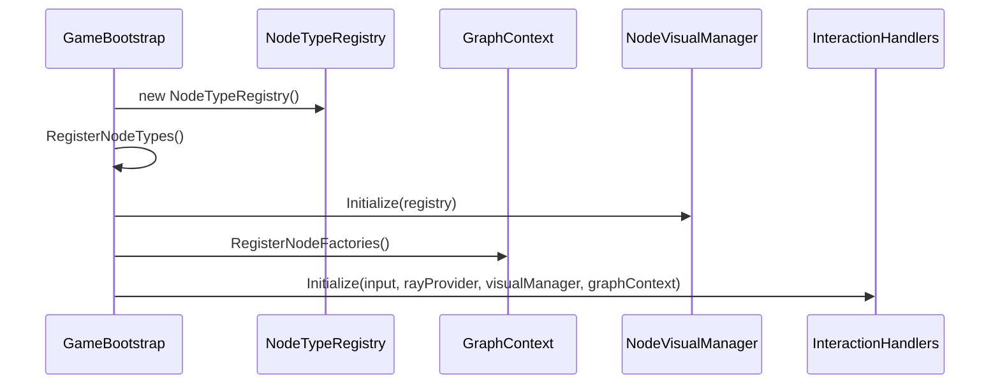

# XR インタラクションレイヤー (XR Interaction Layer)

<details>
<summary>関連ソースファイル</summary>

このWikiページの生成にあたって、以下のファイルがコンテキストとして使用されました：

- [rhizomode/Assets/Runtime/UI/NodeVisualController.cs](../../rhizomode/Assets/Runtime/UI/NodeVisualController.cs)
- [rhizomode/Assets/Runtime/UI/USS/NodePanel.uss](../../rhizomode/Assets/Runtime/UI/USS/NodePanel.uss)
- [rhizomode/Assets/Runtime/XR/ControllerInputRouter.cs](../../rhizomode/Assets/Runtime/XR/ControllerInputRouter.cs)
- [rhizomode/Assets/Runtime/XR/GameBootstrap.cs](../../rhizomode/Assets/Runtime/XR/GameBootstrap.cs)
- [rhizomode/Assets/Runtime/XR/UIRaycastDriver.cs](../../rhizomode/Assets/Runtime/XR/UIRaycastDriver.cs)
- [rhizomode/Assets/Runtime/XR/UIRaycastDriver.cs.meta](../../rhizomode/Assets/Runtime/XR/UIRaycastDriver.cs.meta)
- [rhizomode/Assets/Scenes/SampleScene.unity](../../rhizomode/Assets/Scenes/SampleScene.unity)

</details>


`Rhizomode.XR` アセンブリは、物理的な VR ハードウェアと抽象的なノードグラフを橋渡しします。空間入力の取得、リアクティブストリーム経由でのルーティング、そして高レベルなグラフ操作ロジックの実行を担当します。

このレイヤーでは、入力検出 (「What」) とインタラクションロジック (「How」) がインタフェースおよび R3 Observable によって分離された、疎結合なアーキテクチャを実装しています。

### システムアーキテクチャ概要

XR レイヤーは主に3つのコンポーネントで動作します：
1.  **入力ルーティング**: XR コントローラとヘッドセットのデータを取得。
2.  **インタラクションハンドラー**: 特定のグラフ操作 (Grab、Connect、Delete) を実装する独立クラス群。
3.  **ブートストラップ**: Core、UI、XR アセンブリ間の依存を結線する中心的オーケストレーター。

#### XR インタラクションフロー
次の図は、物理的なボタン押下がグラフ修正へ変換される流れを示します。

**タイトル: 入力からアクションへのパイプライン**
```mermaid
graph TD
    subgraph "ハードウェア空間"
        "XRController"["XR コントローラ (右/左)"]
    end

    subgraph "Rhizomode.XR (入力空間)"
        "RhizomodeInputActions"["RhizomodeInputActions (.inputactions)"]
        "ControllerInputRouter"["ControllerInputRouter.cs"]
    end

    subgraph "Rhizomode.XR (ロジック空間)"
        "NodeGrabHandler"["NodeGrabHandler.cs"]
        "EdgeDragHandler"["EdgeDragHandler.cs"]
        "NodeDeleteHandler"["NodeDeleteHandler.cs"]
    end

    subgraph "Rhizomode.Core (ドメイン空間)"
        "GraphContext"["GraphContext.cs"]
    end

    "XRController" -- "物理シグナル" --> "RhizomodeInputActions"
    "RhizomodeInputActions" -- "バインディング" --> "ControllerInputRouter"
    "ControllerInputRouter" -- "Observable ストリーム (R3)" --> "NodeGrabHandler"
    "ControllerInputRouter" -- "Observable ストリーム (R3)" --> "EdgeDragHandler"
    "ControllerInputRouter" -- "Observable ストリーム (R3)" --> "NodeDeleteHandler"

    "NodeGrabHandler" -- "ノードを移動" --> "GraphContext"
    "EdgeDragHandler" -- "TryConnect()" --> "GraphContext"
    "NodeDeleteHandler" -- "RemoveNode()" --> "GraphContext"
```
**ソース:** [rhizomode/Assets/Runtime/XR/ControllerInputRouter.cs:11-47](), [rhizomode/Assets/Runtime/XR/GameBootstrap.cs:88-132]()

---

### コントローラ入力と入力アクション (Controller Input & Input Actions)
`ControllerInputRouter` は空間データの中央ハブです。ボタンイベント用の `IControllerInput` と、空間ポインティング用の `IRayProvider` を実装します。Unity Input System のアクション (Select、Grab、Delete、Cut、Menu) を `R3.Observable` ストリームへマッピングし、ハンドラーがポーリング不要で入力に反応できるようにします。

*   **右手**: 主に操作系 (Select/Grab、Delete Node、Cut Edge)。
*   **左手**: 主にナビゲーションとメニュー系 (Open Menu、Locomotion)。
*   **Raycasting**: UI および空間インタラクション向けの一貫した `RayOrigin` と `RayDirection` を提供。

詳細は [コントローラー入力と入力アクション](./Controller-Input-&-Input-Actions.md) を参照してください。

**ソース:** [rhizomode/Assets/Runtime/XR/ControllerInputRouter.cs:15-56](), [rhizomode/Assets/Runtime/XR/ControllerInputRouter.cs:82-101]()

---

### インタラクションハンドラー (Interaction Handlers)
インタラクションは「ハンドラー」としてモジュール化されています。各ハンドラーは `MonoBehaviour` で、ブートストラップ段階で必要な依存 (Input、Ray Provider、Graph Context) が注入されます。

| ハンドラー | アクション | トリガー |
| :--- | :--- | :--- |
| **NodeCreationHandler** | 生成メニュー経由でノードを出現させる。 | 左手 `OpenMenu` |
| **NodeGrabHandler** | 3D 空間内でノードを移動。 | 右手 `Grab` |
| **NodeDeleteHandler** | グラフからノードを削除。 | 右手 `DeleteNode` |
| **EdgeDragHandler** | 出力ポートを入力ポートに接続。 | 右手 `Select` (ポート上で) |
| **EdgeCutHandler** | 既存のエッジを切断。 | 右手 `CutEdge` |

詳細は [インタラクションハンドラー](./Interaction-Handlers.md) を参照してください。

**ソース:** [rhizomode/Assets/Runtime/XR/GameBootstrap.cs:16-22](), [rhizomode/Assets/Runtime/XR/GameBootstrap.cs:88-132]()

---

### シーンブートストラップと初期化 (Scene Bootstrap & Initialization)
`GameBootstrap` クラスは XR シーンのエントリーポイントです。`NodeTypeRegistry` への投入と、すべての UI・XR システムが適切に相互参照されることを保証します。

**タイトル: システム初期化シーケンス**


`SampleScene.unity` のヒエラルキーには `Game Manager` オブジェクトがあり、これらのコンポーネントを保持し、`XR Origin` と `GraphContextBehaviour` のリンクをオーケストレートします。

詳細は [シーンブートストラップと初期化順序](./Scene-Bootstrap-&-Initialization-Order.md) を参照してください。

**ソース:** [rhizomode/Assets/Runtime/XR/GameBootstrap.cs:27-32](), [rhizomode/Assets/Runtime/XR/GameBootstrap.cs:88-132](), [rhizomode/Assets/Scenes/SampleScene.unity:136-169]()

---

### UI インタラクションブリッジ (UI Interaction Bridge)
rhizomode はワールドスペース UI (Unity UI Toolkit) を採用しているため、XR の Ray を UI イベントへ変換する専用ブリッジが必要です。`UIRaycastDriver` は `IRayProvider` をポーリングし、ターゲットノード上の `WorldPanelRayBridge` へ通知します。

*   **Hover (ホバー)**: Ray が `WorldPanelRayBridge` のコライダーに出入りした際にトリガー [rhizomode/Assets/Runtime/XR/UIRaycastDriver.cs:58-68]()。
*   **Click (クリック)**: `ControllerInputRouter` の `OnSelect` ストリームによってトリガー [rhizomode/Assets/Runtime/XR/UIRaycastDriver.cs:70-93]()。

**ソース:** [rhizomode/Assets/Runtime/XR/UIRaycastDriver.cs:15-36](), [rhizomode/Assets/Runtime/XR/UIRaycastDriver.cs:38-56]()

---
